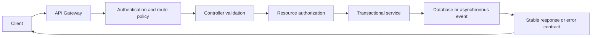

# Production REST API Design

This focused guide continues [HTTP contracts and representations](REST-API-HTTP-CONTRACTS.md).

## Query Design

Use query parameters for optional selection:

```http
GET /api/v1/orders?status=CONFIRMED&sort=createdAt,desc&page=0&size=20
```

Production list APIs should define:

- a maximum page size;
- stable sorting with a unique tie-breaker;
- indexed filter fields;
- an explicit default sort;
- cursor pagination for large or frequently changing datasets;
- allow-listed fields rather than arbitrary query construction.

Return pagination metadata or navigation links consistently. Do not load an
unbounded table into memory.

## Concurrency And Conditional Requests

Use an entity version, timestamp, or ETag to prevent lost updates:

```http
GET /api/v1/inventory/101
ETag: "7"

PUT /api/v1/inventory/101
If-Match: "7"
```

If another update has changed the version, return `409 Conflict` or
`412 Precondition Failed`. Database optimistic locking remains the final
concurrency control even when HTTP preconditions are used.

## Asynchronous Operations

When processing continues after the HTTP request, return a durable operation
or business resource instead of implying completion:

```http
HTTP/1.1 202 Accepted
Location: /api/v1/operations/8bce
```

Clients can poll the operation or receive an event/webhook. For Shopverse,
checkout creates an order synchronously and the SAGA advances asynchronously,
so `201 Created` describes creation of the order, not completion of payment.

## Versioning And Compatibility

Shopverse uses URI versioning:

```text
/api/v1/orders
```

Within a version:

- add optional response fields without changing existing meaning;
- avoid renaming or changing field types;
- do not make optional request fields mandatory;
- define deprecation and removal dates;
- use consumer contract tests for important clients;
- evolve asynchronous event schemas separately from REST schemas.

Create a new major API version only for incompatible contract changes.

## Security

- Authenticate at the gateway and again in each resource service.
- Authorize the resource, not only the route.
- Enforce ownership for customer data.
- Use method-level authorization for sensitive operations.
- Validate input size, type, range, and allow-listed values.
- Use parameterized persistence APIs; never concatenate untrusted SQL.
- Restrict CORS to trusted origins and required methods.
- Apply request-size, rate, timeout, and concurrency limits.
- Redact tokens, passwords, payment data, and personal information from logs.
- Return generic authentication errors to avoid account enumeration.

An API gateway is a policy and routing layer, not a replacement for service
authorization.

## Caching

Cache only data with a clear freshness policy. Define:

- cache key;
- TTL;
- invalidation event;
- behavior during cache failure;
- whether data is safe to share between users.

Use `Cache-Control`, `ETag`, and conditional GET where appropriate. Never cache
user-specific responses in a shared cache without a correctly partitioned key.

## Rate Limits And Resilience

Return `429 Too Many Requests` when a client exceeds an explicit rate policy
and include `Retry-After` when possible. Separate client throttling from
dependency resilience:

- rate limiter controls request admission;
- bulkhead limits concurrent work;
- timeout bounds waiting;
- retry handles selected transient failures;
- circuit breaker avoids repeatedly calling an unhealthy dependency.

Retries require idempotency. Do not retry validation failures, authorization
failures, or non-idempotent commands without a durable idempotency key.

## Documentation And Observability

Publish OpenAPI documentation from the implemented controllers and DTOs.
Document authentication, status codes, validation rules, idempotency, examples,
and error responses.

Separate the API contract from roadmap notes. A reader should be able to tell:

- which endpoints exist today;
- which request and response fields are stable;
- which error shapes are already returned by the runtime;
- which examples are runnable against the current environment;
- which items are planned improvements.

Use labels such as `Current behavior`, `Known limits`, and `Target design`
when production hardening is described beside an implemented API. Avoid saying
an API "supports" a capability until the controller, validation, authorization,
error mapping, tests, and operational evidence all exist.

For each request, record:

- service, method, route template, status, and duration;
- correlation ID and distributed trace context;
- a bounded error code;
- metrics without high-cardinality values such as user ID or order number.

Correlation IDs help operators search logs. Trace IDs identify one distributed
trace. Neither value is an authentication mechanism.

## Production Checklist

1. Use resource-oriented, versioned paths.
2. Match HTTP method and status semantics.
3. Validate all external input.
4. Keep persistence entities out of API contracts.
5. Use one stable error model.
6. require authentication and resource-level authorization.
7. make retried commands idempotent.
8. bound list queries and request sizes.
9. document and test compatibility.
10. emit low-cardinality metrics and correlated logs.
11. define timeouts, rate limits, and dependency failure behavior.
12. never expose secrets or implementation details in responses.

## API Maturity Levels

API maturity is not only whether an endpoint returns `200`.

| Level | Evidence |
|---|---|
| Prototype | Endpoint exists and works for a narrow happy path. |
| Implemented | Request validation, authorization, persistence, and expected responses are coded and tested. |
| Operational baseline | Logs, metrics, timeouts, idempotency, and failure handling are present for normal operations. |
| Production ready | Compatibility policy, contract tests, alerting, rate limits, threat review, and rollback/deprecation process are in place. |

Use these levels when documenting implementation status. They make it clear
whether a page describes runnable behavior, an operational baseline, or a
target production posture.

## Request Flow



## Related Guides

- [Shopverse API guide](API-GUIDE.md)
- [API Gateway](API-GATEWAY-GENERIC.md)
- [Spring Security](../security/SPRING-SECURITY-GENERIC.md)
- [Spring Transactions](../spring/SPRING-TRANSACTIONS.md)
- [Distributed systems](../architecture/DISTRIBUTED-SYSTEMS.md)

## Official References

- [RFC 9110 — HTTP Semantics](https://www.rfc-editor.org/rfc/rfc9110)
- [RFC 9457 — Problem Details](https://www.rfc-editor.org/rfc/rfc9457)
- [OpenAPI Specification](https://spec.openapis.org/oas/latest.html)
