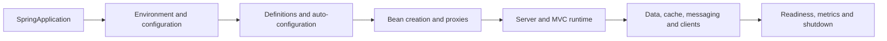

# Spring Boot Internals Learning Guide

<DocLabels items={[
  {label: 'Intermediate to architect', tone: 'intermediate'},
  {label: 'Spring Boot 4', tone: 'foundation'},
  {label: 'Production internals', tone: 'production'},
]} />

Spring Boot assembles a Spring application from environment, classpath, definitions,
conditions and lifecycle callbacks. Follow the pages in dependency order; use the
[runtime engineering map](../spring/SPRING-BOOT-INTERNALS-PRODUCTION.md) when diagnosing
an existing production symptom.

## Focused Guides

<TopicCards items={[
  {
    title: 'Startup And Auto-Configuration',
    href: './spring-boot-internals/STARTUP-AUTOCONFIGURATION',
    description: 'Trace application type, environment, refresh, conditions and readiness.',
    icon: 'route',
    tags: ['Startup', 'Conditions'],
  },
  {
    title: 'Dependency Injection And Bean Lifecycle',
    href: './spring-boot-internals/DI-BEAN-LIFECYCLE-AOP',
    description: 'Understand definitions, resolution, scopes, callbacks and proxy identity.',
    icon: 'boxes',
    tags: ['IoC', 'Lifecycle'],
  },
  {
    title: 'Configuration Properties Internals',
    href: './spring-boot-internals/CONFIGURATION-PROPERTIES',
    description: 'Bind, validate and evolve typed external configuration safely.',
    icon: 'code',
    tags: ['Binding', 'Validation'],
  },
  {
    title: 'Servlet And MVC Request Runtime',
    href: '../spring/web/SERVLET-MVC-REQUEST-LIFECYCLE',
    description: 'Trace filters, dispatch, arguments, controllers and exception ownership.',
    icon: 'route',
    tags: ['Servlet', 'MVC'],
  },
  {
    title: 'HTTP Message Conversion',
    href: '../spring/web/HTTP-MESSAGE-CONVERSION-JACKSON',
    description: 'Own content negotiation, Jackson, streaming and contract compatibility.',
    icon: 'layers',
    tags: ['Jackson', 'Contracts'],
  },
  {
    title: 'Infrastructure Internals',
    href: './spring-boot-internals/INFRASTRUCTURE-INTERNALS',
    description: 'Locate transaction, repository, migration, cache, Kafka and client setup.',
    icon: 'network',
    tags: ['Data', 'Integration'],
  },
  {
    title: 'Operations Internals',
    href: './spring-boot-internals/OPERATIONS-INTERNALS',
    description: 'Diagnose startup, availability, graceful shutdown and production state.',
    icon: 'gauge',
    tags: ['Actuator', 'Lifecycle'],
  },
  {
    title: 'Production Tuning',
    href: './spring-boot-internals/PRODUCTION-TUNING',
    description: 'Size memory, pools and concurrency from workload evidence.',
    icon: 'gauge',
    tags: ['Capacity', 'Performance'],
  },
]} />

<DocCallout type="production" title="Auto-configuration is evidence-driven">

When infrastructure is missing or duplicated, inspect the resolved dependency graph,
condition report, bean definitions and startup steps. Adding exclusions or bean names
without that evidence can hide the actual compatibility or scan problem.

</DocCallout>

## Boot 4 Compatibility

Shopverse is pinned to Boot `4.0.6` and Java 21. Review focused starter changes, Jakarta
EE 11 baselines, Jackson 3 and upgrade gates in the
[Boot 4 And Framework 7 guide](../spring/SPRING-BOOT-4-FRAMEWORK-7.md).

## Official References

- [Spring Boot reference](https://docs.spring.io/spring-boot/reference/)
- [Spring Framework container](https://docs.spring.io/spring-framework/reference/core/beans.html)

## Recommended Next

Start with [Startup And Auto-Configuration](./spring-boot-internals/STARTUP-AUTOCONFIGURATION.md).
