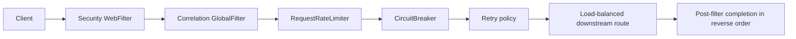
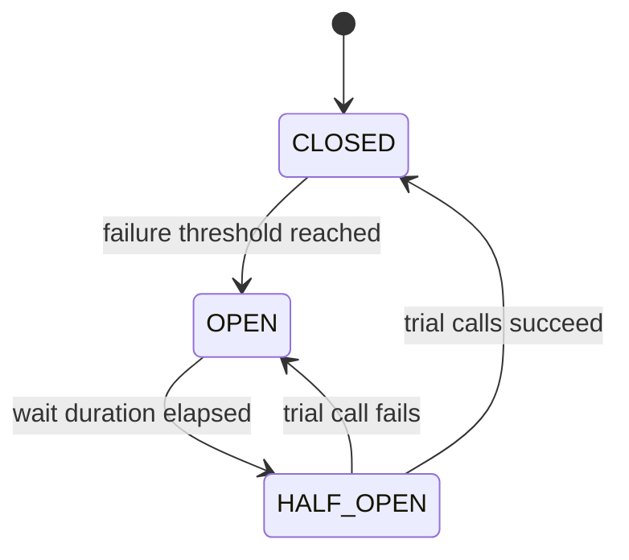

# Advanced Spring Cloud Gateway

This page covers production-oriented Spring Cloud Gateway Server WebFlux
filters, distributed Redis rate limiting, circuit-breaker filters, timeouts,
fallbacks, filter ordering, security boundaries, and operational signals.

Start with [API Gateway fundamentals](API-GATEWAY-GENERIC.md) for routing,
predicates, load balancing, correlation, and the reactive filter chain.

## Shopverse Implementation Status

| Capability | Status |
|---|---|
| Reactive Gateway Server WebFlux | implemented |
| Eureka and `lb://` routes | implemented |
| JWT resource-server security | implemented |
| Correlation, structured logs, and request metrics | implemented |
| Resilience4j `CircuitBreaker` gateway filter | implemented |
| Bounded `GET` retry filter | implemented |
| Redis-backed `RequestRateLimiter` | study/design example; not currently wired |
| Route-specific fallback endpoints | not currently configured |

Do not describe Redis rate limiting as a current Shopverse runtime feature
until Redis, the reactive Redis dependency, key strategy, tests, and operational
dashboards are added.

## Dependencies

Shopverse currently uses:

```gradle
implementation 'org.springframework.boot:spring-boot-starter-webflux'
implementation 'org.springframework.cloud:spring-cloud-starter-gateway-server-webflux'
implementation 'org.springframework.cloud:spring-cloud-starter-circuitbreaker-reactor-resilience4j'
implementation 'org.springframework.boot:spring-boot-starter-oauth2-resource-server'
implementation 'org.springframework.boot:spring-boot-starter-actuator'
```

Redis-backed Gateway rate limiting additionally requires reactive Redis:

```gradle
implementation 'org.springframework.boot:spring-boot-starter-data-redis-reactive'
```

and reachable shared Redis configuration:

```yaml
spring:
  data:
    redis:
      host: ${REDIS_HOST:localhost}
      port: ${REDIS_PORT:6379}
```

All Gateway replicas must use the same Redis deployment when the quota must be
global. An in-memory limiter creates one independent quota per replica.

## Filter Categories

| Type | Scope | Typical use |
|---|---|---|
| `WebFilter` | entire reactive HTTP chain | security-adjacent web concerns |
| `GlobalFilter` | every matched Gateway exchange | correlation, common telemetry |
| `GatewayFilter` | one route/filter chain | route policy |
| `GatewayFilterFactory` | reusable configured filter | YAML/Java DSL filter instances |

Built-in filters should be preferred for standard policies. Use custom filters
only for application-specific behavior.

Useful built-in filters include:

| Filter | Purpose |
|---|---|
| `RequestRateLimiter` | distributed quota enforcement |
| `CircuitBreaker` | stop repeated calls to an unhealthy dependency |
| `Retry` | bounded replay of eligible requests |
| `RequestSize` | reject oversized request bodies |
| `RemoveRequestHeader` | strip untrusted or sensitive headers |
| `SetRequestHeader` | set a trusted downstream header |
| `RewritePath` / `StripPrefix` | adapt external paths to internal routes |
| `DedupeResponseHeader` | remove duplicate CORS/response headers |
| `SecureHeaders` | add common defensive response headers |

## Filter Ordering

Gateway combines global and route filters into one ordered chain. Pre-filter
logic runs in ascending order; post-filter behavior unwinds in reverse.



The exact combined order depends on each filter's `Ordered` value and filter
factory implementation. Verify order with integration tests; do not infer it
only from visual YAML order.

Policy ordering changes behavior:

- rate limiting should normally charge the original client request, not every
  internal retry;
- retries must remain inside the caller's total deadline;
- a circuit breaker must observe the failures it is intended to count;
- logging and metrics should wrap the full request to capture final status and
  latency;
- authentication should happen before a user-based rate-limit key is trusted.

## Redis Token-Bucket Rate Limiting

Spring Cloud Gateway's Redis rate limiter implements a token-bucket policy.
Redis provides shared atomic state across Gateway replicas.

| Argument | Meaning |
|---|---|
| `replenishRate` | tokens added per second |
| `burstCapacity` | maximum tokens the bucket can hold |
| `requestedTokens` | tokens consumed by one request |

Example:

```text
replenishRate = 20 requests/second
burstCapacity = 40 requests
requestedTokens = 1 token/request
```

The client can burst up to 40 requests when the bucket is full. Sustained
traffic then converges toward 20 requests per second. Requests without enough
tokens receive `429 Too Many Requests`.

### Key Resolver

A limiter needs a stable key representing the quota owner:

```java
@Bean
KeyResolver userKeyResolver() {
    return exchange -> exchange.getPrincipal()
            .map(Principal::getName);
}
```

The key can represent:

- authenticated user;
- API client/application;
- tenant;
- trusted source IP;
- route plus user or tenant.

Avoid trusting a caller-provided `X-User-Id` or unvalidated forwarded IP header.
For anonymous traffic, deliberately choose whether to reject an empty key or
derive a key from a trusted proxy-normalized address. One shared `anonymous`
key lets one caller consume every anonymous user's capacity.

### Route Configuration

```yaml
spring:
  cloud:
    gateway:
      server:
        webflux:
          routes:
            - id: order-service
              uri: lb://ORDER-SERVICE
              predicates:
                - Path=/api/v1/orders/**
              filters:
                - name: RequestRateLimiter
                  args:
                    key-resolver: "#{@userKeyResolver}"
                    redis-rate-limiter.replenishRate: 20
                    redis-rate-limiter.burstCapacity: 40
                    redis-rate-limiter.requestedTokens: 1
```

`#{@userKeyResolver}` is SpEL: Gateway resolves the Spring bean and uses it to
calculate the Redis key. See [Spring Expression Language](../spring/SPRING-SPEL.md).

### Capacity Calculation

Start from measured downstream capacity, not an arbitrary request rate:

```text
safe gateway rate = min(
  service capacity,
  database capacity,
  provider quota,
  broker or dependency capacity
) * safety factor
```

For a service proven stable at 500 requests/second and a 70% target:

```text
replenishRate = 500 * 0.70 = 350 requests/second
```

Choose burst capacity from the burst duration the system can absorb:

```text
burstCapacity = replenishRate * allowed burst seconds
```

At 350 requests/second with a two-second burst budget, start near 700 tokens,
then load-test queueing, database connections, and downstream latency.

## Circuit-Breaker Gateway Filter

Shopverse already includes the reactive Resilience4j circuit-breaker starter
and applies this default Gateway filter:

```yaml
default-filters:
  - name: CircuitBreaker
    args:
      name: gateway-downstream
```

Its Resilience4j instance is configured centrally:

```yaml
resilience4j:
  circuitbreaker:
    instances:
      gateway-downstream:
        sliding-window-size: 20
        minimum-number-of-calls: 10
        failure-rate-threshold: 50
        wait-duration-in-open-state: 10s
  timelimiter:
    instances:
      gateway-downstream:
        timeout-duration: 5s
        cancel-running-future: true
```

State flow:



When open, the filter fails fast instead of repeatedly waiting for an unhealthy
downstream service. The circuit breaker is not a substitute for connection and
response timeouts; without bounded waits, failures take too long to enter the
recorded outcome.

### Route-Specific Fallback

```yaml
filters:
  - name: CircuitBreaker
    args:
      name: order-service
      fallbackUri: forward:/fallback/orders
      statusCodes:
        - 500
        - 502
        - 503
        - 504
```

```java
@RestController
class GatewayFallbackController {

    @GetMapping("/fallback/orders")
    ResponseEntity<ProblemDetail> ordersUnavailable() {
        ProblemDetail problem = ProblemDetail.forStatusAndDetail(
                HttpStatus.SERVICE_UNAVAILABLE,
                "Order Service is temporarily unavailable"
        );
        return ResponseEntity.status(HttpStatus.SERVICE_UNAVAILABLE)
                .body(problem);
    }
}
```

A fallback should return an honest degraded response. It must not fabricate a
successful order, payment, or inventory decision.

Use separate circuit-breaker names for dependencies with different latency or
failure characteristics. One global breaker can allow one failing service to
open the circuit for unrelated routes.

## Retry Filter Safety

Shopverse retries selected gateway `GET` failures:

```yaml
- name: Retry
  args:
    retries: 2
    methods: [GET]
    statuses:
      - BAD_GATEWAY
      - SERVICE_UNAVAILABLE
      - GATEWAY_TIMEOUT
```

Good rules:

- retry safe reads only, unless a write has a verified idempotency contract;
- use backoff and jitter where supported and appropriate;
- cap attempts and total elapsed time;
- do not retry authentication, validation, or deterministic `4xx` failures;
- account for retries at Feign clients, services, Kafka, and third parties to
  avoid multiplicative retry storms.

## Custom Filter Example

For reusable route configuration, extend an
`AbstractGatewayFilterFactory<Config>` rather than placing business logic in a
large anonymous filter:

```java
@Component
public class RequiredHeaderGatewayFilterFactory
        extends AbstractGatewayFilterFactory<RequiredHeaderGatewayFilterFactory.Config> {

    public RequiredHeaderGatewayFilterFactory() {
        super(Config.class);
    }

    @Override
    public GatewayFilter apply(Config config) {
        return (exchange, chain) -> {
            String value = exchange.getRequest()
                    .getHeaders()
                    .getFirst(config.headerName());

            if (value == null || value.isBlank()) {
                exchange.getResponse().setStatusCode(HttpStatus.BAD_REQUEST);
                return exchange.getResponse().setComplete();
            }
            return chain.filter(exchange);
        };
    }

    public record Config(String headerName) {
    }
}
```

Reactive filters must not call blocking JDBC, `Thread.sleep`, or blocking HTTP
clients on Netty event-loop threads.

## Observability

Monitor at least:

- request rate by route and status class;
- `429` rate and remaining-token behavior;
- circuit-breaker state, failure rate, slow-call rate, and rejected calls;
- retry attempts and final outcomes;
- gateway p50, p95, and p99 latency;
- Reactor Netty connection-pool pressure;
- downstream connect and response timeouts;
- Redis latency, errors, memory, and availability.

Avoid user ID, raw path parameters, correlation IDs, or IP addresses as
Prometheus labels. They create unbounded metric cardinality. Keep those values
in structured logs.

## Failure Modes And Decisions

| Failure | Required decision |
|---|---|
| Redis unavailable | fail open preserves availability but loses protection; fail closed protects dependencies but rejects traffic |
| Circuit open | return bounded `503`, fallback, or cached safe response |
| Retry budget exhausted | return the final explicit error; do not loop |
| Key resolver empty | reject or use a deliberate trusted anonymous strategy |
| Gateway replica loss | external load balancer routes to healthy replicas |
| Downstream overload | rate limit before saturation and apply service-level bulkheads too |

The Redis failure policy is a product and reliability decision. Document it,
alert on it, and test it; do not let a library default decide silently.

## Production Checklist

- Apply route-specific policies instead of one universal threshold.
- Validate JWT before using identity as a limiter key.
- Keep Redis private, authenticated, encrypted where required, monitored, and
  highly available.
- Add connection and response timeouts.
- Keep retries idempotent and bounded.
- Keep fallback responses truthful.
- Strip untrusted identity and forwarding headers.
- Limit request body size.
- Test filter order, `429`, open circuits, Redis outage, and downstream timeout.
- Enforce authorization again in each owning service.

## Official References

- [Spring Cloud Gateway reference](https://docs.spring.io/spring-cloud-gateway/reference/)
- [Gateway filter factories](https://docs.spring.io/spring-cloud-gateway/reference/spring-cloud-gateway-server-webflux/gatewayfilter-factories.html)
- [RequestRateLimiter filter](https://docs.spring.io/spring-cloud-gateway/reference/spring-cloud-gateway-server-webflux/gatewayfilter-factories/requestratelimiter-factory.html)
- [CircuitBreaker filter](https://docs.spring.io/spring-cloud-gateway/reference/spring-cloud-gateway-server-webflux/gatewayfilter-factories/circuitbreaker-filter-factory.html)

