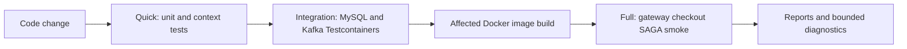

# Testing Architecture And Coverage

<DocLabels items={[{label: 'Advanced', tone: 'advanced'}, {label: 'Shopverse', tone: 'shopverse'}, {label: 'Production', tone: 'production'}]} />

## Objectives

Shopverse testing is designed to:

- give developers feedback without rebuilding the platform;
- verify real MySQL migrations and Kafka connectivity;
- prove transaction/outbox rollback behavior;
- exercise authenticated checkout through the gateway;
- bound CPU, memory, Docker, and elapsed time;
- stop failed verification instead of polling for hours;
- collect focused diagnostics.

## Four Verification Modes

| Mode | Purpose | Performance target | Hard limit |
|---|---|---:|---:|
| Changed | unit tests for affected services only | under 1 minute when narrowly scoped | per-task and suite timeouts |
| Quick | unit tests for every service, or an explicit service list | under 2 minutes with warm caches | per-task and suite timeouts |
| Integration | MySQL/Kafka/Testcontainers tests | 2-5 minutes | normally 10 minutes locally, 12 minutes in CI |
| Full | Docker startup and authenticated SAGA smoke path | under 10 minutes | 10-minute local default; CI smoke job allows 15 minutes |

Targets are engineering goals, not guarantees on a cold machine. The local
verification script bootstraps the Gradle wrapper outside the execution budget,
reuses one daemon across sequential service builds, applies both per-task and
suite deadlines, prints bounded child-process diagnostics on failure, and stops
the daemon after the suite. Image
downloads, Docker startup, and dependency resolution can exceed them. Hard
limits prevent indefinite resource consumption.

Security ownership, DLT replay, and observability remain part of the broader
full-verification objective, but they are not all automated by the current
lightweight Full mode. Their present coverage and remaining gaps are documented
below.

## Verification Architecture



Do not start with Full mode for a compiler or unit-test failure.

## Current Unit Coverage

### User Service

The repository contains focused tests for:

- controller request/response and validation;
- global exception handling;
- user, role, permission, password-history, lookup, and audit services;
- pagination utilities;
- strong-password validation.

Controller example:

```java
mockMvc.perform(post("/api/v1/users")
                .contentType(MediaType.APPLICATION_JSON)
                .content(objectMapper.writeValueAsString(request)))
        .andExpect(status().isCreated())
        .andExpect(jsonPath("$.data.username").value("ahmed"));

verify(userService).createUser(any(CreateUserRequest.class));
```

Service example:

```java
when(passwordEncoder.encode("password123"))
        .thenReturn("hashed-password");

userService.createUser(request);

ArgumentCaptor<User> captor = ArgumentCaptor.forClass(User.class);
verify(userRepository).save(captor.capture());
assertThat(captor.getValue().getPassword())
        .isEqualTo("hashed-password");
```

### Order And Payment Security

Method-level ownership tests cover:

```text
owner allowed
another customer denied
administrator allowed
```

```java
@Test
@WithMockUser(username = "bob", roles = "CUSTOMER")
void anotherCustomerCannotReadTimeline() {
    assertThatThrownBy(() -> controller.getTimeline(orderId))
            .isInstanceOf(AccessDeniedException.class);
}
```

These tests load a Spring context so method-security proxies are active.

### Context Tests

Order, Inventory, and Payment have context-startup tests with external
configuration/discovery dependencies disabled or replaced. Context tests catch
missing beans and invalid wiring but do not replace behavioral tests.

## Current Testcontainers Coverage

Order, Inventory, and Payment each define a separate `integrationTest` source
set using:

```text
MySQL 8.4
Kafka apache/kafka-native:3.9.1
SpringBootTest
DynamicPropertySource
TransactionTemplate
```

Representative declaration:

```java
@Testcontainers(disabledWithoutDocker = true, parallel = true)
@SpringBootTest(properties = {
        "spring.cloud.config.enabled=false",
        "eureka.client.enabled=false",
        "spring.jpa.hibernate.ddl-auto=validate",
        "spring.kafka.listener.auto-startup=false"
})
class OrderInfrastructureIntegrationTest {
}
```

`@DynamicPropertySource` connects the application context to container-assigned
ports:

```java
registry.add("spring.datasource.url", MYSQL::getJdbcUrl);
registry.add("spring.kafka.bootstrap-servers",
        KAFKA::getBootstrapServers);
```

## What Integration Tests Prove

Each commerce service verifies:

1. Liquibase creates expected tables on clean MySQL.
2. Hibernate validates the migrated schema.
3. domain/outbox work can share one local transaction.
4. forced rollback leaves no outbox state committed.
5. Kafka accepts a serialized payload and returns broker metadata.

Transaction example:

```java
transactionTemplate.executeWithoutResult(status ->
        enqueue(committedId)
);
assertThat(outboxCount(committedId)).isOne();

transactionTemplate.executeWithoutResult(status -> {
    enqueue(rolledBackId);
    status.setRollbackOnly();
});
assertThat(outboxCount(rolledBackId)).isZero();
```

Kafka example:

```java
var result = kafkaTemplate
        .send(topic, "order-key", "{\"status\":\"test\"}")
        .get(10, TimeUnit.SECONDS);

assertThat(result.getRecordMetadata().offset())
        .isGreaterThanOrEqualTo(0);
```

## Integration Test Source Set

Commerce services configure:

```gradle
sourceSets {
    integrationTest {
        java.srcDir file('src/integrationTest/java')
        resources.srcDir file('src/integrationTest/resources')
        compileClasspath += sourceSets.main.output +
                configurations.testRuntimeClasspath
        runtimeClasspath += output + compileClasspath
    }
}
```

Separate task:

```gradle
tasks.register('integrationTest', Test) {
    useJUnitPlatform()
    maxParallelForks = 1
    shouldRunAfter tasks.named('test')
    systemProperty 'junit.jupiter.execution.parallel.enabled', 'false'
}
```

This keeps normal unit tests independent from Docker.

## Current E2E Smoke Test

`scripts/Smoke-Test.ps1`:

1. logs in through the gateway;
2. generates unique correlation and idempotency IDs;
3. submits checkout;
4. retries temporary gateway `503` responses within a deadline;
5. polls the Order until `CONFIRMED` or terminal failure;
6. loads the timeline;
7. verifies:

```text
ORDER_CREATED
INVENTORY_RESERVED
PAYMENT_PROCESSING
PAYMENT_COMPLETED
ORDER_CONFIRMED
```

Every HTTP call and polling loop has a timeout.

The current smoke script proves the successful checkout path. Ownership,
payment failure/reconciliation, DLT replay, and observability checks are
documented manual/full-verification scenarios but are not all automated by
this one script.

## Recommended Next

Return to [Shopverse Testing Strategy](./TESTING.md) to select the next focused guide.


## Official References

- [Spring Framework reference](https://docs.spring.io/spring-framework/reference/)
- [Spring Boot reference](https://docs.spring.io/spring-boot/reference/)
