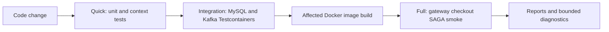

# Shopverse Testing And Verification Strategy

This guide documents Shopverse-specific coverage and verification modes.
Reusable JUnit, Mockito, Spring Test, repository/controller/service testing,
Testcontainers, and E2E concepts are in
[Spring Boot testing](../spring/SPRING-BOOT-TESTING.md).

## Objectives

Shopverse testing is designed to:

- give developers feedback without rebuilding the platform;
- verify real MySQL migrations and Kafka connectivity;
- prove transaction/outbox rollback behavior;
- exercise authenticated checkout through the gateway;
- bound CPU, memory, Docker, and elapsed time;
- stop failed verification instead of polling for hours;
- collect focused diagnostics.

## Four Verification Modes

| Mode | Purpose | Performance target | Hard limit |
|---|---|---:|---:|
| Changed | unit tests for affected services only | under 1 minute when narrowly scoped | per-task and suite timeouts |
| Quick | unit tests for every service, or an explicit service list | under 2 minutes with warm caches | per-task and suite timeouts |
| Integration | MySQL/Kafka/Testcontainers tests | 2-5 minutes | normally 10 minutes locally, 12 minutes in CI |
| Full | Docker startup and authenticated SAGA smoke path | under 10 minutes | 10-minute local default; CI smoke job allows 15 minutes |

Targets are engineering goals, not guarantees on a cold machine. The local
verification script bootstraps the Gradle wrapper outside the execution budget,
reuses one daemon across sequential service builds, applies both per-task and
suite deadlines, prints bounded child-process diagnostics on failure, and stops
the daemon after the suite. Image
downloads, Docker startup, and dependency resolution can exceed them. Hard
limits prevent indefinite resource consumption.

Security ownership, DLT replay, and observability remain part of the broader
full-verification objective, but they are not all automated by the current
lightweight Full mode. Their present coverage and remaining gaps are documented
below.

## Verification Architecture



Do not start with Full mode for a compiler or unit-test failure.

## Current Unit Coverage

### User Service

The repository contains focused tests for:

- controller request/response and validation;
- global exception handling;
- user, role, permission, password-history, lookup, and audit services;
- pagination utilities;
- strong-password validation.

Controller example:

```java
mockMvc.perform(post("/api/v1/users")
                .contentType(MediaType.APPLICATION_JSON)
                .content(objectMapper.writeValueAsString(request)))
        .andExpect(status().isCreated())
        .andExpect(jsonPath("$.data.username").value("ahmed"));

verify(userService).createUser(any(CreateUserRequest.class));
```

Service example:

```java
when(passwordEncoder.encode("password123"))
        .thenReturn("hashed-password");

userService.createUser(request);

ArgumentCaptor<User> captor = ArgumentCaptor.forClass(User.class);
verify(userRepository).save(captor.capture());
assertThat(captor.getValue().getPassword())
        .isEqualTo("hashed-password");
```

### Order And Payment Security

Method-level ownership tests cover:

```text
owner allowed
another customer denied
administrator allowed
```

```java
@Test
@WithMockUser(username = "bob", roles = "CUSTOMER")
void anotherCustomerCannotReadTimeline() {
    assertThatThrownBy(() -> controller.getTimeline(orderId))
            .isInstanceOf(AccessDeniedException.class);
}
```

These tests load a Spring context so method-security proxies are active.

### Context Tests

Order, Inventory, and Payment have context-startup tests with external
configuration/discovery dependencies disabled or replaced. Context tests catch
missing beans and invalid wiring but do not replace behavioral tests.

## Current Testcontainers Coverage

Order, Inventory, and Payment each define a separate `integrationTest` source
set using:

```text
MySQL 8.4
Kafka apache/kafka-native:3.9.1
SpringBootTest
DynamicPropertySource
TransactionTemplate
```

Representative declaration:

```java
@Testcontainers(disabledWithoutDocker = true, parallel = true)
@SpringBootTest(properties = {
        "spring.cloud.config.enabled=false",
        "eureka.client.enabled=false",
        "spring.jpa.hibernate.ddl-auto=validate",
        "spring.kafka.listener.auto-startup=false"
})
class OrderInfrastructureIntegrationTest {
}
```

`@DynamicPropertySource` connects the application context to container-assigned
ports:

```java
registry.add("spring.datasource.url", MYSQL::getJdbcUrl);
registry.add("spring.kafka.bootstrap-servers",
        KAFKA::getBootstrapServers);
```

## What Integration Tests Prove

Each commerce service verifies:

1. Liquibase creates expected tables on clean MySQL.
2. Hibernate validates the migrated schema.
3. domain/outbox work can share one local transaction.
4. forced rollback leaves no outbox state committed.
5. Kafka accepts a serialized payload and returns broker metadata.

Transaction example:

```java
transactionTemplate.executeWithoutResult(status ->
        enqueue(committedId)
);
assertThat(outboxCount(committedId)).isOne();

transactionTemplate.executeWithoutResult(status -> {
    enqueue(rolledBackId);
    status.setRollbackOnly();
});
assertThat(outboxCount(rolledBackId)).isZero();
```

Kafka example:

```java
var result = kafkaTemplate
        .send(topic, "order-key", "{\"status\":\"test\"}")
        .get(10, TimeUnit.SECONDS);

assertThat(result.getRecordMetadata().offset())
        .isGreaterThanOrEqualTo(0);
```

## Integration Test Source Set

Commerce services configure:

```gradle
sourceSets {
    integrationTest {
        java.srcDir file('src/integrationTest/java')
        resources.srcDir file('src/integrationTest/resources')
        compileClasspath += sourceSets.main.output +
                configurations.testRuntimeClasspath
        runtimeClasspath += output + compileClasspath
    }
}
```

Separate task:

```gradle
tasks.register('integrationTest', Test) {
    useJUnitPlatform()
    maxParallelForks = 1
    shouldRunAfter tasks.named('test')
    systemProperty 'junit.jupiter.execution.parallel.enabled', 'false'
}
```

This keeps normal unit tests independent from Docker.

## Current E2E Smoke Test

`scripts/Smoke-Test.ps1`:

1. logs in through the gateway;
2. generates unique correlation and idempotency IDs;
3. submits checkout;
4. retries temporary gateway `503` responses within a deadline;
5. polls the Order until `CONFIRMED` or terminal failure;
6. loads the timeline;
7. verifies:

```text
ORDER_CREATED
INVENTORY_RESERVED
PAYMENT_PROCESSING
PAYMENT_COMPLETED
ORDER_CONFIRMED
```

Every HTTP call and polling loop has a timeout.

The current smoke script proves the successful checkout path. Ownership,
payment failure/reconciliation, DLT replay, and observability checks are
documented manual/full-verification scenarios but are not all automated by
this one script.

## Verification Scripts

| Script | Purpose |
|---|---|
| `scripts/Verify-Shopverse.ps1` | orchestrates Quick, Changed, Integration, and Full modes |
| `scripts/Get-ChangedServices.ps1` | maps Git changes to affected services |
| `scripts/Smoke-Test.ps1` | authenticated checkout and timeline verification |
| `scripts/Wait-Service.ps1` | bounded health polling |

Operational command details are kept in the
[testing README](https://github.com/taukhir/shopverse/tree/main/testing).

## Quick Mode

One service:

```powershell
powershell -NoProfile -ExecutionPolicy Bypass `
  -File .\scripts\Verify-Shopverse.ps1 `
  -Mode Quick `
  -Services order-service
```

The script runs:

```text
gradlew.bat test --no-daemon --max-workers=2
```

All services:

```powershell
powershell -NoProfile -ExecutionPolicy Bypass `
  -File .\scripts\Verify-Shopverse.ps1 `
  -Mode Quick
```

Prefer one affected service during development.

## Changed Mode

```powershell
powershell -NoProfile -ExecutionPolicy Bypass `
  -File .\scripts\Verify-Shopverse.ps1 `
  -Mode Changed `
  -BaseRef origin/main
```

The script detects affected services. Shared-file changes can select all
services. If no services changed, it exits without creating work.

## Integration Mode

```powershell
powershell -NoProfile -ExecutionPolicy Bypass `
  -File .\scripts\Verify-Shopverse.ps1 `
  -Mode Integration `
  -TimeoutMinutes 10
```

By default, it runs `integrationTest` sequentially for:

```text
order-service
inventory-service
payment-service
```

Direct service command:

```powershell
cd order-service
.\gradlew.bat integrationTest --no-daemon --max-workers=2
```

Docker must be available. The annotations currently allow tests to be disabled
when Docker is absent; CI is expected to provide Docker.

## Full Mode

Reuse a healthy development stack:

```powershell
powershell -NoProfile -ExecutionPolicy Bypass `
  -File .\scripts\Verify-Shopverse.ps1 `
  -Mode Full `
  -TimeoutMinutes 10
```

Force a fresh isolated stack:

```powershell
powershell -NoProfile -ExecutionPolicy Bypass `
  -File .\scripts\Verify-Shopverse.ps1 `
  -Mode Full `
  -TimeoutMinutes 10 `
  -ForceIsolatedStack
```

The isolated mode:

- uses `docker-compose.yml` plus `docker-compose.test.yml`;
- publishes the gateway on `localhost:18080`;
- limits Compose build/start parallelism to two;
- starts application dependencies but omits the heavy observability stack;
- polls gateway health;
- runs the SAGA smoke test;
- prints bounded diagnostics on failure;
- removes containers and volumes unless `-KeepStack` is supplied.

Because the lightweight Full mode omits Prometheus, Loki, Promtail, and Grafana,
it does not verify the complete observability deployment. Observability should
be checked against the normal full development stack or a dedicated scheduled
gate.

## Existing Stack Smoke Test

```powershell
powershell -NoProfile -ExecutionPolicy Bypass `
  -File .\scripts\Smoke-Test.ps1
```

Custom gateway and deadline:

```powershell
.\scripts\Smoke-Test.ps1 `
  -GatewayUrl http://localhost:18080 `
  -TimeoutSeconds 45
```

The script returns order ID, order number, status, correlation ID, and the
configured deadline.

## CI Pipeline

`.github/workflows/ci.yml` currently:

1. validates configuration and Compose;
2. detects changed services;
3. runs affected unit-test jobs with maximum parallelism three;
4. runs affected commerce integration jobs with maximum parallelism two;
5. builds affected Docker images;
6. runs a lightweight Compose checkout gate on `main`, manual, and scheduled
   runs;
7. uploads failed Gradle reports;
8. prints bounded Compose diagnostics;
9. always tears down the CI stack.

CI hard limits include:

```text
unit test job:        10 minutes
integration job:     12 minutes
Docker build job:    12 minutes
Compose smoke job:   15 minutes
```

These hard limits are deliberately above the performance targets.

## Resource Controls

- Gradle workers are limited to two.
- Test JVM forks are limited to one per service.
- integration tests execute sequentially inside each service.
- CI matrices have bounded parallelism.
- Compose parallelism is limited to two.
- verification uses an overall deadline.
- container startup and HTTP waits are bounded.
- diagnostics tail a fixed number of lines.
- cleanup runs unless preservation is requested.

These controls reduce deadlocks and resource exhaustion in testing. Production
deadlock prevention still depends on short transactions, lock ordering,
idempotency, and bounded retries.

## Recommended Test Selection

| Change | Minimum verification |
|---|---|
| pure utility/domain rule | unit test |
| controller validation/JSON | controller test or MVC slice |
| authorization expression | Spring security test |
| repository query/mapping | JPA slice or MySQL integration |
| Liquibase change | MySQL Testcontainers integration |
| outbox transaction | transaction integration |
| Kafka serialization/producer | Kafka integration |
| SAGA contract/listener | focused integration plus smoke where needed |
| gateway route/security | gateway test plus E2E smoke |
| Docker/startup configuration | Compose validation and bounded Full mode |
| observability provisioning | normal stack plus target/query checks |

## Failure Triage

### Unit Failure

```powershell
.\order-service\gradlew.bat test `
  --no-daemon `
  --max-workers=2
```

Read:

```text
order-service/build/reports/tests/test/index.html
```

Do not start Docker to diagnose an assertion or compilation failure.

### Integration Failure

```powershell
.\order-service\gradlew.bat integrationTest `
  --no-daemon `
  --max-workers=2
```

Check:

- Docker availability and image pull;
- Testcontainers startup logs;
- dynamic datasource/Kafka properties;
- Liquibase failure;
- MySQL constraint/locking error;
- broker acknowledgement timeout;
- report under `build/reports/tests/integrationTest`.

### E2E Failure

Inspect:

```powershell
docker compose ps
docker compose logs --tail=120 `
  api-gateway order-service inventory-service payment-service kafka mysql
```

Use the generated correlation ID to search logs. Keep the stack only when
additional inspection is required:

```powershell
-KeepStack
```

Clean it manually afterward.

## Current Gaps

- Repository-specific `@DataJpaTest` coverage is limited.
- Automated SAGA failure/compensation scenarios are not as complete as the
  success smoke path.
- DLT persistence/replay is not fully covered by the current E2E script.
- Prometheus, Loki, Zipkin, and Grafana are not verified by the lightweight
  isolated Full mode.
- Consumer processing and lag behavior need deeper Kafka integration tests.
- Concurrent last-item race testing should be automated.
- Event contracts need immutable event IDs before strict consumer-inbox tests.

These are testing roadmap items, not implemented guarantees.

## Next Improvements

1. Add MySQL repository tests for uniqueness, entity graphs, and optimistic
   locking.
2. Add listener integration tests with unique topics and bounded Awaitility.
3. Add automated payment decline, timeout/reconciliation, and compensation
   scenarios.
4. Add DLT persistence and replay integration tests.
5. Add concurrent last-item reservation tests.
6. Add an observability verification job for targets, rules, Loki correlation,
   Zipkin trace, and Grafana health.
7. Report mode duration trends so performance regressions are visible.
8. Fail CI explicitly if required integration suites are skipped.

## Related Guides

- [Spring Boot testing](../spring/SPRING-BOOT-TESTING.md)
- [Testing commands](https://github.com/taukhir/shopverse/tree/main/testing)
- [CI workflows](https://github.com/taukhir/shopverse/tree/main/.github/workflows)
- [Debugging](DEBUGGING.md)
- [Features and demos](../reference/FEATURES-AND-DEMOS.md)
