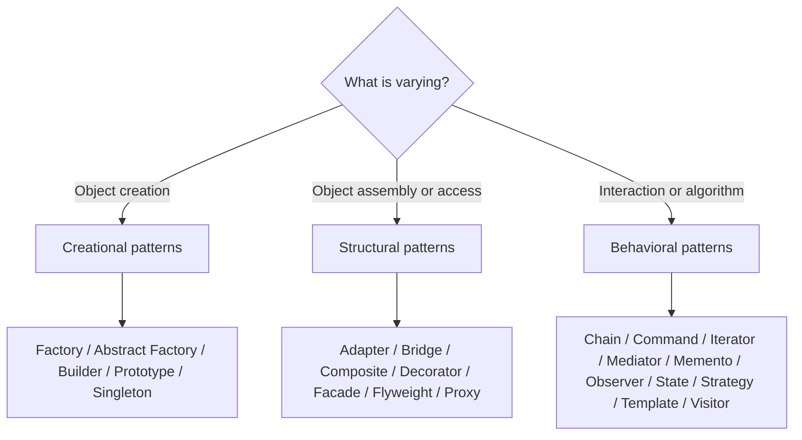

# Design Pattern Selection Cheat Sheet

A pattern is justified by a recurring design pressure, not by a desire to name
more classes. Start with the change you must isolate, the invariant you must
protect, and the coupling you must remove. Then select the smallest pattern that
solves that problem.

## First Decision

| Design pressure | Start with | Avoid when |
|---|---|---|
| callers should not know the concrete type | Factory Method | there is one stable implementation |
| create a compatible family of objects | Abstract Factory | products vary independently |
| construct a complex value step by step | Builder | a constructor or record is already clear |
| copy a configured template | Prototype | identity or deep-copy semantics are unclear |
| exactly one application-scoped collaborator | container-managed Singleton | global mutable state is being hidden |
| make an external API fit a domain port | Adapter | you control both interfaces and can align them |
| two dimensions must evolve independently | Bridge | there is only one real variation axis |
| treat leaves and groups uniformly | Composite | callers must distinguish every concrete type |
| wrap behavior around the same contract | Decorator | ordering and identity become surprising |
| expose a simple entry point to a subsystem | Facade | it becomes a god service containing business rules |
| share immutable intrinsic state at high volume | Flyweight | shared state is mutable or instances are few |
| control access, lifecycle, or remote invocation | Proxy | ordinary delegation is sufficient |
| pass work through ordered handlers | Chain of Responsibility | exactly one known receiver should handle it directly |
| represent a request as an object | Command | the operation never needs queuing, history, or composition |
| traverse a collection without exposing representation | Iterator | the language collection API already solves it |
| centralize a dense interaction graph | Mediator | the mediator would absorb unrelated domain logic |
| capture and restore state | Memento | snapshots are large, sensitive, or cheaper to recompute |
| notify multiple in-process dependents | Observer | delivery, replay, and durability require a message broker |
| behavior changes with lifecycle state | State | a small enum switch is clearer and stable |
| select one interchangeable algorithm | Strategy | there is no meaningful algorithm variation |
| keep workflow order fixed while steps vary | Template Method | composition is preferable to inheritance |
| add operations across a stable object structure | Visitor | object types change more often than operations |

## Creational Patterns

| Pattern | Recognition question | Shopverse or Spring example | Main cost |
|---|---|---|---|
| Factory Method | Who chooses the implementation? | select a `PaymentProvider` by gateway type | selection logic can become a large switch |
| Abstract Factory | Must several created objects belong to the same family? | cloud-specific storage, queue, and signer adapters | adding a new product type touches every factory |
| Builder | Are many optional parameters or validation steps involved? | immutable checkout command or test fixture | ceremony for simple values |
| Prototype | Is cloning a configured baseline cheaper than rebuilding it? | copy a notification template before personalization | shallow/deep-copy errors |
| Singleton | Is one stateless service instance enough per container? | default Spring singleton bean | hidden shared state and test coupling |

Prefer dependency injection to service locators and manually implemented global
singletons. Scope and lifecycle are container responsibilities unless the domain
has a compelling reason otherwise.

## Structural Patterns

| Pattern | Recognition question | Shopverse or Spring example | Main cost |
|---|---|---|---|
| Adapter | Does a vendor interface conflict with the application port? | map a payment SDK to `PaymentGateway` | mapping code and semantic mismatch |
| Bridge | Do abstraction and implementation vary separately? | notification type independent of delivery channel | more types and indirection |
| Composite | Must clients treat a tree uniformly? | product bundles containing products or bundles | constraints for leaves and groups differ |
| Decorator | Must responsibilities be stacked dynamically? | metrics, tracing, validation around a gateway | wrapper order affects behavior |
| Facade | Do callers need one coarse entry point? | checkout facade coordinating application ports | can become an orchestration god object |
| Flyweight | Are millions of objects repeating immutable data? | shared product-category metadata in an in-memory model | externalized contextual state |
| Proxy | Must access be intercepted without changing the target? | Spring transactions, security, caching, remote client | self-invocation and identity surprises |

### Decorator Versus Proxy Versus Adapter

| Question | Decorator | Proxy | Adapter |
|---|---|---|---|
| same client-facing contract? | yes | usually | no; it converts one contract to another |
| primary goal | add responsibility | control access or lifecycle | reconcile incompatible interfaces |
| typical example | metrics wrapper | transactional/security proxy | vendor SDK wrapper |

## Behavioral Patterns

| Pattern | Recognition question | Shopverse or Spring example | Main cost |
|---|---|---|---|
| Chain of Responsibility | Should ordered handlers inspect or transform a request? | servlet/security filters, validation chain | unclear terminal handler or ordering |
| Command | Should an operation be queued, retried, audited, or undone? | `ReserveInventoryCommand` | command proliferation |
| Iterator | Should traversal be independent of storage representation? | paged domain collection cursor | invalidation during mutation |
| Mediator | Are peers excessively coupled to one another? | checkout process manager coordinating participants | centralized complexity |
| Memento | Must prior state be restored without exposing internals? | draft configuration/version snapshot | storage, privacy, and versioning cost |
| Observer | Should many listeners react to an in-process event? | Spring application events | ordering and failure semantics are easy to hide |
| State | Does an object have legal state-specific behavior? | order/payment lifecycle | many classes for a small state machine |
| Strategy | Must one algorithm be selected at runtime? | pricing, fraud, or payment-routing policy | needless abstraction for one rule |
| Template Method | Is the workflow stable but selected steps variable? | import job skeleton with hook methods | inheritance coupling |
| Visitor | Are new operations added to a stable type hierarchy? | validation/export over a stable product expression tree | adding a new element type is expensive |

## Similar Patterns That Are Commonly Confused

| Choice | Prefer the first when | Prefer the second when |
|---|---|---|
| Strategy vs State | caller/policy selects an algorithm | lifecycle state selects legal behavior |
| Strategy vs Template Method | composition and runtime choice matter | invariant workflow order matters |
| Observer vs message broker | reaction is local and ephemeral | delivery must survive process failure |
| Mediator vs Facade | peers communicate through a coordinator | outside callers need a simpler subsystem API |
| Command vs Strategy | represent an action and its lifecycle | represent an interchangeable calculation |
| Composite vs Decorator | model part-whole trees | wrap one object with additional behavior |
| Prototype vs Memento | create another configured object | restore an earlier state of the same logical object |

## Selection Review Checklist

Before approving a pattern, answer:

1. What concrete change or coupling does it isolate?
2. What is the simpler design, and why is it insufficient?
3. Which invariant owns the abstraction?
4. How are errors, ordering, transactions, and concurrency handled?
5. Can the pattern be removed without changing observable behavior?
6. Which test proves implementations are substitutable?
7. Does the name match the runtime behavior, or only the class diagram?

## Interview Answer Pattern

Use a four-part response:

1. **Problem:** name the variation or coupling.
2. **Choice:** state the pattern and the participating roles.
3. **Trade-off:** explain the new indirection or operational cost.
4. **Boundary:** state when a simpler design or a different pattern is better.

## Related Guides

- [Creational Patterns](./CREATIONAL-PATTERNS.md)
- [Structural Patterns](./STRUCTURAL-PATTERNS.md)
- [Behavioral Patterns](./BEHAVIORAL-PATTERNS.md)
- [Design Patterns](../DESIGN-PATTERNS.md)
- [SOLID In Shopverse](../SOLID-JAVA-SHOPVERSE.md)

## References

- [Design Patterns Cheat Sheet - GeeksforGeeks](https://www.geeksforgeeks.org/system-design/design-patterns-cheat-sheet-when-to-use-which-design-pattern/)
- [Refactoring.Guru Design Patterns](https://refactoring.guru/design-patterns)
