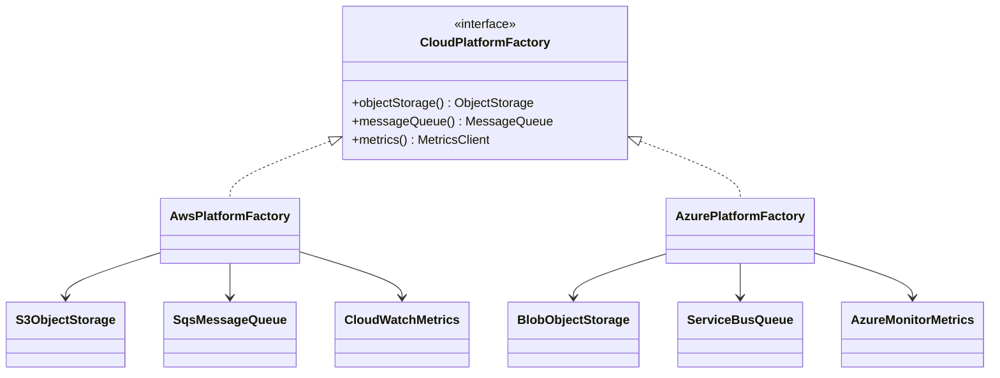

# Abstract Factory Pattern in Java and Spring

<DocLabels items={[{label: 'GoF creational', tone: 'advanced'}, {label: 'Product families', tone: 'foundation'}, {label: 'Architecture', tone: 'production'}]} />

Abstract Factory provides an interface for creating a **family of related
products** without exposing their concrete classes. Its important promise is
compatibility across the whole family, not merely hiding `new`.

## The Problem

Shopverse can run against AWS or Azure. Each environment needs object storage,
a queue, and metrics. If application code selects each client independently,
it can accidentally assemble a mixed family:

```java
ObjectStorage storage = new S3ObjectStorage(properties);
MessageQueue queue = new AzureServiceBus(properties); // accidental mismatch
MetricsClient metrics = new CloudWatchMetrics(properties);
```

Provider conditionals then spread across configuration classes, tests, and
business services. Adding a provider changes every switch, and nothing in the
design guarantees that the selected products belong together.

## What The Pattern Changes



Clients see only application-owned product contracts. One factory owns the
decision about which concrete family is valid.

## Implementation 1: Classic Java Abstract Factory

```java
public interface ObjectStorage {
    URI put(String key, byte[] content);
}

public interface MessageQueue {
    void publish(String topic, byte[] event);
}

public interface MetricsClient {
    void increment(String name);
}

public interface CloudPlatformFactory {
    ObjectStorage objectStorage();
    MessageQueue messageQueue();
    MetricsClient metrics();
}
```

```java
public final class AwsPlatformFactory implements CloudPlatformFactory {
    private final AwsProperties properties;

    public AwsPlatformFactory(AwsProperties properties) {
        this.properties = properties;
    }

    @Override
    public ObjectStorage objectStorage() {
        return new S3ObjectStorage(properties.s3());
    }

    @Override
    public MessageQueue messageQueue() {
        return new SqsMessageQueue(properties.sqs());
    }

    @Override
    public MetricsClient metrics() {
        return new CloudWatchMetrics(properties.cloudWatch());
    }
}
```

The composition root chooses exactly one family:

```java
CloudPlatformFactory platform = switch (configuration.provider()) {
    case AWS -> new AwsPlatformFactory(configuration.aws());
    case AZURE -> new AzurePlatformFactory(configuration.azure());
};

CheckoutInfrastructure infrastructure = new CheckoutInfrastructure(
        platform.objectStorage(),
        platform.messageQueue(),
        platform.metrics()
);
```

### Drawbacks

- Adding a **new family** is localized: implement one factory and its products.
- Adding a **new product type** is expensive: every factory interface and every
  concrete family must change.
- A factory that creates new clients on every call can duplicate connection
  pools and threads.

### Remedies

Keep the family narrow and cohesive. Return cached, lifecycle-managed clients
when they are expensive. If products do not need to vary together, use
independent factories or direct dependency injection instead.

## Implementation 2: Spring Configuration Families

Spring can make the application context the family assembly boundary:

```java
@Configuration
@Profile("aws")
class AwsPlatformConfiguration {

    @Bean
    ObjectStorage objectStorage(AwsProperties properties) {
        return new S3ObjectStorage(properties.s3());
    }

    @Bean
    MessageQueue messageQueue(AwsProperties properties) {
        return new SqsMessageQueue(properties.sqs());
    }

    @Bean
    MetricsClient metricsClient(AwsProperties properties) {
        return new CloudWatchMetrics(properties.cloudWatch());
    }
}
```

An equivalent `AzurePlatformConfiguration` activates under the `azure` profile.
Business services inject the three contracts and never inspect the active
provider.

### Drawbacks

- String profile names can be misspelled or activated together.
- Conditional configuration can become difficult to trace.
- Context-heavy tests are slower than plain unit tests.

### Remedies

Validate that exactly one provider is configured, group provider properties
with `@ConfigurationProperties`, use focused context tests for wiring, and keep
business behavior in plain unit-testable classes.

## Implementation 3: An Immutable Product-Family Record

When the family only groups already-created collaborators, a record can be
clearer than creation methods:

```java
public record CloudPlatform(
        ObjectStorage objectStorage,
        MessageQueue messageQueue,
        MetricsClient metrics
) {
    public CloudPlatform {
        Objects.requireNonNull(objectStorage);
        Objects.requireNonNull(messageQueue);
        Objects.requireNonNull(metrics);
    }
}
```

This is not the textbook GoF shape, but it preserves the compatibility boundary
without pretending that the group constructs objects repeatedly.

## When Not To Use It

Avoid Abstract Factory when:

- only one product varies—use Factory Method or direct injection;
- the family members have no compatibility relationship;
- provider selection occurs once in Spring configuration and an extra factory
  adds no useful boundary;
- callers need arbitrary mixing, because the pattern would enforce a false
  invariant.

## Testing The Design

Define contract tests once and run them against every family:

```java
abstract class CloudPlatformContract {
    protected abstract CloudPlatformFactory factory();

    @Test
    void uploadsAndPublishesAReference() {
        URI uri = factory().objectStorage().put("orders/1", new byte[]{1});
        factory().messageQueue().publish(
                "order-created", uri.toString().getBytes(StandardCharsets.UTF_8));
        assertNotNull(uri);
    }
}
```

Also test provider-selection failure, lifecycle cleanup, and configuration
validation. A useful architecture test can assert that domain packages do not
import vendor SDK packages.

## Interview-Ready Answer

> Abstract Factory creates a compatible family of related products behind
> application-owned contracts. It makes adding a new family easy but adding a
> new product expensive because all families must change. In Spring I often
> express the family as conditional configuration, validate that exactly one
> family is active, and keep expensive clients container-managed.

## Related Patterns

- [Factory Method](./factory.md) selects one product rather than a family.
- [Builder](./builder.md) assembles one complex product step by step.
- [Adapter](./adapter.md) can wrap each vendor product behind the
  application-owned contracts used by the factory.

## Official References

- [Spring Java-based container configuration](https://docs.spring.io/spring-framework/reference/core/beans/java.html)
- [Spring bean definition profiles](https://docs.spring.io/spring-framework/reference/core/beans/environment.html#beans-definition-profiles)
