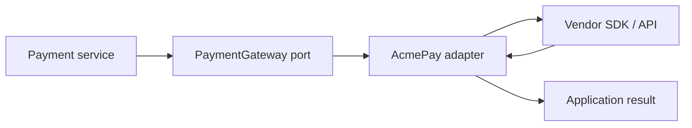

# Adapter Pattern in Spring

<DocLabels items={[{label: 'Interview priority', tone: 'advanced'}, {label: 'Structural', tone: 'foundation'}, {label: 'Integration', tone: 'production'}]} />

Adapter translates an incompatible interface into the contract the application
expects. It is the implementation at a port in ports-and-adapters architecture.

## Keep the Port Application-Owned

```java
public interface PaymentGateway {
    Authorization authorize(PaymentRequest request);
}

public record PaymentRequest(
        OrderId orderId,
        Money amount,
        PaymentToken token
) {}
```

The contract uses application language and types. A provider adapter owns all
vendor translation:

```java
@Component
final class AcmePayAdapter implements PaymentGateway {
    private final AcmePayClient client;

    public Authorization authorize(PaymentRequest request) {
        AcmeChargeResponse response = client.charge(new AcmeChargeRequest(
                request.orderId().value(),
                request.amount().minorUnitsExact(),
                request.amount().currency().getCurrencyCode(),
                request.token().value()
        ));

        return switch (response.status()) {
            case "APPROVED" -> Authorization.approved(response.reference());
            case "DECLINED" -> Authorization.declined(response.reasonCode());
            default -> throw new UnknownProviderStatus(response.status());
        };
    }
}
```

The adapter may use `WebClient`, RestClient, a generated client, or an SDK. Those
choices must not leak through the port.

## Translation Responsibilities

- convert money without rounding or unit mistakes;
- map vendor statuses to owned domain outcomes;
- translate transport exceptions into a small failure taxonomy;
- attach idempotency and correlation identifiers;
- validate provider responses instead of accepting unknown values silently;
- keep credentials and timeouts in typed configuration;
- record provider-safe metrics without sensitive data.



<DocCallout type="mistake" title="Do not leak provider types through the port">

Returning `AcmeChargeResponse` forces business code and tests to understand the
vendor. Return an application-owned `Authorization`; preserve raw provider data
only where audit or support requirements justify it.

</DocCallout>

## Multiple Providers

One adapter per provider can implement the same port. Select it with a
[Strategy](./strategy.md) registry or [Factory](./factory.md). Avoid a single
adapter containing provider switches and unrelated mappings.

## Testing

Unit-test mapping boundaries, including unknown status, malformed response,
currency conversion, and exception translation. Use a mock HTTP server or vendor
sandbox for transport contract tests. A shared contract test suite can verify
that every adapter honors the port's success and failure semantics.

## Adapter Versus Facade

Adapter changes an interface for compatibility. Facade simplifies a complex
subsystem behind a higher-level API. One class may do both, but naming the primary
intent keeps responsibilities reviewable.

## Interview-Ready Answer

> Adapter lets the application depend on its own port while a Spring bean
> translates to and from a vendor API. I keep provider DTOs, status codes,
> exceptions, money units, and credentials inside the adapter and verify it with
> mapping and contract tests. This reduces vendor coupling, but it should not
> become a second business-service layer.

## Related Patterns

- [Bridge](./bridge.md) separates two application-controlled dimensions of
  variation; Adapter reconciles an existing incompatible API.
- [Decorator](./decorator.md) can add metrics or resilience around the port.

## Official References

- [Spring HTTP interface clients](https://docs.spring.io/spring-framework/reference/integration/rest-clients.html#rest-http-interface)
- [Spring `HandlerAdapter`](https://docs.spring.io/spring-framework/reference/web/webmvc/mvc-servlet/special-bean-types.html)
