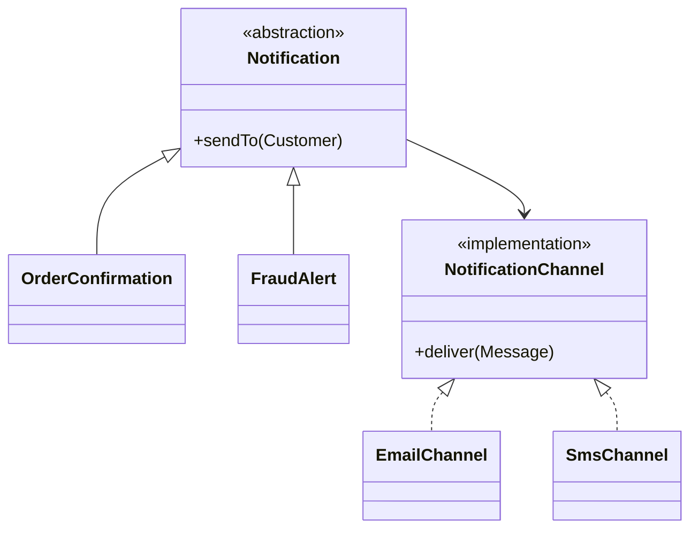

# Bridge Pattern in Spring

<DocLabels items={[{label: 'Core pattern', tone: 'advanced'}, {label: 'Structural', tone: 'foundation'}, {label: 'Composition', tone: 'production'}]} />

Bridge separates an abstraction from its implementation so two dimensions can
evolve independently. It replaces a Cartesian-product inheritance hierarchy with
composition.

## Recognize Two Axes of Change

Suppose notification **purpose** varies between order confirmation and fraud
alert, while delivery **channel** varies between email, SMS, and push. Subclasses
such as `EmailOrderConfirmation`, `SmsOrderConfirmation`, `EmailFraudAlert`, and
`SmsFraudAlert` multiply with every new option.

Bridge keeps the dimensions separate:



## Spring Implementation

```java
public interface NotificationChannel {
    ChannelType type();
    DeliveryReceipt deliver(OutboundMessage message);
}

public abstract class Notification {
    private final NotificationChannel channel;

    protected Notification(NotificationChannel channel) {
        this.channel = channel;
    }

    public final DeliveryReceipt sendTo(Customer customer) {
        return channel.deliver(compose(customer));
    }

    protected abstract OutboundMessage compose(Customer customer);
}
```

Concrete channel implementations can be Spring beans. If the channel is selected
at runtime, inject a keyed registry into a notification factory; do not inject one
specific channel into every abstraction.

```java
final class OrderConfirmation extends Notification {
    private final Order order;

    OrderConfirmation(Order order, NotificationChannel channel) {
        super(channel);
        this.order = order;
    }

    protected OutboundMessage compose(Customer customer) {
        return OutboundMessage.orderConfirmed(customer, order);
    }
}
```

## Bridge Versus Adapter and Strategy

| Pattern | Intent |
|---|---|
| Bridge | design two independent dimensions to vary from the start |
| Adapter | make an existing incompatible API fit an expected contract |
| Strategy | replace one algorithm used by a context |

Bridge's implementation side often looks like a Strategy. The distinguishing
signal is that both the abstraction hierarchy and implementation hierarchy are
first-class variation axes.

<DocCallout type="tip" title="Use Bridge only when both dimensions are real">

If there is one notification type and several channels, a Strategy is enough. If
there is one vendor API that does not fit, use an Adapter. Bridge earns its extra
structure when both axes already vary or have a credible reason to do so.

</DocCallout>

## Testing and Trade-offs

Test abstraction behavior with an in-memory channel and channel behavior against
its transport contract. Add a small matrix test for important combinations. The
pattern avoids subclass explosion but introduces more collaboration and selection
logic, so naming and package ownership must keep the two axes obvious.

## Interview-Ready Answer

> Bridge uses composition to separate two independent dimensions of variation.
> For notifications, the message purpose can vary independently from the delivery
> channel. Spring injects channel implementations, while the abstraction owns
> message composition. I choose it only when both axes are genuine; otherwise a
> Strategy or Adapter is simpler.

## Related Patterns

- [Strategy](./strategy.md) commonly implements the replaceable side of a bridge.
- [Adapter](./adapter.md) can sit behind a channel to translate a vendor SDK.
- [Factory](./factory.md) can assemble the chosen abstraction/channel pair.

## Official References

- [Spring dependency injection](https://docs.spring.io/spring-framework/reference/core/beans/dependencies/factory-collaborators.html)
- [Spring bean definition inheritance](https://docs.spring.io/spring-framework/reference/core/beans/child-bean-definitions.html)
