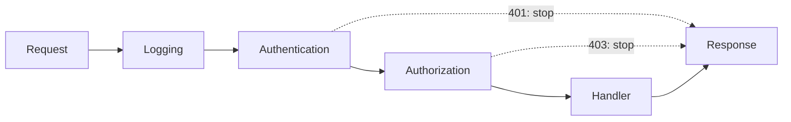

# Chain of Responsibility Pattern in Spring

<DocLabels items={[{label: 'Interview priority', tone: 'advanced'}, {label: 'Behavioral', tone: 'foundation'}, {label: 'Spring', tone: 'production'}]} />

Chain of Responsibility sends a request through ordered handlers. A handler may
inspect or transform the request, stop processing, or allow the next handler to
continue.

## Spring List-Based Chain

Spring can discover and order handlers without manually linking `next` fields:

```java
public sealed interface ValidationOutcome {
    record Continue() implements ValidationOutcome {}
    record Reject(String code) implements ValidationOutcome {}
}

public interface CheckoutRule {
    ValidationOutcome evaluate(CheckoutContext context);
}

@Component
@Order(10)
final class BasketNotEmptyRule implements CheckoutRule {
    public ValidationOutcome evaluate(CheckoutContext context) {
        return context.items().isEmpty()
                ? new ValidationOutcome.Reject("EMPTY_BASKET")
                : new ValidationOutcome.Continue();
    }
}
```

```java
@Service
final class CheckoutRuleChain {
    private final List<CheckoutRule> rules;

    CheckoutRuleChain(List<CheckoutRule> rules) {
        this.rules = List.copyOf(rules);
    }

    void validate(CheckoutContext context) {
        for (CheckoutRule rule : rules) {
            switch (rule.evaluate(context)) {
                case ValidationOutcome.Continue ignored -> { }
                case ValidationOutcome.Reject rejected ->
                        throw new CheckoutRejected(rejected.code());
            }
        }
    }
}
```

The outcome makes continuation explicit. Exceptions can still represent
unexpected technical failure rather than ordinary rule rejection.

## Framework Examples

- Servlet `FilterChain` wraps request processing before and after `doFilter`.
- Spring Security uses ordered filters and may terminate with an authentication or
  authorization response.
- Spring MVC applies `HandlerInterceptor` instances around controller execution.
- Exception resolvers are consulted until one handles an exception.
- `AuthenticationProvider` implementations form a support-based chain.



## Ordering and Ownership

Use coarse order ranges such as 100, 200, and 300 so new steps can be inserted.
If the exact sequence is a business invariant, assemble it explicitly in
configuration rather than relying only on scattered annotations. Keep the context
small; shared mutable maps make handler contracts invisible.

<DocCallout type="production" title="Define the chain contract before adding handlers">

Document whether handlers may mutate context, short-circuit, execute after the
next handler, compensate earlier work, or retry. Also decide whether a rejection
is data, an exception, or an HTTP response. Consistency matters more than the
linking mechanism.

</DocCallout>

## Testing

Test handlers independently, then test the assembled order, early termination,
and exception policy. For filters, use MockMvc or WebTestClient to prove that the
request reaches—or does not reach—the endpoint and that the response remains
valid.

## Trade-offs

Chains allow independent extension and focused tests. Long or conditionally
assembled chains can obscure control flow, and ordering bugs may surface only at
runtime. Prefer a direct method when every step always runs in a fixed, simple
sequence.

## Interview-Ready Answer

> Chain of Responsibility runs a request through ordered handlers that may
> continue or stop processing. In Spring I often inject an ordered list, define an
> explicit outcome, and keep technical failures separate from business rejection.
> Servlet and Spring Security filters are canonical examples. The main risks are
> hidden order, accidental short-circuiting, and mutable shared context.

## Related Patterns

- [Strategy](./strategy.md) selects one algorithm; a chain may invoke several.
- [Decorator](./decorator.md) usually wraps a single delegate in a known nesting
  order.
- [Template Method](./template-method.md) fixes the sequence in one abstraction.

## Official References

- [Spring Framework servlet filters](https://docs.spring.io/spring-framework/reference/web/webmvc/filters.html)
- [Spring Security servlet architecture](https://docs.spring.io/spring-security/reference/servlet/architecture.html)
