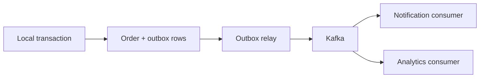

# Observer Pattern in Spring

<DocLabels items={[{label: 'Interview priority', tone: 'advanced'}, {label: 'Behavioral', tone: 'foundation'}, {label: 'Events', tone: 'production'}]} />

Observer lets a publisher announce a fact without knowing every interested
subscriber. Spring application events provide an in-process implementation.

## Publish a Fact, Not an Instruction

```java
public record OrderConfirmed(
        UUID orderId,
        String customerEmail,
        Instant occurredAt
) {}

@Service
final class OrderService {
    private final ApplicationEventPublisher events;

    @Transactional
    public Order confirm(ConfirmOrder command) {
        Order order = confirmAndSave(command);
        events.publishEvent(new OrderConfirmed(
                order.id(), order.customerEmail(), Instant.now()));
        return order;
    }
}
```

The event name states something that happened. `SendOrderEmail` would be a
command and would couple the publisher to one reaction.

## Select the Transaction Phase

```java
@Component
final class ConfirmationEmailListener {
    @TransactionalEventListener(phase = TransactionPhase.AFTER_COMMIT)
    public void on(OrderConfirmed event) {
        emailGateway.sendConfirmation(event.orderId(), event.customerEmail());
    }
}
```

| Listener | Timing | Use carefully because |
|---|---|---|
| `@EventListener` | normally synchronous at publication | failure can propagate into publisher flow |
| `BEFORE_COMMIT` | before transaction commits | listener work can still cause rollback |
| `AFTER_COMMIT` | only after a successful commit | follow-up database writes need a new transaction |
| `AFTER_ROLLBACK` | after rollback | useful for local cleanup or diagnostics |
| `AFTER_COMPLETION` | after either outcome | outcome-specific behavior is less explicit |

An `@Async` listener changes threading and error propagation; it does not make the
event durable. Configure the executor, context propagation, rejection policy, and
exception handling deliberately.

## In-Process Events Versus Messaging

Spring application events are not automatically stored, replayable, or delivered
after a process crash. For a critical cross-service event, persist business state
and an outbox record in one local transaction, then relay the outbox record to
Kafka or another broker.



<DocCallout type="mistake" title="Events can hide essential workflow">

Do not use an event listener for a step required to complete the caller's use
case unless its consistency and failure semantics are explicit. Invisible chains
of listeners make ownership and debugging difficult.

</DocCallout>

## Testing and Operations

- Unit-test listener behavior as a normal method.
- Use `@RecordApplicationEvents` or a test listener to verify publication.
- Integration-test commit and rollback phases with a real transaction boundary.
- Make external side effects idempotent because retries and duplicates occur in
  durable messaging.
- Include event type, aggregate identifier, and correlation identifier in logs.

## Interview-Ready Answer

> Observer decouples a publisher from multiple reactions. In Spring I use typed
> application events for non-durable in-process collaboration and choose the
> transaction phase explicitly. `AFTER_COMMIT` prevents acting on rolled-back
> state, but it still is not durable. For critical cross-service delivery I use a
> transactional outbox and broker, plus idempotent consumers.

## Related Patterns

- [Chain of Responsibility](./chain-of-responsibility.md) processes ordered
  handlers; Observer broadcasts to independent listeners.
- [Adapter](./adapter.md) should isolate the broker or email provider API.

## Official References

- [Spring application events](https://docs.spring.io/spring-framework/reference/core/beans/context-introduction.html#context-functionality-events)
- [Spring transaction-bound events](https://docs.spring.io/spring-framework/reference/data-access/transaction/event.html)
