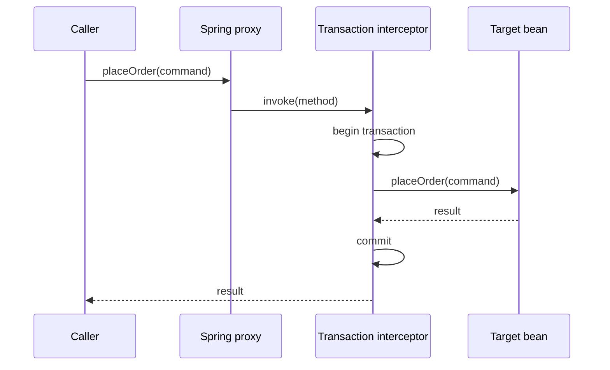

# Proxy Pattern in Spring

<DocLabels items={[{label: 'Interview priority', tone: 'advanced'}, {label: 'Structural', tone: 'foundation'}, {label: 'Spring AOP', tone: 'production'}]} />

A proxy is a substitute that controls access to a target while preserving a
compatible API. Spring uses proxies to apply cross-cutting behavior around method
calls without putting that behavior in domain code.



## Where It Appears

- `@Transactional` opens, commits, or rolls back a transaction.
- `@Cacheable` checks and populates a cache.
- `@PreAuthorize` evaluates authorization before invocation.
- `@Async` submits work to an executor.
- custom Spring AOP advice records metrics or enforces policy.

The bean injected into collaborators is normally the proxy; the target remains
behind it.

## JDK and Class-Based Proxies

| Proxy style | Mechanism | Important limit |
|---|---|---|
| JDK dynamic proxy | implements target interfaces | callers interact through an interface |
| class-based proxy | subclasses the concrete class | `final` classes/methods cannot be overridden |

Do not design business APIs around a proxy implementation detail. Constructor
injection and non-final interceptable boundaries keep the design predictable.

## The Self-Invocation Trap

```java
@Service
class CheckoutService {
    void checkout() {
        persistOrder(); // direct call on this; proxy is bypassed
    }

    @Transactional
    void persistOrder() { /* database writes */ }
}
```

The internal call never re-enters the proxy, so advice on `persistOrder` does not
run. Extract the transactional operation into a separate bean with a meaningful
boundary:

```java
@Service
final class OrderWriter {
    @Transactional
    public Order persist(CreateOrder command) { /* ... */ }
}
```

Other common surprises include private methods, constructing the class with
`new`, tests that instantiate the target directly, and exception handling that
prevents the transaction interceptor from seeing a failure.

<DocCallout type="production" title="Annotations describe an interception boundary">

When reviewing `@Transactional`, `@Async`, or `@Cacheable`, ask who calls the
method, whether the call crosses the proxy, which interceptor runs first, and what
happens on failure. The annotation alone does not prove runtime behavior.

</DocCallout>

## Proxy Versus Decorator

Their structures can be identical. Intent distinguishes them: a Proxy manages
access, location, lifecycle, or interception; a [Decorator](./decorator.md)
explicitly composes additional responsibility. Spring AOP can produce behavior
that feels decorator-like while being implemented with a proxy.

## Testing

Use a Spring integration test when the behavior depends on proxy creation. Assert
the observable result: rollback, cache hit, denied access, or execution thread.
Calling a Mockito spy or a directly constructed service does not verify Spring
interception.

## Interview-Ready Answer

> Spring usually wraps eligible beans in JDK or class-based proxies. Calls that
> cross the proxy pass through interceptors for transactions, caching, security,
> or async execution before reaching the target. Self-invocation and private
> methods bypass proxy interception, so I place annotations on meaningful public
> bean boundaries and verify the behavior with an integration test.

## Related Patterns

- [Decorator](./decorator.md) adds explicit, composable responsibility.
- [Chain of Responsibility](./chain-of-responsibility.md) resembles the ordered
  interceptor chain a proxy invokes.

## Official References

- [Spring AOP proxying mechanisms](https://docs.spring.io/spring-framework/reference/core/aop/proxying.html)
- [Spring transaction declarative annotations](https://docs.spring.io/spring-framework/reference/data-access/transaction/declarative/annotations.html)
