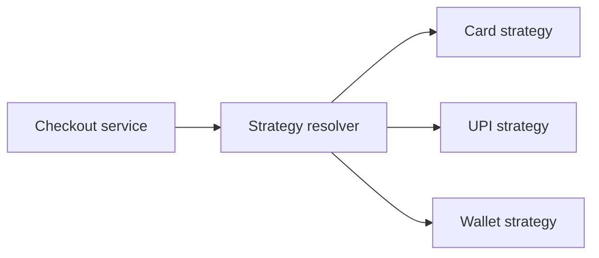

# Strategy Pattern in Spring

<DocLabels items={[{label: 'Interview priority', tone: 'advanced'}, {label: 'Behavioral', tone: 'foundation'}, {label: 'Spring', tone: 'production'}]} />

Strategy encapsulates interchangeable algorithms behind one contract. The caller
states **what** it needs; a selected strategy decides **how** to do it.

## Recognize the Problem

Use Strategy when a growing `if` or `switch` selects algorithms that change
independently—for example card, UPI, and wallet payment processing. Do not use it
for two tiny branches that are unlikely to grow.



## Spring Implementation

Use a domain key instead of coupling business input to Spring bean names:

```java
public enum PaymentMethod { CARD, UPI, WALLET }

public interface PaymentStrategy {
    PaymentMethod supports();
    PaymentResult pay(PaymentCommand command);
}

@Component
final class CardPaymentStrategy implements PaymentStrategy {
    public PaymentMethod supports() { return PaymentMethod.CARD; }

    public PaymentResult pay(PaymentCommand command) {
        return PaymentResult.authorized("card-reference");
    }
}
```

Build the registry once and reject duplicate keys during startup:

```java
@Component
final class PaymentStrategyRegistry {
    private final Map<PaymentMethod, PaymentStrategy> strategies;

    PaymentStrategyRegistry(List<PaymentStrategy> candidates) {
        this.strategies = candidates.stream().collect(Collectors.toUnmodifiableMap(
                PaymentStrategy::supports,
                Function.identity()
        ));
    }

    PaymentStrategy required(PaymentMethod method) {
        return Optional.ofNullable(strategies.get(method))
                .orElseThrow(() -> new UnsupportedPaymentMethod(method));
    }
}
```

The context coordinates the use case but does not contain provider algorithms:

```java
@Service
final class PaymentService {
    private final PaymentStrategyRegistry registry;

    PaymentResult pay(PaymentCommand command) {
        return registry.required(command.method()).pay(command);
    }
}
```

## Runtime and Design Decisions

- Constructor injection discovers all strategy beans at startup.
- An enum or value object provides a refactor-safe key.
- A missing strategy is a boundary error; translate it to a stable API response.
- Strategies may have different infrastructure dependencies, but must honor the
  same semantic contract.
- Put retry or transaction policy at a deliberate boundary; do not copy it into
  every strategy.

<DocCallout type="mistake" title="A registry is not automatically extensible">

A resolver containing a new `switch` for every strategy only relocates the
original branching. Prefer registration by metadata and fail fast on duplicate
keys.

</DocCallout>

## Testing

Unit-test each algorithm against shared contract cases. Test the registry for a
known key, an unknown key, and duplicate registration. Add one Spring integration
test to prove component discovery; a full application context test per strategy is
usually unnecessary.

## Framework Examples

Spring exposes strategy-shaped extension points such as `AuthenticationProvider`,
`HttpMessageConverter`, `HandlerMethodArgumentResolver`, and `CacheManager`.
Spring often injects an ordered list and asks each implementation whether it
supports the current request.

## Interview-Ready Answer

> Strategy replaces runtime algorithm branching with interchangeable
> implementations behind one interface. In Spring I register implementations as
> beans, inject them into a list, build an immutable domain-keyed registry, and
> fail fast on duplicate keys. It improves independent testing and extension, but
> it adds classes and is unnecessary for stable, trivial branches.

## Related Patterns

- [Factory](./factory.md) creates or returns the selected object; Strategy performs
  the selected behavior.
- [Template Method](./template-method.md) varies steps through inheritance;
  Strategy favors composition and runtime replacement.
- [Chain of Responsibility](./chain-of-responsibility.md) may run several handlers;
  Strategy normally selects one algorithm.

## Official References

- [Spring dependency injection](https://docs.spring.io/spring-framework/reference/core/beans/dependencies/factory-collaborators.html)
- [Spring extension points](https://docs.spring.io/spring-framework/reference/core/beans/factory-extension.html)
