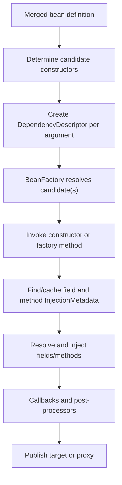

# Spring Autowiring And Circular Reference Internals

<DocLabels items={[
  {label: 'Dependency resolution', tone: 'advanced'},
  {label: 'Container internals', tone: 'intermediate'},
  {label: 'Failure diagnosis', tone: 'production'},
]} />

`@Autowired` is processed during bean creation. Spring discovers injection
metadata, resolves dependencies from bean definitions, injects them, and
publishes the resulting bean or proxy.

## Core Runtime Types

| Type | Responsibility |
|---|---|
| `AutowiredAnnotationBeanPostProcessor` | discovers autowired constructors, fields and methods and performs injection |
| `InjectionMetadata` | cached injectable field/method description for a class |
| `DependencyDescriptor` | type, generics, annotations, name and required/optional metadata for one dependency |
| `DefaultListableBeanFactory` | owns definitions, finds candidates and resolves dependencies |
| `AutowireCandidateResolver` | interprets qualifier, lazy and candidate metadata |
| `BeanPostProcessor` | participates around initialization and may publish a proxy |

These helpers are internal APIs. Learn ownership and evidence rather than calling
them from application code.

## Constructor And Member Injection Flow



Constructor dependencies are resolved before the object exists. Field and method
injection occurs after instantiation during property population. This is why a
constructor cycle has no instance that can be exposed early. With one constructor,
Spring can select it without `@Autowired`.

## Dependency Resolution Pipeline

For one required dependency, the bean factory conceptually:

1. handles special resolvable dependencies and lazy/optional wrappers;
2. reads raw and generic type from `DependencyDescriptor`;
3. finds type-compatible bean names;
4. removes candidates rejected by autowire-candidate or qualifier rules;
5. selects a primary candidate when exactly one applies;
6. considers supported priority/fallback rules;
7. may use the injection-point name as a final fallback;
8. returns one candidate, an aggregate, absence for optional input, or throws.

The precise tie-breaking implementation is version-sensitive. Treat
`@Qualifier` as semantic narrowing and `@Primary` as an application-wide default;
do not route business behavior through accidental parameter names.

| Outcome | Typical result |
|---|---|
| no required candidate | `NoSuchBeanDefinitionException` or unsatisfied-dependency wrapper |
| several candidates remain | `NoUniqueBeanDefinitionException` |
| candidate creation fails | `BeanCreationException` with nested cause |
| active creation path loops | `BeanCurrentlyInCreationException` |

## Injection Style Decision Table

| Style | Appropriate use | Main risk |
|---|---|---|
| single constructor | required immutable collaborators | exposes real design cycles, which is desirable |
| field `@Autowired` | framework integration or legacy code | hidden mutable dependency and reflection-heavy tests |
| setter `@Autowired` | deliberately replaceable/optional collaborator | temporarily incomplete object; hides ownership cycles |
| arbitrary autowired method | inject a related dependency set atomically | less visible contract than constructor |
| `@Bean` method parameter | explicit third-party/infrastructure factory | oversized configuration/service locator |
| `Optional<T>` | one eagerly resolved optional capability | can hide required configuration errors |
| `ObjectProvider<T>` | deferred, scoped, ordered or optional lookup | service-locator misuse and hidden cycles |
| `List<T>` / `Set<T>` | every strategy/handler participates | ordering and uniqueness need a contract |
| `Map<String,T>` | internal strategy registry | bean names leaking into business/untrusted input |

```java
@Service
final class CheckoutCoordinator {
    CheckoutCoordinator(
            @Qualifier("primaryPayment") PaymentGateway gateway,
            List<FraudRule> rules) {
        // copy/store required dependencies
    }
}

@Bean
OrderFactory orderFactory(Clock clock, ObjectProvider<AuditPublisher> audit) {
    return new OrderFactory(clock, audit.getIfAvailable());
}
```

## By Type Name And Qualifier

`@Autowired` is type/generic driven, then candidate rules narrow the set. An
injection-point name can be a fallback when candidates tie, but renaming a
parameter should not silently choose a critical strategy.

`@Qualifier("card")` narrows type-compatible candidates using qualifier metadata;
it is not universally identical to raw bean-name lookup. `@Resource(name = "...")`,
processed by common-annotation infrastructure, has different name-oriented
semantics. Document which model the codebase uses.

## Why Circular Dependencies Occur

```text
OrderService constructor -> PaymentService constructor -> OrderService
```

Neither constructor can run first. Refactor by moving orchestration to a third
owner, reversing/narrowing a dependency, passing required data as a method
argument, or publishing an event when asynchronous ownership fits. Changing a
class to an interface does not break the runtime cycle when the same beans still
depend on each other.

## Three-Level Singleton Exposure

The singleton registry conceptually tracks:

| Registry | Meaning |
|---|---|
| `singletonObjects` | fully created, published singleton instances |
| `earlySingletonObjects` | early reference already materialized for a current cycle |
| `singletonFactories` | factories capable of producing an early reference, including an early proxy where supported |

For some setter/field cycles, Spring can instantiate A, register an early-reference
factory, begin B, inject early A into B, finish B, then finish A. This does not
make the design safe:

- B can observe A before initialization completes;
- identity can diverge if one participant receives a raw target and others a proxy;
- transaction, cache, async or security advice may be absent;
- lifecycle and cleanup become creation-order dependent;
- constructor cycles remain impossible because no instance exists to expose.

Post-processors can participate in early proxy creation, but not every custom
processor/lifecycle can guarantee consistent identity. Early exposure is a
framework compatibility mechanism, not an application design primitive.

## Boot Circular-Reference Policy

Modern Boot rejects circular references by default. A compatibility property may
allow some resolvable cycles:

```properties
spring.main.allow-circular-references=true
```

Do not make this a permanent fix. It cannot solve constructor cycles, can surface
raw/proxy identity problems and makes startup order-sensitive. If temporarily
enabled for migration, record the exact cycle, owner, removal date and a test
proving required advice is present.

`@Lazy` or `ObjectProvider` is valid when deferred availability is the actual
lifecycle contract. Using it only to hide mutual synchronous ownership leaves the
cycle intact.

## Cycle Diagnosis Procedure

1. Start from the deepest cycle/dependency-path exception.
2. Draw bean edges with injection point, type, qualifier and lazy status.
3. Mark constructor edges, factory calls, configuration proxies and processors.
4. Identify the true orchestration/data owner before changing injection style.
5. Check whether transactions, caching, async, validation or security require a proxy.
6. Refactor one edge and rerun a focused context test.
7. Assert selected identity and required advice, not only that startup succeeds.
8. Add architecture/dependency tests to prevent recurrence.

## Ambiguity Diagnosis Procedure

For `NoUniqueBeanDefinitionException`, capture the required raw/generic type,
injection annotations/name, every candidate's qualifiers/primary/fallback/profile,
factory product type, test/auto-configuration origin and condition report.

Use a semantic qualifier when callers need different strategies, one `@Primary`
for a real default, collections when all implementations participate, and
profiles/conditions only when availability truly depends on environment/config.

## Official References

- [Spring Autowired](https://docs.spring.io/spring-framework/reference/core/beans/annotation-config/autowired.html)
- [Spring Qualifiers](https://docs.spring.io/spring-framework/reference/core/beans/annotation-config/autowired-qualifiers.html)
- [Spring Dependencies](https://docs.spring.io/spring-framework/reference/core/beans/dependencies/factory-collaborators.html)
- [Spring Container Extension Points](https://docs.spring.io/spring-framework/reference/core/beans/factory-extension.html)

## Recommended Next

Place resolution in the full refresh protocol with [Spring Container Runtime For Architects](../../spring/SPRING-CONTAINER-ARCHITECT.md).
