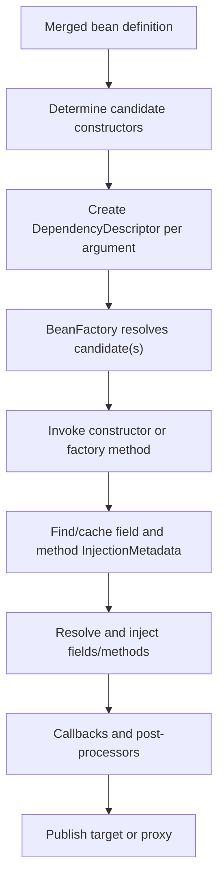

# Spring Autowiring, Injection Types, Ambiguity, And Circular Dependencies

<DocLabels items={[
  {label: 'Dependency resolution', tone: 'advanced'},
  {label: 'Container internals', tone: 'intermediate'},
  {label: 'Failure diagnosis', tone: 'production'},
]} />

`@Autowired` is processed during bean creation. Spring discovers injection
metadata, resolves dependencies from bean definitions, injects them, and
publishes the resulting bean or proxy.

## Core Runtime Types

| Type | Responsibility |
|---|---|
| `AutowiredAnnotationBeanPostProcessor` | discovers autowired constructors, fields and methods and performs injection |
| `InjectionMetadata` | cached injectable field/method description for a class |
| `DependencyDescriptor` | type, generics, annotations, name and required/optional metadata for one dependency |
| `DefaultListableBeanFactory` | owns definitions, finds candidates and resolves dependencies |
| `AutowireCandidateResolver` | interprets qualifier, lazy and candidate metadata |
| `BeanPostProcessor` | participates around initialization and may publish a proxy |

These helpers are internal APIs. Learn ownership and evidence rather than calling
them from application code.

## Constructor And Member Injection Flow


```mermaid
flowchart TD
    DEF["Merged bean definition"] --> CTOR["Determine candidate constructors"]
    CTOR --> DESC["Create DependencyDescriptor per argument"]
    DESC --> RESOLVE["BeanFactory resolves candidate(s)"]
    RESOLVE --> NEW["Invoke constructor or factory method"]
    NEW --> META["Find/cache field and method InjectionMetadata"]
    META --> POPULATE["Resolve and inject fields/methods"]
    POPULATE --> INIT["Callbacks and post-processors"]
    INIT --> PUBLISH["Publish target or proxy"]
```

Constructor dependencies are resolved before the object exists. Field and method
injection occurs after instantiation during property population. This is why a
constructor cycle has no instance that can be exposed early. With one constructor,
Spring can select it without `@Autowired`.

## Dependency Resolution Pipeline

For one required dependency, the bean factory conceptually:

1. handles special resolvable dependencies and lazy/optional wrappers;
2. reads raw and generic type from `DependencyDescriptor`;
3. finds type-compatible bean names;
4. removes candidates rejected by autowire-candidate or qualifier rules;
5. selects a primary candidate when exactly one applies;
6. considers supported priority/fallback rules;
7. may use the injection-point name as a final fallback;
8. returns one candidate, an aggregate, absence for optional input, or throws.

The precise tie-breaking implementation is version-sensitive. Treat
`@Qualifier` as semantic narrowing and `@Primary` as an application-wide default;
do not route business behavior through accidental parameter names.

| Outcome | Typical result |
|---|---|
| no required candidate | `NoSuchBeanDefinitionException` or unsatisfied-dependency wrapper |
| several candidates remain | `NoUniqueBeanDefinitionException` |
| candidate creation fails | `BeanCreationException` with nested cause |
| active creation path loops | `BeanCurrentlyInCreationException` |

## Injection Style Decision Table

| Style | Appropriate use | Main risk |
|---|---|---|
| single constructor | required immutable collaborators | exposes real design cycles, which is desirable |
| field `@Autowired` | framework integration or legacy code | hidden mutable dependency and reflection-heavy tests |
| setter `@Autowired` | deliberately replaceable/optional collaborator | temporarily incomplete object; hides ownership cycles |
| arbitrary autowired method | inject a related dependency set atomically | less visible contract than constructor |
| `@Bean` method parameter | explicit third-party/infrastructure factory | oversized configuration/service locator |
| `Optional<T>` | one eagerly resolved optional capability | can hide required configuration errors |
| `ObjectProvider<T>` | deferred, scoped, ordered or optional lookup | service-locator misuse and hidden cycles |
| `List<T>` / `Set<T>` | every strategy/handler participates | ordering and uniqueness need a contract |
| `Map<String,T>` | internal strategy registry | bean names leaking into business/untrusted input |

```java
@Service
final class CheckoutCoordinator {
    CheckoutCoordinator(
            @Qualifier("primaryPayment") PaymentGateway gateway,
            List<FraudRule> rules) {
        // copy/store required dependencies
    }
}

@Bean
OrderFactory orderFactory(Clock clock, ObjectProvider<AuditPublisher> audit) {
    return new OrderFactory(clock, audit.getIfAvailable());
}
```

## Autowiring Types With Examples

### Constructor Injection: Required Dependencies

```java
@Service
final class OrderService {
    private final OrderRepository orders;
    private final PaymentGateway payments;

    OrderService(OrderRepository orders, PaymentGateway payments) {
        this.orders = orders;
        this.payments = payments;
    }
}
```

A single constructor does not need `@Autowired`. This is the default for required collaborators:
the object cannot exist incompletely, fields can be final, tests can construct it directly, and a
cycle is exposed immediately.

### Setter Or Method Injection: Truly Optional/Reconfigurable Input

```java
@Autowired(required = false)
void setAuditPublisher(AuditPublisher publisher) {
    this.publisher = publisher;
}
```

Use sparingly. The object must remain valid when the method is never called. Setter injection is not
a sound way to hide a required constructor cycle.

### Field Injection: Supported But Usually Avoided

```java
@Autowired
private OrderRepository orders;
```

Field injection hides the construction contract, prevents final fields, encourages reflection-based
tests, and makes manual construction invalid. It remains useful in narrow framework-managed legacy
cases, but constructor injection should be the application default.

### Collection And Generic Injection

```java
CheckoutService(List<FraudRule> rules, Map<String, PaymentGateway> gateways) {
    this.rules = List.copyOf(rules);
    this.gateways = Map.copyOf(gateways);
}
```

Spring injects all matching beans. Use `@Order` or `Ordered` only when handler order is part of the
contract. The map keys are bean names; do not expose them directly as untrusted business input.
Generic types can narrow candidates, such as `Repository<Order>` versus `Repository<Customer>`.

### Deferred And Scoped Injection

```java
ReportService(ObjectProvider<ReportWorkspace> workspaces) {
    this.workspaces = workspaces;
}
```

Use `ObjectProvider` for deliberate deferred, optional, ordered, or repeated scoped lookup. `@Lazy`
injects a proxy that resolves the target on first use. Both can hide failures until runtime, so they
should represent a real lifecycle requirement rather than conceal poor ownership.

## By Type Name And Qualifier

`@Autowired` is type/generic driven, then candidate rules narrow the set. An
injection-point name can be a fallback when candidates tie, but renaming a
parameter should not silently choose a critical strategy.

`@Qualifier("card")` narrows type-compatible candidates using qualifier metadata;
it is not universally identical to raw bean-name lookup. `@Resource(name = "...")`,
processed by common-annotation infrastructure, has different name-oriented
semantics. Document which model the codebase uses.

## Why Circular Dependencies Occur

```text
OrderService constructor -> PaymentService constructor -> OrderService
```

Neither constructor can run first. Refactor by moving orchestration to a third
owner, reversing/narrowing a dependency, passing required data as a method
argument, or publishing an event when asynchronous ownership fits. Changing a
class to an interface does not break the runtime cycle when the same beans still
depend on each other.

## Three-Level Singleton Exposure

The singleton registry conceptually tracks:

| Registry | Meaning |
|---|---|
| `singletonObjects` | fully created, published singleton instances |
| `earlySingletonObjects` | early reference already materialized for a current cycle |
| `singletonFactories` | factories capable of producing an early reference, including an early proxy where supported |

For some setter/field cycles, Spring can instantiate A, register an early-reference
factory, begin B, inject early A into B, finish B, then finish A. This does not
make the design safe:

- B can observe A before initialization completes;
- identity can diverge if one participant receives a raw target and others a proxy;
- transaction, cache, async or security advice may be absent;
- lifecycle and cleanup become creation-order dependent;
- constructor cycles remain impossible because no instance exists to expose.

Post-processors can participate in early proxy creation, but not every custom
processor/lifecycle can guarantee consistent identity. Early exposure is a
framework compatibility mechanism, not an application design primitive.

## Boot Circular-Reference Policy

Modern Boot rejects circular references by default. A compatibility property may
allow some resolvable cycles:

```properties
spring.main.allow-circular-references=true
```

Do not make this a permanent fix. It cannot solve constructor cycles, can surface
raw/proxy identity problems and makes startup order-sensitive. If temporarily
enabled for migration, record the exact cycle, owner, removal date and a test
proving required advice is present.

`@Lazy` or `ObjectProvider` is valid when deferred availability is the actual
lifecycle contract. Using it only to hide mutual synchronous ownership leaves the
cycle intact.

## Cycle Diagnosis Procedure

1. Start from the deepest cycle/dependency-path exception.
2. Draw bean edges with injection point, type, qualifier and lazy status.
3. Mark constructor edges, factory calls, configuration proxies and processors.
4. Identify the true orchestration/data owner before changing injection style.
5. Check whether transactions, caching, async, validation or security require a proxy.
6. Refactor one edge and rerun a focused context test.
7. Assert selected identity and required advice, not only that startup succeeds.
8. Add architecture/dependency tests to prevent recurrence.

## Ambiguity Diagnosis Procedure

For `NoUniqueBeanDefinitionException`, capture the required raw/generic type,
injection annotations/name, every candidate's qualifiers/primary/fallback/profile,
factory product type, test/auto-configuration origin and condition report.

Use a semantic qualifier when callers need different strategies, one `@Primary`
for a real default, collections when all implementations participate, and
profiles/conditions only when availability truly depends on environment/config.

## Fixing Autowiring Ambiguity

Given two implementations:

```java
@Component("stripeGateway")
final class StripeGateway implements PaymentGateway {}

@Component("walletGateway")
final class WalletGateway implements PaymentGateway {}
```

Choose a fix from the meaning of the dependency:

| Intent | Correct mechanism |
|---|---|
| one implementation is the genuine application default | mark exactly one `@Primary` |
| this injection point requires a semantic variant | use `@Qualifier("stripeGateway")` or a custom qualifier |
| every implementation participates | inject `List<PaymentGateway>` |
| choose at runtime from trusted domain key | build an explicit registry with duplicate/unknown validation |
| implementation exists only under configuration/environment | `@Conditional...` or profile, with condition tests |
| bean should not be an autowire candidate | set `autowireCandidate=false` where configuration owns it |

```java
@Target({FIELD, PARAMETER, METHOD, TYPE})
@Retention(RUNTIME)
@Qualifier
public @interface CardPayments {}

@CardPayments
@Component
final class StripeGateway implements PaymentGateway {}

CheckoutService(@CardPayments PaymentGateway gateway) {
    this.gateway = gateway;
}
```

Custom qualifiers avoid coupling domain meaning to a class or arbitrary bean name. Do not solve
ambiguity by renaming a constructor parameter and relying on name fallback for critical behavior.

<ExpandableAnswer title="Dry run: how Spring resolves an ambiguous PaymentGateway">

1. Spring builds a `DependencyDescriptor` containing `PaymentGateway`, generics, annotations, name,
   and required status.
2. The bean factory finds `stripeGateway` and `walletGateway` by assignable type.
3. Qualifier metadata removes nonmatching candidates.
4. If several remain, one valid primary or priority candidate may win.
5. With no unique winner, resolution fails with `NoUniqueBeanDefinitionException`; Spring does not
   randomly select a bean.
6. Add a semantic qualifier for point-specific meaning, or one primary only when a global default
   really exists.

</ExpandableAnswer>

## Fixing Circular Dependencies Architecturally

### Extract The Workflow Owner

```java
// Before: OrderService -> PaymentService -> OrderService

@Service
final class CheckoutCoordinator {
    private final OrderService orders;
    private final PaymentService payments;

    CheckoutResult checkout(CheckoutCommand command) {
        Order order = orders.prepare(command);
        Payment payment = payments.authorize(order.paymentRequest());
        return orders.confirm(order.id(), payment.reference());
    }
}
```

`OrderService` and `PaymentService` now own cohesive capabilities; the coordinator owns sequencing.
Other valid fixes are passing required data as a method argument, extracting a smaller read-only
port, reversing an incorrectly directed dependency, or publishing a fact when eventual consistency
and asynchronous ownership are genuinely acceptable.

### Temporary Mechanisms And Their Limits

| Mechanism | When legitimate | Why it is not the architectural fix |
|---|---|---|
| `@Lazy` | dependency is truly deferred/expensive | cycle still exists and failure moves to first call |
| `ObjectProvider` | optional/scoped/repeated lookup | hides dependency and can become service locator |
| setter injection | collaborator is genuinely optional | permits incomplete state and early references |
| allow circular references property | time-bounded legacy migration | proxy identity and initialization hazards remain |
| application event | optional or asynchronous reaction to a fact | wrong for a required synchronous return value |

<ExpandableAnswer title="Dry run: constructor cycle and the correct fix">

1. Creating `OrderService` requires a complete `PaymentService`.
2. Creating `PaymentService` requires a complete `OrderService`.
3. Neither instance exists, so there is no early object Spring can inject.
4. Switching to fields may allow early singleton exposure in some cases but creates a partially
   initialized graph and possible raw/proxy mismatch.
5. Extracting `CheckoutCoordinator` removes both reverse edges and gives the workflow one owner.
6. A context test proves startup, and an architecture test prevents the dependency cycle returning.

</ExpandableAnswer>

## Code Explanation And Tests

<ExpandableAnswer title="Why constructor injection is the safest default">

The constructor lists every required collaborator, allows final fields, and produces a usable object
in both production and plain unit tests. It also makes dependency cycles fail at startup instead of
leaving a partially initialized instance. Optional or deferred behavior should be explicit in its
type or provider, not hidden in nullable fields.

</ExpandableAnswer>

```java
@SpringBootTest
class WiringTest {
    @Autowired ApplicationContext context;

    @Test
    void cardGatewayIsTheSelectedSemanticCandidate() {
        CheckoutService service = context.getBean(CheckoutService.class);
        assertThat(AopUtils.getTargetClass(service.gateway()))
            .isEqualTo(StripeGateway.class);
    }
}
```

Add focused context tests for qualifier choice, missing candidates, duplicate candidates, collection
order, proxy presence, conditional configuration, and absence of cycles. Unit tests alone do not
exercise container resolution.

## Interview Questions

<ExpandableAnswer title="What injection type should be the default?">

Single-constructor injection for required dependencies. It makes the contract explicit, supports
final fields and ordinary tests, and exposes cycles. Use setters, providers, or lazy proxies only
when optionality or lifecycle genuinely requires them.

</ExpandableAnswer>

<ExpandableAnswer title="How do @Primary and @Qualifier differ?">

`@Primary` identifies the default among multiple candidates. `@Qualifier` semantically narrows the
candidates for a particular injection point. Prefer a qualifier when two variants are intentionally
used for different purposes; use primary only when one real default exists.

</ExpandableAnswer>

<ExpandableAnswer title="Does changing a circular dependency to field injection fix it?">

No. It may let Spring expose an early singleton reference for some cycles, but ownership remains
cyclic and the bean can be observed before initialization or without its final proxy. Refactor the
dependency graph.

</ExpandableAnswer>

<ExpandableAnswer title="When is @Lazy appropriate in dependency injection?">

When delayed creation or access is an intentional lifecycle contract, such as an expensive optional
capability. It is not a general circular-dependency fix because it defers resolution and failure
rather than removing the cycle.

</ExpandableAnswer>

## Official References

- [Spring Autowired](https://docs.spring.io/spring-framework/reference/core/beans/annotation-config/autowired.html)
- [Spring Qualifiers](https://docs.spring.io/spring-framework/reference/core/beans/annotation-config/autowired-qualifiers.html)
- [Spring Dependencies](https://docs.spring.io/spring-framework/reference/core/beans/dependencies/factory-collaborators.html)
- [Spring Container Extension Points](https://docs.spring.io/spring-framework/reference/core/beans/factory-extension.html)

## Recommended Next

Place resolution in the full refresh protocol with [Spring Container Runtime For Architects](../../spring/SPRING-CONTAINER-ARCHITECT.md).
