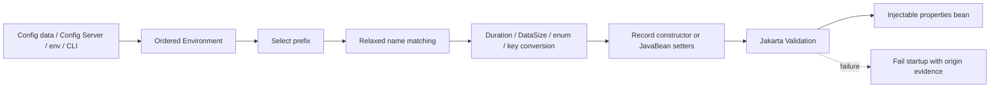

# Spring Boot 4 Configuration Properties

<DocLabels items={[
  {label: 'Intermediate', tone: 'intermediate'},
  {label: 'Typed configuration', tone: 'foundation'},
  {label: 'Secrets and rollout', tone: 'production'},
  {label: 'Shopverse examples', tone: 'shopverse'},
]} />

`@ConfigurationProperties` turns external text into a grouped, typed, validated
startup contract. It does not make a value secret, dynamically refreshable, or safe
to change across mixed application versions by itself.

## Binding Pipeline



Later property sources can override earlier ones. Diagnose the winning value and
origin, not only the YAML file a developer expected to win.

## Immutable Record Binding

```yaml
shopverse:
  inventory:
    reservation-ttl: 5m
    expiry-scan-delay-ms: 30000
```

```java
@Validated
@ConfigurationProperties("shopverse.inventory")
public record InventoryProperties(
        @NotNull Duration reservationTtl,
        @Positive long expiryScanDelayMs
) {}
```

Records bind through their canonical constructor when registered with scanning or
`@EnableConfigurationProperties`. Relaxed binding maps `reservation-ttl` to
`reservationTtl`, and Boot conversion turns `5m` into a `Duration`.

```java
@SpringBootApplication
@ConfigurationPropertiesScan
class InventoryServiceApplication {}
```

Use `@EnableConfigurationProperties(ThirdPartyProperties.class)` in focused
configuration/auto-configuration when broad package scanning is not appropriate.

<DocCallout type="shopverse" title="Current immutable contracts">

Inventory uses a validated record for reservation TTL and scan delay; Payment uses
a validated `BigDecimal` approval limit; Order, Inventory, and Payment use records
for Kafka topic names. Auth registers an RSA key record explicitly. These are
current code paths.

</DocCallout>

## Constructor Versus Mutable JavaBean

| Immutable constructor/record | Mutable JavaBean binding |
|---|---|
| complete value created once | no-arg object populated through setters |
| final state and explicit required values | convenient defaults and incremental binding |
| straightforward equality/testing | can support third-party bean binding |
| consumers cannot mutate shared config | setters remain callable after binding |

Prefer immutable records for application configuration. Mutable classes remain
useful in reusable starters when defaults, compatibility setters, or derived accessors
are required.

<DocCallout type="shopverse" title="Current starter trade-off">

Outbox and Kafka-recovery starters currently use mutable property classes with
defaults and derived `Duration` accessors. That is an intentional compatibility
style, not proof that configuration changes live after startup.

</DocCallout>

If a class has several constructors, select the intended binding constructor
explicitly. Do not make a configuration-properties class a general Spring component
that also injects service beans; keep it focused on environment values.

## Nested Values And Validation

```java
@Validated
@ConfigurationProperties("shopverse.payment")
public record PaymentProperties(
        @DecimalMin("0.01") BigDecimal approvalLimit,
        @Valid Provider provider
) {
    public record Provider(
            @NotNull Duration connectTimeout,
            @NotNull Duration readTimeout
    ) {}
}
```

Validate ranges and relationships at startup. For cross-field rules such as
`connectTimeout < readTimeout`, add a constructor invariant or class-level
constraint with a clear message. Decide whether a missing nested object is optional
or invalid; do not rely on a later null failure.

## Precedence And Diagnostics

Boot combines defaults, packaged and external config data, profile documents,
environment variables, system properties, command-line arguments, and test sources
in a defined order. Shopverse services import Config Server optionally, so local
files can start a service even when remote configuration is absent.

<DocCallout type="production" title="Optional import changes failure policy">

`optional:configserver:` means Config Server absence does not stop startup. Every
mandatory property therefore needs a safe local/default source or startup validation
that fails rather than silently using an unsafe value.

</DocCallout>

Use binding exceptions, the condition report, and tightly secured Actuator `env` or
`configprops` diagnostics to identify origin. Never expose those endpoints publicly;
their output can reveal configuration structure and sensitive values even when
sanitization is enabled.

## Secrets Are References, Not Metadata

Bind secrets only from environment-specific secret stores, mounted config trees, or
Vault-like systems. Do not put secret defaults, private keys, passwords, or tokens in
configuration metadata, logs, exception messages, or source-controlled production
files.

Shopverse database passwords already require environment variables. Inventory has a
development default for its MinIO secret; production deployment must override it and
should reject the known development value.

Secret rotation needs overlap: make clients trust old and new credentials, switch
writers/clients, observe authentication, then revoke old material. A new bound string
does not automatically rebuild an existing datasource, HTTP client, signer, or pool.

## Configuration Metadata

```gradle
annotationProcessor 'org.springframework.boot:spring-boot-configuration-processor'
```

It generates `META-INF/spring-configuration-metadata.json` for IDE completion, not
runtime binding. Shopverse platform starters declare it; application modules should
add it when they own public property contracts.

## Refresh And Compatibility Rollout

Standard singleton property beans remain as bound until their bean/context is
recreated. Mutable setters do not make them a dynamic configuration service. If
Spring Cloud refresh scope or programmatic rebinding is introduced, prove which bean
is recreated, whether consumers see the new instance, and whether owned resources
are safely rebuilt.

For a property rename or type change:

1. accept old and new names/types in a compatibility release;
2. define precedence when both are present and emit a safe deprecation signal;
3. update every environment and secret manifest;
4. switch consumers and observe effective values;
5. retain rollback support;
6. remove the old property only after no deployed version depends on it.

<DocCallout type="mistake" title="A refresh is not a safe universal rollout">

Timeouts, pool sizes, credentials, and cryptographic keys can require resource
replacement or overlap. Prefer a controlled restart when live mutation cannot be
proven safe and reversible.

</DocCallout>

## Testing Evidence

```java
new ApplicationContextRunner()
        .withUserConfiguration(InventoryPropertiesConfiguration.class)
        .withPropertyValues(
                "shopverse.inventory.reservation-ttl=5m",
                "shopverse.inventory.expiry-scan-delay-ms=30000")
        .run(context -> assertThat(context)
                .hasSingleBean(InventoryProperties.class));
```

Test valid binding, missing required values, boundaries, invalid units, environment
overrides, deprecated/new property precedence, and secret-safe errors. Use
`@DynamicPropertySource` for container-generated endpoints and credentials. Assert
the bound bean and origin-sensitive behavior rather than only context startup.

## Interview Questions

<ExpandableAnswer title="Why does @ConfigurationProperties not evaluate SpEL?">

It models external data binding with relaxed names, conversion, validation, and
metadata. Use `@Value` only when expression evaluation is deliberately required.

</ExpandableAnswer>

<ExpandableAnswer title="Why does a mutable properties class not imply live refresh?">

Setters are used during binding, but the singleton remains the same bound object
unless a refresh/rebinding mechanism explicitly mutates or recreates it.

</ExpandableAnswer>

<ExpandableAnswer title="How do you diagnose an unexpected configuration value?">

Inspect the effective Environment property-source order and value origin, then the
bound `configprops` bean under secured diagnostics. Do not assume one YAML file won.

</ExpandableAnswer>

<ExpandableAnswer title="How should a configuration property be renamed safely?">

Temporarily accept both names with defined precedence, update every environment,
observe use of the new name, preserve rollback, then remove the old contract later.

</ExpandableAnswer>

<ExpandableAnswer title="Why can rotating a bound credential require more than refresh?">

The client or pool may retain authenticated connections, key material, or tokens.
Rotation needs overlap and controlled resource recreation, not only a new string.

</ExpandableAnswer>

## Official References

- [Externalized configuration](https://docs.spring.io/spring-boot/4.0/reference/features/external-config.html)
- [ConfigurationProperties API](https://docs.spring.io/spring-boot/4.0/api/java/org/springframework/boot/context/properties/ConfigurationProperties.html)
- [Configuration metadata](https://docs.spring.io/spring-boot/4.0/specification/configuration-metadata/index.html)
- [Actuator configprops endpoint](https://docs.spring.io/spring-boot/4.0/api/rest/actuator/configprops.html)

## Recommended Next

Continue with [Spring AOP](../../spring/SPRING-AOP.md) or return to [Spring Boot Internals](../SPRING-BOOT-INTERNALS.md).
