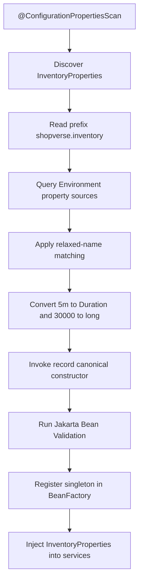

---
title: Spring Configuration Properties Internals
---

# Spring Configuration Properties Internals

Type-safe configuration binding, validation, metadata, nested properties, and when to prefer ConfigurationProperties over Value.

Back to [Spring Boot Internals](../SPRING-BOOT-INTERNALS.md).

## Configuration Properties Example

Shopverse Inventory configuration:

```yaml
shopverse:
  inventory:
    reservation-ttl: 5m
    expiry-scan-delay-ms: 30000
```

Immutable property contract:

```java
@Validated
@ConfigurationProperties(prefix = "shopverse.inventory")
public record InventoryProperties(
        @NotNull Duration reservationTtl,
        @Positive long expiryScanDelayMs
) {
}
```

Registration is enabled by:

```java
@ConfigurationPropertiesScan
public class InventoryServiceApplication {
}
```


## How Spring Creates `InventoryProperties`



Detailed flow:

1. `@ConfigurationPropertiesScan` discovers the annotated record.
2. Boot registers binding infrastructure and a bean definition for it.
3. The Binder selects properties under `shopverse.inventory`.
4. Relaxed binding matches configuration names to Java names:

```text
reservation-ttl       -> reservationTtl
expiry-scan-delay-ms  -> expiryScanDelayMs
```

5. Conversion services convert text:

```text
5m    -> Duration.ofMinutes(5)
30000 -> long 30000
```

6. Because this is a record, binding invokes the canonical constructor:

```java
new InventoryProperties(Duration.ofMinutes(5), 30000L);
```

7. `@Validated` triggers Jakarta Validation.
8. A missing TTL or non-positive delay fails startup with a binding/validation
   error.
9. The immutable object becomes an injectable singleton bean.

The conceptual Binder API resembles:

```java
Binder.get(environment)
        .bind(
                "shopverse.inventory",
                Bindable.of(InventoryProperties.class)
        );
```

Application code normally does not invoke `Binder` directly. Boot's
configuration-properties infrastructure owns that process.


## Using The Bound Bean

```java
@Service
@RequiredArgsConstructor
public class InventoryService {

    private final InventoryProperties properties;

    public void reserveItem() {
        Duration ttl = properties.reservationTtl();
        long delay = properties.expiryScanDelayMs();
    }
}
```

The record is immutable. Consumers cannot accidentally change shared
configuration at runtime.


## Nested Configuration

Related settings can use nested records:

```java
@ConfigurationProperties("shopverse.payment")
public record PaymentProperties(
        BigDecimal approvalLimit,
        Provider provider
) {
    public record Provider(
            Duration connectTimeout,
            Duration readTimeout
    ) {
    }
}
```

```yaml
shopverse:
  payment:
    approval-limit: 5000
    provider:
      connect-timeout: 2s
      read-timeout: 5s
```

This keeps one configuration domain cohesive and testable.


## `@ConfigurationProperties` Versus `@Value`

`@Value`:

```java
@Value("${shopverse.inventory.reservation-ttl}")
private Duration reservationTtl;
```

It is reasonable for an isolated value or expression. It becomes difficult to
maintain when many related fields are scattered across classes.

`@ConfigurationProperties`:

```java
@ConfigurationProperties("shopverse.inventory")
public record InventoryProperties(...) {
}
```

| Capability | `@Value` | `@ConfigurationProperties` |
|---|---:|---:|
| one isolated value | good | possible |
| grouped configuration contract | weak | strong |
| immutable record binding | not the main model | supported |
| nested configuration | manual/scattered | supported |
| Jakarta Validation | manual | integrated |
| relaxed binding | limited/different behavior | designed for it |
| IDE metadata | limited | configuration processor |
| focused binding tests | awkward | straightforward |
| SpEL expressions | supported | intentionally not the model |

For production configuration domains, prefer typed
`@ConfigurationProperties`. Use `@Value` sparingly for genuinely isolated
values. See [Spring Expression Language](../../spring/SPRING-SPEL.md) for
property placeholders, scalar injection, arrays, lists, maps, expression
evaluation, and production safety guidance.


## Configuration Metadata

Add the configuration processor to generate metadata for IDE completion and
property documentation:

```gradle
annotationProcessor 'org.springframework.boot:spring-boot-configuration-processor'
```

It generates metadata under:

```text
META-INF/spring-configuration-metadata.json
```

This metadata improves tooling. It does not perform runtime binding.

Inventory Service currently has Lombok's annotation processor but does not
explicitly declare the Boot configuration processor. Adding it is a useful
developer-experience improvement, not a runtime requirement.


## Configuration Binding Practices

- Group one domain under one prefix.
- Use immutable records where appropriate.
- Validate required values and ranges at startup.
- Use `Duration`, `DataSize`, enums, and domain-relevant types.
- Supply safe local defaults where appropriate.
- Avoid secrets in metadata, logs, and actuator output.
- Do not create one giant properties class for unrelated systems.
- Test binding and invalid values.
- Document whether a change requires refresh or restart.


