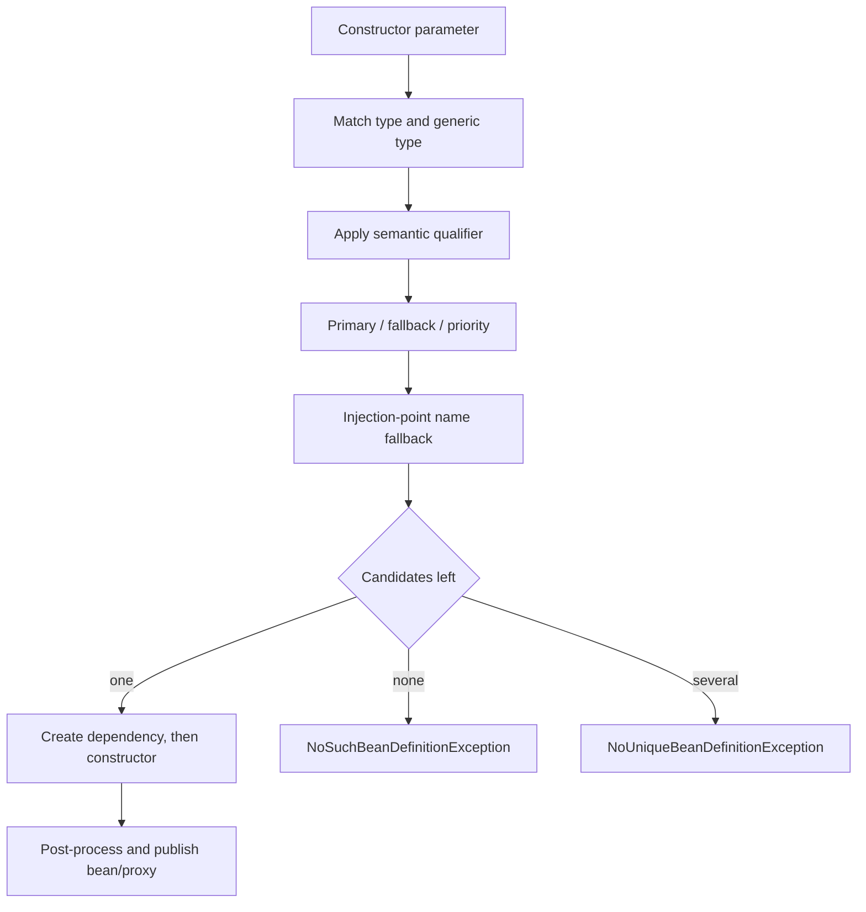

# Spring Dependency Injection And Bean Resolution

<DocLabels items={[
  {label: 'Intermediate', tone: 'intermediate'},
  {label: 'Dependency resolution', tone: 'foundation'},
  {label: 'Startup diagnostics', tone: 'production'},
  {label: 'Shopverse examples', tone: 'shopverse'},
]} />

Dependency injection makes the constructor the ownership contract. Spring resolves
that contract from registered bean definitions and publishes the resulting bean or
proxy through the application context.



## Bean Definition Versus Instance

A bean definition records class/factory, scope, constructor arguments, qualifiers,
lazy behavior, and lifecycle metadata. Component scanning, `@Bean` methods,
imports, and auto-configuration register definitions before normal singleton
instances are created.

Use stereotypes for application-owned classes and `@Bean` for third-party objects
or explicit infrastructure construction:

```java
@Configuration(proxyBeanMethods = false)
class TimeConfiguration {
    @Bean
    Clock applicationClock() {
        return Clock.systemUTC();
    }
}
```

## Constructor Injection

```java
@Service
@RequiredArgsConstructor
class InventoryServiceImpl {
    private final InventoryItemRepository itemRepository;
    private final InventoryProperties properties;
    private final OutboxService outboxService;
}
```

With one constructor, `@Autowired` is unnecessary. Required constructor arguments
stay explicit, can be `final`, and allow a plain unit test to construct the class.
Too many parameters are useful design pressure to reduce responsibilities.

<DocCallout type="shopverse" title="Current Shopverse pattern">

Inventory, Order, Payment, and recovery services use constructor injection, often
through Lombok `@RequiredArgsConstructor`. Their repositories, typed properties,
clients, and outbox collaborators are visible in the class contract. This is current
code.

</DocCallout>

Field injection hides required collaborators and forces reflection or a Spring
context in unit tests. Setter injection is appropriate only when mutability or an
optional collaborator is an intentional class contract.

## Multiple Candidates

Use a semantic qualifier when the caller requires one strategy:

```java
CheckoutService(@Qualifier("card") PaymentGateway paymentGateway) {
    this.paymentGateway = paymentGateway;
}
```

Use `@Primary` for the normal application-wide choice. Spring Framework also
supports `@Fallback` for candidates selected only when no regular candidate remains.
Do not depend on an accidental parameter-name match when the distinction is a
business decision.

<DocCallout type="code" title="Illustrative, not current Shopverse wiring">

Shopverse currently has one injected `PaymentProvider` implementation. A future
card/wallet provider set should introduce semantic qualifiers or a router only when
multiple implementations actually exist.

</DocCallout>

## Collections And Strategy Chains

Inject a collection when every implementation participates:

```java
FraudEngine(List<FraudRule> rules) {
    this.rules = List.copyOf(rules);
}
```

`@Order` or `Ordered` controls collection order, not general singleton startup
order. A `Map<String, PaymentGateway>` uses bean names as keys; translate them to a
domain enum/configuration rather than exposing arbitrary bean names to request input.

Generic type arguments also narrow candidates, such as `Handler<OrderCommand>`
versus `Handler<PaymentCommand>`.

## Optional And Deferred Resolution

```java
OptionalAudit(ObjectProvider<AuditPublisher> publisher) {
    this.publisher = publisher;
}

void record(AuditEvent event) {
    publisher.ifAvailable(value -> value.publish(event));
}
```

`ObjectProvider` expresses optional, ordered-stream, or deferred lookup without
injecting `ApplicationContext` as a service locator. `@Lazy` can defer an expensive
dependency through a proxy. Neither should hide a required missing bean or routine
circular design.

## Circular Dependencies

Constructor cycles cannot be built:

```text
OrderService -> PaymentService -> OrderService
```

Resolve ownership with a coordinator, event, narrower interface, or extracted
collaborator. Enabling circular references or switching to field injection hides the
problem and risks partially initialized identity/proxy behavior.

<DocCallout type="mistake" title="A lazy proxy is not a general cycle fix">

Use deferred lookup only when delayed availability is part of the design. If both
services own each other synchronously, change the boundary.

</DocCallout>

## Diagnostic Evidence

For a startup failure, capture:

- the exact injection point, required type, and generic arguments;
- candidate bean names, qualifiers, primary/fallback markers, and conditions;
- component-scan/import boundaries and condition evaluation report;
- whether a bean was created too early or replaced by test configuration;
- the dependency cycle path from the root exception.

Use `ApplicationContextRunner` or a focused `@SpringBootTest` for wiring behavior.
Use direct construction for service logic. A context-load test should assert the
selected implementation, not merely that startup succeeded.

```java
new ApplicationContextRunner()
        .withUserConfiguration(PaymentConfiguration.class)
        .run(context -> assertThat(context)
                .hasSingleBean(PaymentGateway.class));
```

## Interview Questions

<ExpandableAnswer title="How does Spring choose between two beans of the same interface?">

It begins with type/generic matching, narrows by qualifiers, applies primary or
fallback/priority rules, and can use the injection-point name as a final fallback.
Ambiguity should be resolved semantically rather than accidentally.

</ExpandableAnswer>

<ExpandableAnswer title="Why is constructor injection easier to test?">

The dependency contract is ordinary Java. A unit test passes mocks/fakes directly
without reflection or a Spring context and cannot create an instance missing a
required argument.

</ExpandableAnswer>

<ExpandableAnswer title="When should ObjectProvider be used instead of Optional?">

When lookup must be deferred, ordered, streamed, or performed only if available.
Use `Optional` when one eager optional value is the entire contract.

</ExpandableAnswer>

<ExpandableAnswer title="Why does @Order not guarantee bean startup order?">

It orders matching elements at ordered injection/processing points. Startup order
comes from actual dependency relationships and explicit lifecycle semantics.

</ExpandableAnswer>

<ExpandableAnswer title="What is the architectural fix for a constructor cycle?">

Move coordination to a third owner, publish an event, narrow/reverse one dependency,
or pass data as a method argument. The goal is unidirectional ownership.

</ExpandableAnswer>

## Official References

- [Spring dependency injection](https://docs.spring.io/spring-framework/reference/core/beans/dependencies/factory-collaborators.html)
- [Autowired resolution](https://docs.spring.io/spring-framework/reference/core/beans/annotation-config/autowired.html)
- [Qualifiers](https://docs.spring.io/spring-framework/reference/core/beans/annotation-config/autowired-qualifiers.html)
- [Generic autowiring qualifiers](https://docs.spring.io/spring-framework/reference/core/beans/annotation-config/generics-as-qualifiers.html)

## Recommended Next

Continue with [Autowiring And Circular Reference Internals](./AUTOWIRING-CIRCULAR-REFERENCE-INTERNALS.md),
then [Bean Scopes And Lifecycle](./BEAN-SCOPES-LIFECYCLE.md).
