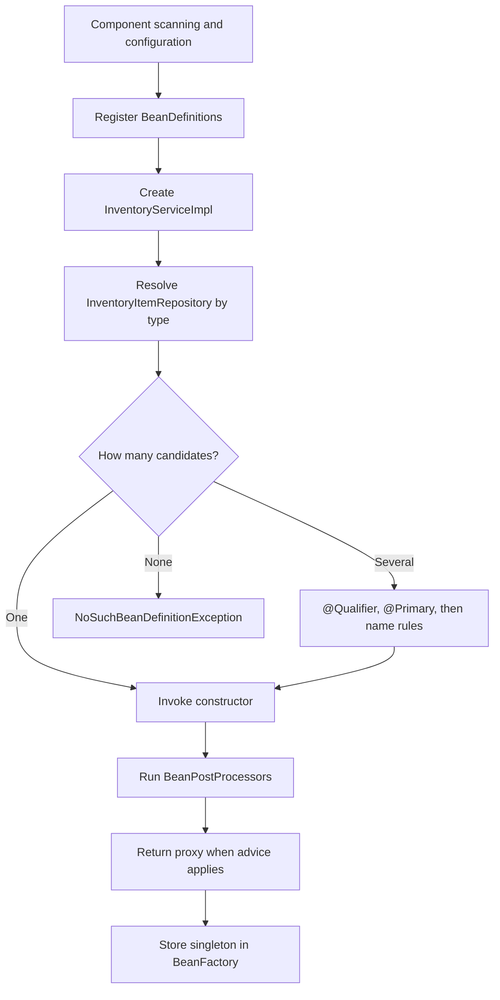
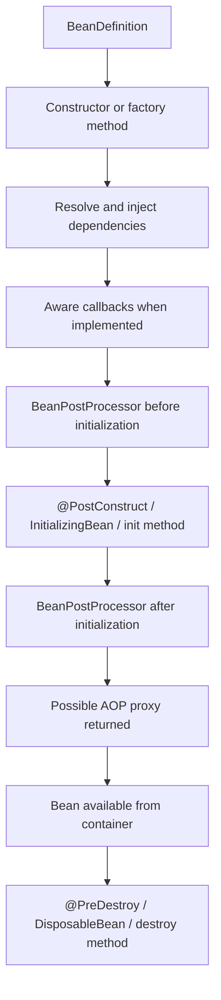

---
title: Spring Dependency Injection Bean Lifecycle And AOP
---

# Spring Dependency Injection Bean Lifecycle And AOP

Bean definitions, bean instances, dependency injection, lifecycle callbacks, and AOP proxy behavior.

Back to [Spring Boot Internals](../SPRING-BOOT-INTERNALS.md).

## Bean Definitions Versus Bean Instances

A `BeanDefinition` is metadata describing how Spring can create and configure
an object. It can contain:

- bean class or factory method;
- scope;
- constructor arguments;
- qualifiers;
- lifecycle methods;
- lazy/eager behavior;
- role and source metadata.

During context setup, Spring first registers definitions. During refresh, it
normally instantiates non-lazy singleton beans.

```text
@Service class discovered
  -> BeanDefinition registered
  -> dependencies resolved
  -> object instantiated
  -> initialized and possibly proxied
  -> singleton stored in BeanFactory
```


## Dependency Injection

Dependency injection (DI) means an object receives its dependencies from the
Spring container instead of constructing them itself. It is the practical
implementation of inversion of control (IoC): application code declares what
it needs, while the container controls object creation, wiring, lifecycle, and
eligible proxy decoration.

Without DI:

```java
public class InventoryService {
    private final InventoryRepository repository = new JdbcInventoryRepository();
}
```

This class chooses the implementation, controls its lifecycle, and is difficult
to isolate in a unit test.

With DI:

```java
@Service
@RequiredArgsConstructor
public class InventoryServiceImpl {

    private final InventoryItemRepository itemRepository;
    private final InventoryProperties properties;
}
```

Lombok generates the constructor. Spring resolves constructor parameters by
type, qualifier, and bean name rules, then invokes it.

### How Spring Resolves A Dependency

At startup, Spring performs this conceptual flow:



More precisely:

1. component scanning, `@Bean` methods, imports, and auto-configuration
   register bean definitions;
2. `DefaultListableBeanFactory` identifies beans that match each constructor
   parameter;
3. Spring considers type, generic type, `@Qualifier`, `@Primary`, priority,
   and dependency name;
4. dependencies are created first when necessary;
5. Spring invokes the constructor or factory method;
6. bean post-processors apply lifecycle callbacks and may return an AOP proxy;
7. the resulting singleton is cached in the application context.

Spring injects the object registered in the container. For repositories,
transactions, caching, security, or asynchronous behavior, that object may be
a generated proxy rather than the concrete target instance.

### Constructor Injection

Constructor injection is the default choice for required dependencies:

```java
@Service
public class PaymentService {

    private final PaymentRepository paymentRepository;
    private final PaymentGateway paymentGateway;

    public PaymentService(
            PaymentRepository paymentRepository,
            PaymentGateway paymentGateway
    ) {
        this.paymentRepository = paymentRepository;
        this.paymentGateway = paymentGateway;
    }
}
```

When a class has one constructor, `@Autowired` is unnecessary. Lombok
`@RequiredArgsConstructor` can generate the constructor for `final` fields.

Constructor injection:

- makes dependencies explicit;
- supports immutable fields;
- exposes circular dependencies during startup;
- makes unit tests easy;
- avoids partially initialized field-injected objects.

```java
PaymentGateway gateway = mock(PaymentGateway.class);
PaymentRepository repository = mock(PaymentRepository.class);
PaymentService service = new PaymentService(repository, gateway);
```

The test does not need a Spring context because the dependency contract is
ordinary Java.

### Setter Injection

Setter injection is appropriate for a genuinely optional or reconfigurable
dependency:

```java
@Service
public class ReportService {

    private AuditPublisher auditPublisher = AuditPublisher.noOp();

    @Autowired(required = false)
    public void setAuditPublisher(AuditPublisher auditPublisher) {
        this.auditPublisher = auditPublisher;
    }
}
```

Required business dependencies should normally remain constructor parameters.
Setter injection makes mutability and the possibility of incomplete
initialization part of the class design.

### Field Injection

```java
@Autowired
private PaymentRepository paymentRepository;
```

Field injection is concise but should generally be avoided in production code:

- required dependencies are hidden from the constructor contract;
- fields cannot normally be `final`;
- plain unit tests require reflection or a Spring context;
- classes can accumulate too many dependencies without obvious constructor
  pressure;
- the object can be instantiated in an invalid state outside Spring.

### Multiple Implementations

If two beans implement the same interface, injection by type is ambiguous:

```java
public interface PaymentGateway {
    PaymentResult charge(PaymentCommand command);
}

@Component("cardGateway")
class CardPaymentGateway implements PaymentGateway {
    // ...
}

@Component("walletGateway")
class WalletPaymentGateway implements PaymentGateway {
    // ...
}
```

Choose explicitly with `@Qualifier`:

```java
@Service
public class CheckoutService {

    private final PaymentGateway paymentGateway;

    public CheckoutService(
            @Qualifier("cardGateway") PaymentGateway paymentGateway
    ) {
        this.paymentGateway = paymentGateway;
    }
}
```

Or define the application-wide default with `@Primary`:

```java
@Primary
@Component
class CardPaymentGateway implements PaymentGateway {
    // ...
}
```

Use `@Qualifier` when the caller requires a particular semantic implementation.
Use `@Primary` when one implementation is the normal default. Avoid depending
on accidental parameter-name matching.

### Injecting All Implementations

Spring can inject collections when an application must execute a strategy
chain:

```java
public interface FraudRule {
    FraudDecision evaluate(PaymentCommand command);
}

@Service
public class FraudEngine {

    private final List<FraudRule> rules;

    public FraudEngine(List<FraudRule> rules) {
        this.rules = List.copyOf(rules);
    }
}
```

Use `@Order` or implement `Ordered` when sequence is part of the contract:

```java
@Component
@Order(Ordered.HIGHEST_PRECEDENCE)
class BlockedAccountRule implements FraudRule {
    // ...
}
```

For keyed strategy selection, inject a map. Bean names become keys:

```java
public PaymentRouter(Map<String, PaymentGateway> gateways) {
    this.gateways = Map.copyOf(gateways);
}
```

### Optional And Lazy Dependencies

`ObjectProvider<T>` supports optional or deferred lookup without injecting the
entire application context:

```java
@Service
public class OptionalAuditService {

    private final ObjectProvider<AuditPublisher> publisherProvider;

    public OptionalAuditService(
            ObjectProvider<AuditPublisher> publisherProvider
    ) {
        this.publisherProvider = publisherProvider;
    }

    public void publish(AuditEvent event) {
        publisherProvider.ifAvailable(publisher -> publisher.publish(event));
    }
}
```

`@Lazy` delays bean creation or injects a lazy proxy:

```java
public ReportService(@Lazy ExpensiveReportClient reportClient) {
    this.reportClient = reportClient;
}
```

Use laziness for startup cost or an intentional deferred dependency, not to
hide an invalid architecture or routine circular dependency.

### Circular Dependencies

Constructor cycles cannot be created:

```text
OrderService -> PaymentService -> OrderService
```

Spring cannot finish constructing either object because each requires the
other first. The preferred fix is to change ownership:

```text
CheckoutCoordinator
  -> OrderService
  -> PaymentService
```

Other valid solutions include:

- publish an application or domain event instead of calling back;
- extract the shared responsibility into a third service;
- reverse one dependency behind a narrower interface;
- pass required data as a method argument;
- use `ObjectProvider` or `@Lazy` only when delayed resolution is genuinely
  part of the design.

Enabling circular references or switching to field injection hides the design
problem and can produce partially initialized beans. It is not a production
solution.

### `@Bean` Versus Component Scanning

Use component stereotypes for application-owned classes:

```java
@Service
class InventoryService {
}
```

Use `@Bean` when creating a third-party type, selecting construction
parameters, or centralizing infrastructure configuration:

```java
@Configuration(proxyBeanMethods = false)
class ClockConfiguration {

    @Bean
    Clock applicationClock() {
        return Clock.systemUTC();
    }
}
```

Both approaches register bean definitions in the same container. `@Bean`
describes how a bean is created; `@Component` marks the class itself as a
component-scan candidate.

### Dependency Injection Production Practices

- use constructor injection for mandatory dependencies;
- keep injected fields `final`;
- inject narrow interfaces instead of broad service locators;
- treat excessive constructor parameters as a design warning;
- use `@Qualifier` names that express business meaning;
- avoid mutable singleton state;
- do not perform remote calls in constructors;
- use conditional configuration for optional infrastructure;
- mock direct collaborators in unit tests and reserve context tests for
  wiring behavior;
- remember that self-invocation bypasses proxy-based advice such as
  `@Transactional`, `@Async`, and `@Cacheable`.


## Bean Lifecycle



Important extension points:

| Mechanism | Purpose |
|---|---|
| `BeanFactoryPostProcessor` | modify bean definitions before ordinary beans are created |
| `BeanPostProcessor` | inspect/wrap bean instances during creation |
| `@PostConstruct` | initialization after injection |
| `@PreDestroy` | cleanup during graceful context shutdown |
| AOP proxy creator | wrap beans for transactions, security, caching, async, resilience |

The object stored in the container can be a proxy rather than the raw class.
This is why calls must pass through the proxy for `@Transactional`,
`@Cacheable`, and method-security interception.

Avoid heavy network work in constructors or `@PostConstruct`; it delays startup
and complicates failure recovery.


## AOP Proxies

Annotations such as these are implemented through infrastructure and proxies:

```text
@Transactional
@Cacheable
@PreAuthorize
@Async
Resilience4j annotations
```

Conceptual call:

```text
Controller
  -> proxy
     -> transaction/security/cache interceptor
        -> target service method
```

A call such as `this.otherTransactionalMethod()` stays inside the target object
and normally bypasses the external proxy. Distinct propagation or security
boundaries should be placed on appropriately separated Spring beans.


