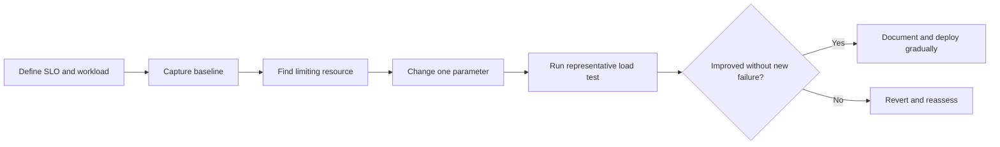

# Spring Boot Production Tuning

Production tuning is the measured alignment of application concurrency, JVM
memory, database connections, HTTP clients, startup behavior, and deployment
limits with a defined latency and reliability objective.

Do not begin with copied JVM flags. Establish a baseline, identify the actual
bottleneck, change one bounded parameter, load-test, and compare results.

Back to [Spring Boot Internals](../SPRING-BOOT-INTERNALS.md).

## Shopverse Baseline

Shopverse currently has:

- Java 21 and Spring Boot 4;
- virtual threads enabled in centralized configuration;
- Actuator, Micrometer, Prometheus, and JVM/Hikari metrics;
- container-aware JVM sizing with `MaxRAMPercentage=75` in service images;
- health checks and dependency-aware Docker startup;
- no explicit service-specific Hikari pool sizing in centralized config;
- no documented per-service CPU/memory request and limit model because Docker
  Compose is the current POC runtime.

This is a functional POC baseline, not proof that production capacity is
correctly sized.

## Tuning Workflow



Measure:

- throughput and concurrent requests;
- p50, p95, and p99 latency;
- error and timeout rate;
- heap, native memory, allocation rate, and GC pause;
- live/platform/virtual thread behavior;
- CPU utilization and throttling;
- database active, idle, pending, and timed-out connections;
- downstream HTTP pool utilization;
- Kafka consumer lag and listener concurrency.

## Capacity Relationships

Little's Law provides a useful approximation:

```text
concurrency = throughput * average latency
```

At 400 requests/second and 250 ms average latency:

```text
concurrency = 400 * 0.250 = 100 active requests
```

This does not mean the database needs 100 connections. If each request spends
only 40 ms using a database connection:

```text
average active DB connections = 400 * 0.040 = 16
```

Add measured headroom rather than matching the HTTP concurrency directly.

## Startup Measurement

### Application Startup Endpoint

Spring Boot can record startup steps:

```java
public static void main(String[] args) {
    SpringApplication application =
            new SpringApplication(OrderServiceApplication.class);
    application.setApplicationStartup(
            new BufferingApplicationStartup(2048)
    );
    application.run(args);
}
```

When the Actuator startup endpoint is exposed and secured, buffered startup
steps can be inspected at:

```text
/actuator/startup
```

Use this to locate slow bean creation and initialization. Do not expose the
endpoint publicly.

Java Flight Recorder can provide lower-level startup and runtime evidence for
class loading, allocation, locks, CPU, and GC.

### Common Startup Costs

- classpath scanning and excessive auto-configuration;
- remote Config Server, discovery, JWKS, database, or broker waits;
- Liquibase migrations;
- large Hibernate metadata/entity models;
- eager cache loading;
- network calls in constructors or `@PostConstruct`;
- oversized application contexts;
- repeated retries without a bounded startup deadline.

### Lazy Initialization

```yaml
spring:
  main:
    lazy-initialization: true
```

Lazy initialization can shorten apparent startup by creating beans on first
use. It can also move configuration failures and latency into the first user
request. Do not enable it globally merely to improve a startup number. Prefer
removing unnecessary beans and expensive initialization, then use selective
`@Lazy` only where the deferred behavior is intentional and tested.

### Readiness

Startup completion is not the same as readiness. A service should become ready
only when it can safely handle traffic. Keep startup and readiness probes
separate from liveness so a slow dependency does not cause destructive restart
loops.

## Container-Aware JVM Memory

The container limit includes more than Java heap:

```text
container memory
  = heap
  + metaspace
  + code cache
  + thread stacks
  + direct/Netty buffers
  + GC/native structures
  + shared libraries and other native memory
```

Therefore `-Xmx` must not equal the container limit.

Shopverse service images currently use:

```text
-XX:MaxRAMPercentage=75
-XX:+UseContainerSupport
-XX:+ExitOnOutOfMemoryError
```

For a 1 GiB container, 75% allows roughly 768 MiB as the maximum heap and
leaves roughly 256 MiB for non-heap/native memory. That remainder may be too
small for a reactive gateway with direct buffers or an application with many
platform-thread stacks. Verify with load tests and native-memory evidence.

Example runtime policy:

```yaml
environment:
  JAVA_TOOL_OPTIONS: >-
    -XX:MaxRAMPercentage=70
    -XX:InitialRAMPercentage=25
    -XX:+ExitOnOutOfMemoryError
```

`JAVA_TOOL_OPTIONS` is recognized by the JVM without requiring shell expansion.
Do not place secrets in it because process metadata and logs may expose flags.

### Heap Dump Caution

Heap dumps are sensitive and can be approximately heap-sized. Enable them only
when a writable volume, storage quota, encryption, retention, and restricted
access are defined:

```text
-XX:+HeapDumpOnOutOfMemoryError
-XX:HeapDumpPath=/diagnostics
```

## Garbage Collection

Java 21's general-purpose defaults are a sensible starting point. Choose a GC
from measured latency and throughput requirements:

| Collector direction | Typical reason |
|---|---|
| G1 | balanced general-purpose server workload |
| ZGC | very low pause goals with sufficient CPU/memory testing |
| Serial | very small constrained process, not typical microservice default |

Do not combine many unverified GC flags. Observe allocation rate, live-set
size, pause duration, frequency, and CPU before changing collectors.

## Threading And Concurrency

### Servlet Services

Platform-thread servlet services have a bounded request-thread pool. Too few
threads underuse dependencies; too many increase memory, context switching,
and pressure on database/HTTP pools.

Shopverse enables virtual threads globally:

```yaml
spring:
  threads:
    virtual:
      enabled: true
```

Virtual threads make blocking concurrency cheaper; they do not make the
database, Kafka broker, payment provider, or HTTP dependency unlimited. Keep
rate limits, bulkheads, timeouts, and connection pools bounded.

### Reactive Gateway

Spring Cloud Gateway uses Reactor Netty event loops. Never perform blocking
JDBC or blocking HTTP work in a Gateway filter. More event-loop threads do not
repair blocking code; remove or isolate the blocking operation.

## Hikari Database Connection Pool

Spring Boot uses HikariCP for JDBC when it is available. Important settings:

```yaml
spring:
  datasource:
    hikari:
      maximum-pool-size: 20
      minimum-idle: 5
      connection-timeout: 2000
      validation-timeout: 1000
      idle-timeout: 600000
      max-lifetime: 1740000
      keepalive-time: 300000
```

These numbers are examples, not universal defaults for Shopverse.
Hikari's direct setters use milliseconds for these timeout values.

| Setting | Purpose |
|---|---|
| `maximum-pool-size` | hard cap on active plus idle pool connections |
| `minimum-idle` | lower bound of maintained idle connections |
| `connection-timeout` | maximum caller wait for a connection |
| `validation-timeout` | maximum validation wait |
| `idle-timeout` | retire excess idle connections |
| `max-lifetime` | retire a connection before infrastructure does |
| `keepalive-time` | periodically keep an idle connection alive |

Set `max-lifetime` below database, proxy, or network connection expiry, with
room for jitter. It must exceed `keepalive-time`. Verify exact constraints
against the Hikari version managed by the current Spring Boot BOM.

### Pool Budget Across Replicas

Reserve database connections for migrations, administration, monitoring, and
recovery:

```text
per-replica maximum pool
  <= floor((database max connections - reserved connections)
           / maximum application replicas)
```

Example:

```text
database maximum = 200
reserved          = 40
maximum replicas  = 8

per replica <= floor((200 - 40) / 8) = 20
```

Apply the calculation across every service sharing that database server, even
when each service correctly owns a separate schema.

### Pool Sizing From Workload

A useful starting estimate is:

```text
required active connections
  ~= request throughput * average DB connection hold time
```

Then add bounded headroom and test. Long transactions, remote calls inside
transactions, N+1 queries, and lock waits increase connection hold time. Fix
those problems before increasing the pool.

### Pool Symptoms

| Signal | Likely interpretation |
|---|---|
| active near maximum and pending rising | pool or database is saturated |
| timeout counter rising | callers cannot obtain connections in time |
| low active connections but high API latency | bottleneck is elsewhere |
| database CPU saturated after pool increase | larger pool amplified overload |
| many idle connections across replicas | pool budget is wasteful |

Relevant Micrometer metrics commonly include:

```text
hikaricp_connections_active
hikaricp_connections_idle
hikaricp_connections_pending
hikaricp_connections_timeout_total
```

## HTTP Connection Pools And Timeouts

Feign, `RestClient`, `WebClient`, and Reactor Netty can each use different HTTP
clients and pools. Define and observe:

- connect timeout;
- response/read timeout;
- maximum total and per-target connections;
- pending-acquire timeout;
- connection lifetime and idle eviction;
- retry and circuit-breaker budgets.

An HTTP worker or virtual thread waiting for a connection is still delayed.
Size client pools against downstream capacity rather than upstream request
concurrency.

## Kafka And Scheduler Resources

- Consumer concurrency cannot usefully exceed assigned partitions.
- More listener threads increase database and downstream concurrency.
- Bound scheduler pools and queued work.
- Avoid overlapping scheduled jobs unless they are designed for concurrency.
- Keep shutdown time sufficient for listener acknowledgement or safe
  redelivery.

## Graceful Shutdown

Configure a bounded drain period:

```yaml
server:
  shutdown: graceful

spring:
  lifecycle:
    timeout-per-shutdown-phase: 30s
```

Deployment flow should be:

```text
mark instance not ready
  -> stop new traffic
  -> drain bounded HTTP/Kafka work
  -> close pools and context
  -> force termination after platform grace period
```

The orchestrator's termination grace period must exceed Spring's shutdown
budget. Durable correctness must still survive forced termination.

## Metrics And Prometheus Queries

Heap utilization:

```promql
sum by (application) (jvm_memory_used_bytes{area="heap"})
/
clamp_min(
  sum by (application) (jvm_memory_max_bytes{area="heap"}),
  1
)
```

Database pool pressure:

```promql
max by (application, pool) (hikaricp_connections_active)
/
clamp_min(
  max by (application, pool) (hikaricp_connections_max),
  1
)
```

Pending connection requests:

```promql
max by (application, pool) (hikaricp_connections_pending)
```

p95 HTTP latency:

```promql
histogram_quantile(
  0.95,
  sum by (le, application) (
    rate(http_server_requests_seconds_bucket[5m])
  )
)
```

Metric names depend on enabled binders and Prometheus normalization. Confirm
them in `/actuator/prometheus` before creating alerts.

## Common Tuning Mistakes

- setting heap equal to the container memory limit;
- increasing every pool instead of finding the bottleneck;
- enabling global lazy initialization to hide startup defects;
- running remote calls during bean construction;
- allowing unbounded executor queues;
- assuming virtual threads remove downstream limits;
- blocking Reactor Netty event loops;
- increasing Hikari pool size beyond the database budget;
- changing GC flags without allocation and pause evidence;
- omitting readiness and graceful shutdown;
- using averages while ignoring p95/p99 latency and saturation.

## Shopverse Hardening Sequence

1. Capture current JVM, HTTP, Hikari, Kafka, and process metrics under a
   reproducible checkout load.
2. Define per-service memory and CPU limits.
3. Calculate the total MySQL connection budget and configure each JDBC
   service's Hikari maximum.
4. Add explicit HTTP connection/response timeouts and observe client pools.
5. Configure graceful shutdown and verify SAGA/outbox recovery after forced
   termination.
6. Load-test virtual-thread services and the reactive Gateway separately.
7. Add alerts for heap pressure, GC pause, Hikari pending/timeouts, CPU
   throttling, Kafka lag, and p95/p99 latency.
8. Change JVM or pool parameters only when evidence identifies them as the
   limiting resource.

## Official References

- [Spring Boot efficient deployments](https://docs.spring.io/spring-boot/reference/packaging/efficient.html)
- [Spring Boot graceful shutdown](https://docs.spring.io/spring-boot/reference/web/graceful-shutdown.html)
- [Spring Boot Actuator startup endpoint](https://docs.spring.io/spring-boot/api/rest/actuator/startup.html)
- [Spring Boot virtual threads](https://docs.spring.io/spring-boot/reference/features/spring-application.html#features.spring-application.virtual-threads)
- [HikariCP configuration](https://github.com/brettwooldridge/HikariCP#configuration-knobs-baby)
- [Java container support](https://docs.oracle.com/en/java/javase/21/docs/specs/man/java.html)
