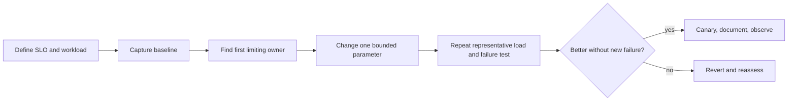

# Spring Boot Production Tuning

<DocLabels items={[
  {label: 'Learning path', tone: 'foundation'},
  {label: 'Advanced tuning', tone: 'advanced'},
  {label: 'Evidence required', tone: 'production'},
  {label: 'Shopverse baseline', tone: 'shopverse'},
]} />

Production tuning aligns workload, latency objectives, application concurrency,
JVM memory, database and HTTP resources, and deployment limits. It is not a list of
copied JVM flags or larger pools.

<DocCallout type="production" title="Tune one constrained owner at a time">
Define the workload and SLO, capture the baseline, identify the first saturated
resource, change one bounded parameter, repeat the same test, and keep an explicit
rollback. Throughput without correctness and recovery is not an improvement.
</DocCallout>

## Choose A Canonical Guide

<TopicCards items={[
  {title: 'Startup, JVM, and container memory', href: '/spring/production/STARTUP-JVM-CONTAINER-MEMORY', description: 'Measure startup, class loading, heap and native memory, GC, direct buffers, thread stacks, diagnostics, and OOM behavior.', icon: 'gauge', tags: ['Startup', 'JVM']},
  {title: 'Resource pools and capacity', href: '/spring/production/RESOURCE-POOL-CONCURRENCY-CAPACITY', description: 'Size admission, executors, Hikari, HTTP clients, Kafka consumers, and replica budgets from measured demand.', icon: 'network', tags: ['Pools', 'Concurrency']},
  {title: 'Lifecycle and incident runbook', href: '/spring/internals-production/PRODUCTION-LIFECYCLE', description: 'Operate readiness, admission, drain, forced termination, observability, incident evidence, and recovery.', icon: 'security', tags: ['Runbook', 'Shutdown']},
]} />

## Tuning Workflow

## Shopverse Baseline Contract

The existing Shopverse material describes Java 21, virtual-thread configuration,
Actuator/Micrometer/Prometheus, container-aware JVM sizing, health checks, and a
Docker Compose proof-of-concept runtime. Treat this as a hypothesis to verify from
the deployed image and effective configuration, not as production capacity proof.

For each service, record:

- image, JDK, Spring Boot/Cloud BOM, CPU and memory limits;
- request/event mix, throughput, concurrency, p50/p95/p99, and error budget;
- heap, native memory, allocation, GC, thread and event-loop evidence;
- executor queue age and database/HTTP pool acquisition;
- Kafka partitions, lag, listener concurrency, and oldest business work;
- readiness, drain, forced-termination, and reconciliation results.

## Official References

- [Spring Boot production-ready features](https://docs.spring.io/spring-boot/reference/actuator/)
- [Spring Boot application startup tracking](https://docs.spring.io/spring-boot/reference/features/spring-application.html#features.spring-application.application-startup-tracking)
- [Spring Boot metrics](https://docs.spring.io/spring-boot/reference/actuator/metrics.html)
- [Spring Boot graceful shutdown](https://docs.spring.io/spring-boot/reference/web/graceful-shutdown.html)

## Recommended Next

Start with the guide that owns the observed bottleneck. If the owner is unclear,
begin with [Resource Pools And Capacity](../../spring/production/RESOURCE-POOL-CONCURRENCY-CAPACITY.md)
and its cross-resource worksheet.
