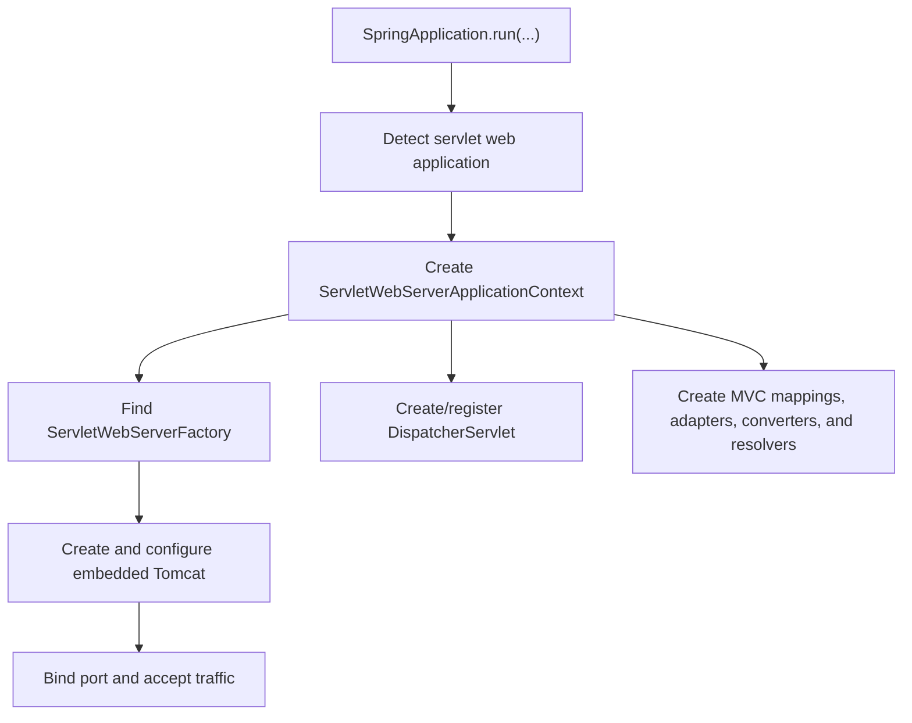
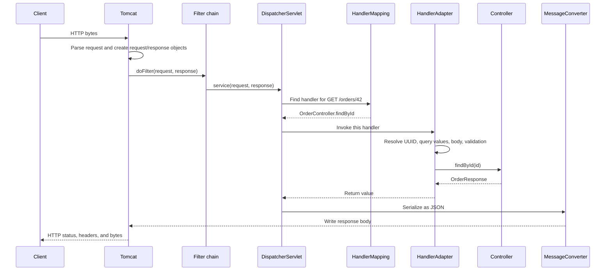

# Servlets And `DispatcherServlet` In Spring Boot

The short answer is: **not everything in Spring is a servlet**.

A servlet is a Java component managed by a **servlet container**. In a typical
Spring Boot MVC application, the container receives HTTP traffic and calls one
main Spring servlet: `DispatcherServlet`. Spring then routes that request to an
ordinary controller method.

```text
HTTP request
  -> embedded Tomcat (servlet container)
  -> servlet filters
  -> DispatcherServlet (one servlet)
  -> @RestController method (not a servlet)
  -> service/repository beans (not servlets)
  -> HTTP response
```

This page explains each layer from the ground up. For adjacent topics, see
[Spring Web MVC Servlet And Filter Internals](WEB-MVC-SERVLET-FILTERS.md).

## First Separate The Terms

| Term | What it is | Who creates or manages it? |
|---|---|---|
| HTTP request | Bytes sent using the HTTP protocol | The client sends it |
| `HttpServletRequest` | Java object representing an incoming request | The servlet container |
| `HttpServletResponse` | Java object used to build the response | The servlet container |
| Servlet | Java object with a servlet lifecycle and a `service` method | The servlet container |
| Servlet container | Runtime that handles connections and executes servlets | Tomcat, Jetty, or Undertow |
| `DispatcherServlet` | Spring MVC's front-controller servlet | Registered by Spring Boot; invoked by the container |
| `@RestController` | Spring bean containing handler methods | The Spring container |

`HttpServletRequest` is **not a servlet**. It is a request object passed *to* a
servlet. Likewise, `@RestController`, `@Service`, and `@Repository` objects are
Spring-managed beans, not servlets.

Two containers cooperate in a Spring MVC application:

- the **servlet container** manages network-facing servlet infrastructure;
- the **Spring IoC container** manages application beans and dependencies.

They integrate closely, but they are different concepts.

## What Is A Servlet?

A servlet is a Java server-side component that participates in the Jakarta
Servlet lifecycle. At its core, the container calls it with a request and a
response:

```java
public class HelloServlet extends HttpServlet {
    @Override
    protected void doGet(
            HttpServletRequest request,
            HttpServletResponse response
    ) throws IOException {
        String name = request.getParameter("name");
        response.setContentType("text/plain");
        response.getWriter().write("Hello " + name);
    }
}
```

Conceptually, `HttpServlet.service(...)` examines the HTTP method and delegates
to `doGet`, `doPost`, `doPut`, and similar methods.

A servlet has a lifecycle:

1. the container creates the servlet;
2. it calls `init(...)` once;
3. many requests call `service(...)`;
4. it calls `destroy()` during shutdown.

Usually one servlet instance serves many requests concurrently. Therefore,
request-specific data must not be stored in mutable servlet instance fields.

## Why Does Spring MVC Need `DispatcherServlet`?

Without Spring MVC, developers could create a servlet for each area of an
application and manually parse parameters, deserialize JSON, select business
logic, and handle errors. That becomes repetitive.

Spring MVC instead uses the **Front Controller pattern**. A single
`DispatcherServlet` receives matching requests and delegates the work to
specialized components. Application endpoints stay as small Java methods:

```java
@RestController
@RequestMapping("/orders")
class OrderController {

    @GetMapping("/{id}")
    OrderResponse findById(@PathVariable UUID id) {
        return orderService.findById(id);
    }
}
```

`OrderController` does not extend `HttpServlet`. It does not implement a
servlet lifecycle. `DispatcherServlet` adapts the servlet world to Spring's
controller programming model.

## What Spring Boot Configures At Startup

When a servlet web starter and a supported server are on the classpath, Spring
Boot creates a servlet web application context and auto-configures the web
infrastructure. With the normal MVC starter, Tomcat is commonly the embedded
container.



Boot removes the need to install Tomcat separately or write traditional
`web.xml` registration. It still uses the Servlet API underneath.

## One Request Under The Hood

Suppose a client sends:

```http
GET /orders/42?details=true HTTP/1.1
Host: localhost:8080
Accept: application/json
Authorization: Bearer eyJ...
```

The main path is:



### 1. Tomcat accepts and parses the connection

The connector accepts bytes from the socket, parses the HTTP method, path,
headers, and body, and exposes them through container implementations of
`HttpServletRequest` and `HttpServletResponse`. Your code normally programs
against the Jakarta interfaces, not Tomcat's concrete classes.

### 2. The container runs its filter chain

Filters wrap servlet execution and can act before and after the next element:

```java
public void doFilter(
        ServletRequest request,
        ServletResponse response,
        FilterChain chain
) throws IOException, ServletException {
    // Before the rest of the chain
    chain.doFilter(request, response);
    // After the downstream call returns
}
```

Logging, correlation IDs, CORS, compression, and Spring Security commonly live
here. A filter is not a servlet; both are Servlet API components with different
roles. A filter may stop the chain and return a response, so not every request
reaches `DispatcherServlet`.

### 3. `DispatcherServlet` performs dispatch

Its simplified algorithm is:

```text
find a HandlerMapping that knows the target handler
find a HandlerAdapter capable of invoking that handler
resolve the handler method's arguments
invoke the handler
process its return value
render a view or write the response body
resolve exceptions if any step fails
```

Why use both `HandlerMapping` and `HandlerAdapter`?

- `HandlerMapping` answers **which handler matches this request?**
- `HandlerAdapter` answers **how should that kind of handler be invoked?**

For annotation-based controllers, `RequestMappingHandlerMapping` discovers
methods annotated with `@GetMapping`, `@PostMapping`, and related annotations
at startup. `RequestMappingHandlerAdapter` invokes the selected method.

### 4. Spring resolves controller arguments

Argument resolvers turn request data and framework state into method values:

| Controller parameter | Typical source |
|---|---|
| `@PathVariable UUID id` | URI path segment |
| `@RequestParam boolean details` | Query string |
| `@RequestHeader String value` | HTTP header |
| `@RequestBody CreateOrderRequest body` | Body read by an `HttpMessageConverter` |
| `Authentication authentication` | Spring Security context |
| `HttpServletRequest request` | Original container request object |

You *can* inject `HttpServletRequest`, but ordinary controller code is usually
clearer when it requests only the exact path, query, header, or body values it
needs.

### 5. Spring processes the return value

For `@RestController`, the returned object normally becomes the response body.
Spring selects an `HttpMessageConverter` based on the Java type and negotiated
media type. A JSON converter serializes an object to JSON bytes and writes them
to `HttpServletResponse`.

For a traditional `@Controller`, a returned view name may instead be resolved
and rendered as HTML. `DispatcherServlet` supports both models.

### 6. The call stack unwinds

After MVC finishes, control returns through the filters in reverse order. The
container commits the status, headers, and body to the network. A response can
become committed earlier if code flushes its output; after that, changing its
status or headers may be impossible.

## Where Exceptions Are Handled

The layer that throws an exception matters:

```text
Spring Security filter failure
  -> security AuthenticationEntryPoint / AccessDeniedHandler

Controller or MVC failure
  -> HandlerExceptionResolver
  -> @ExceptionHandler / @ControllerAdvice / built-in resolver

Container-level failure
  -> servlet container error handling / error dispatch
```

A `@RestControllerAdvice` is inside Spring MVC. It does not automatically catch
an exception thrown by a filter before `DispatcherServlet` is entered.

## Threads, Concurrency, And Request Scope

In traditional Spring MVC, a Tomcat worker thread normally executes the filter
chain, `DispatcherServlet`, controller, and service calls for one request. The
thread is later reused for other requests.

Most controllers and services are singleton beans, so the same instance can be
called concurrently by many request threads. Keep request data in local
variables or an appropriate request-scoped object, not mutable singleton
fields. Also clean up `ThreadLocal` or MDC values in a `finally` block.

Servlet async processing can release the original container thread while work
continues and later perform an async dispatch. That adds lifecycle details:
filters can opt into async and error dispatches, and “once per request” must be
understood in terms of dispatch configuration.

## Are All Spring Web Applications Servlet Applications?

No. Spring has two major web stacks:

| Spring MVC | Spring WebFlux |
|---|---|
| Built on the Servlet API | Built on a reactive, non-blocking API |
| Uses `DispatcherServlet` | Uses `DispatcherHandler` |
| Commonly runs on Tomcat | Commonly runs on Reactor Netty |
| Uses `HttpServletRequest` | Uses reactive request/response abstractions |
| Usually thread-per-request execution | Event-loop and reactive execution model |

Spring Cloud Gateway is normally WebFlux-based, so its request path is not a
`DispatcherServlet` path. A project can also use Spring for non-web workloads,
Kafka consumers, scheduled jobs, or command-line applications with no servlet
container at all.

## A Better Mental Model

Think in layers:

```text
TCP and HTTP
  -> servlet container
  -> Servlet API request/response + filters
  -> Spring MVC DispatcherServlet
  -> mappings, adapters, resolvers, and converters
  -> your controller
  -> your application/domain code
```

Spring MVC is built **on top of** the Servlet API; it is not true that every
Spring object or every HTTP concept is a servlet.

## Common Interview Checks

**Is `HttpServletRequest` a servlet?**  
No. It is the container-created request abstraction supplied to servlet and
filter code.

**Is a Spring controller a servlet?**  
No. It is a Spring bean invoked indirectly through `DispatcherServlet`.

**How many `DispatcherServlet` instances are there?**  
Usually one mapped to `/` in a Boot MVC application, though applications can
register more than one.

**Does every request reach a controller?**  
No. A filter may reject it, no mapping may exist, a static resource handler may
serve it, or another servlet may own that mapping.

**Does `DispatcherServlet` contain business logic?**  
No. It coordinates Spring MVC infrastructure and delegates to application
handlers.

**Is Spring Security inside `DispatcherServlet`?**  
Its web security chain normally runs as servlet filters before MVC dispatch.
Method security, however, is applied by Spring proxies when secured methods are
called.

## Summary

- A servlet is a container-managed Java web component.
- Tomcat is a servlet container; `DispatcherServlet` is Spring MVC's main
  servlet.
- `HttpServletRequest` and `HttpServletResponse` are data/access abstractions,
  not servlets.
- Filters surround servlet execution and can short-circuit a request.
- Controllers, services, and repositories are Spring beans, not servlets.
- `DispatcherServlet` maps a request, invokes a controller, and coordinates
  conversion, rendering, and exception handling.
- Spring MVC is servlet-based; Spring WebFlux is not.

