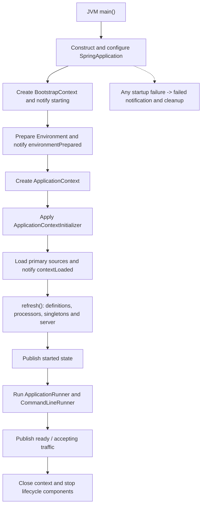

# Spring Boot Startup Extension Points And Events

<DocLabels items={[
  {label: 'Startup internals', tone: 'advanced'},
  {label: 'Lifecycle ordering', tone: 'intermediate'},
  {label: 'Production readiness', tone: 'production'},
]} />

`main(...)` is the JVM entry point. `SpringApplication.run(...)` coordinates
extension points around environment preparation, context creation, refresh,
runners, availability, failure and shutdown. They run at different phases and
are not interchangeable.

## Lifecycle Timeline



This is a stable conceptual order. Internal methods and events can evolve; use
the pinned Boot version's API and startup evidence rather than relying on
undocumented ordering.

## Bootstrap Registry And Run Listeners

A bootstrap registry holds objects needed before the application context exists,
such as early infrastructure used while preparing configuration. A bootstrap
initializer must not assume that normal application beans have been registered.

`SpringApplicationRunListener` receives coarse startup phases. Boot commonly
uses an event-publishing implementation to translate phases into application
events. It is framework infrastructure, not the normal choice for application
startup work.

Typical public events progress through:

| Event | What is available |
|---|---|
| `ApplicationStartingEvent` | application and early bootstrap state; environment/context are not ready |
| `ApplicationEnvironmentPreparedEvent` | prepared environment and property sources; no refreshed context |
| `ApplicationContextInitializedEvent` | context exists and initializers ran; definitions may not be fully loaded |
| `ApplicationPreparedEvent` | definitions loaded but refresh not completed |
| `ApplicationStartedEvent` | context refreshed; runners not yet finished |
| `AvailabilityChangeEvent<LivenessState>` | liveness transition |
| `ApplicationReadyEvent` | runners completed successfully and application is ready |
| `ApplicationFailedEvent` | startup failed; context may be absent or partial |

Do not use an early event listener to fetch ordinary beans. Use the latest
extension point that owns the required state.

## ApplicationContextInitializer

An `ApplicationContextInitializer` customizes a newly created context before
refresh. Appropriate work includes adding a property source or applying a
context-level facility for bootstrap/testing.

```java
final class RegionContextInitializer
        implements ApplicationContextInitializer<ConfigurableApplicationContext> {
    @Override
    public void initialize(ConfigurableApplicationContext context) {
        context.getEnvironment().getPropertySources().addFirst(
                new MapPropertySource("bootstrapRegion", Map.of("app.region", "test")));
    }
}
```

It is too early for normal singleton use. Prefer ordinary configuration and
typed properties unless context-level customization is required.

## Factories Metadata Versus Auto-Configuration Imports

| Metadata | Purpose |
|---|---|
| `META-INF/spring.factories` and `SpringFactoriesLoader` | factory/extension discovery for supported factory types and historical Boot extension points |
| `META-INF/spring/org.springframework.boot.autoconfigure.AutoConfiguration.imports` | modern list of candidate Boot auto-configuration classes |

`@EnableAutoConfiguration` does not component-scan every dependency. Boot imports
candidates from dedicated metadata; class, property and missing-bean conditions
decide which definitions apply. “Everything comes from `spring.factories`” is
incomplete for modern Boot.

## Refresh-Time Processor Ordering

During `ApplicationContext.refresh()`:

1. `BeanDefinitionRegistryPostProcessor` can register definitions.
2. `BeanFactoryPostProcessor` can modify definitions before singleton creation.
3. `BeanPostProcessor` instances are registered.
4. normal non-lazy singletons are instantiated and initialized.
5. lifecycle components and embedded infrastructure start during refresh.

| Extension | Operates on | Normal use |
|---|---|---|
| `BeanDefinitionRegistryPostProcessor` | definition registry | register definitions derived from metadata |
| `BeanFactoryPostProcessor` | definitions/factory metadata | alter definition properties before instances exist |
| `BeanPostProcessor` | instances | injection, validation, callbacks and proxy wrapping |

Creating application beans from a factory post-processor can instantiate them
too early, before all processors exist, so they may miss injection or proxying.
Treat premature-creation warnings as correctness evidence.

## Bean Initialization Is Before Runners

During refresh, constructor resolution and instantiation are followed by
dependency population, aware callbacks, initialization post-processors,
`@PostConstruct`, `InitializingBean`, custom init methods and proxy publication.

Therefore `@PostConstruct` is not a runner that executes after server startup.
It is a per-bean initialization callback and should not perform long remote work.

## ApplicationRunner And CommandLineRunner

Both run after refresh and `ApplicationStartedEvent`, but before
`ApplicationReadyEvent`:

| Runner | Argument model |
|---|---|
| `CommandLineRunner` | raw `String...` arguments |
| `ApplicationRunner` | parsed `ApplicationArguments` |

```java
@Component
@Order(20)
final class CacheWarmupRunner implements ApplicationRunner {
    @Override
    public void run(ApplicationArguments args) {
        // bounded, observable startup work
    }
}
```

Use `Ordered` or `@Order` for required ordering. A runner failure prevents the
ready event and triggers failure handling. Keep mandatory work bounded and
idempotent; move optional or continuously retryable work behind explicit
lifecycle/readiness ownership.

## Web Application Type And Server Startup

`SpringApplication` infers servlet, reactive or non-web application type from
framework classes unless explicitly configured. Detection is more nuanced than
“Tomcat means servlet, Netty means reactive”; starters, exclusions and both web
stacks can change the decision.

The embedded server starts during context refresh. A listening socket alone does
not prove that runners, migrations, listener containers or readiness completed.

## Failure Readiness And Shutdown

On failure, capture the earliest root exception, phase, condition report, bean
cycle/candidate evidence and partial context state. Later exceptions often wrap
the useful cause.

Separate liveness, readiness, required dependency health and optional degraded
features. Readiness should mean the instance can serve its promised traffic.

On orderly close, Boot closes the context. The runtime should stop accepting new
traffic, drain configured in-flight server work, stop `SmartLifecycle` components
in phase order, invoke destruction callbacks and release resources within the
platform budget. Shutdown is not guaranteed after a crash; durable business work
must use database/message recovery rather than `@PreDestroy`.

## Diagnostic Checklist

1. Identify the last startup phase/event reached.
2. Capture the deepest root cause.
3. Inspect property precedence and profiles.
4. Inspect condition matches and bean back-offs.
5. Check for premature bean creation and missed proxying.
6. Separate refresh, runner and readiness failures.
7. Record runner and lifecycle start/stop duration.
8. Test startup failure and shutdown under production timeouts.

## Official References

- [Spring Boot Application Events And Listeners](https://docs.spring.io/spring-boot/reference/features/spring-application.html#features.spring-application.application-events-and-listeners)
- [Spring Boot Startup](https://docs.spring.io/spring-boot/reference/features/spring-application.html)
- [Spring Container Extension Points](https://docs.spring.io/spring-framework/reference/core/beans/factory-extension.html)
- [Spring Boot Graceful Shutdown](https://docs.spring.io/spring-boot/reference/web/graceful-shutdown.html)

## Recommended Next

Trace instance creation in [Autowiring And Circular Reference Internals](./AUTOWIRING-CIRCULAR-REFERENCE-INTERNALS.md).
