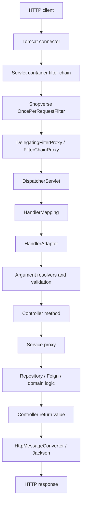
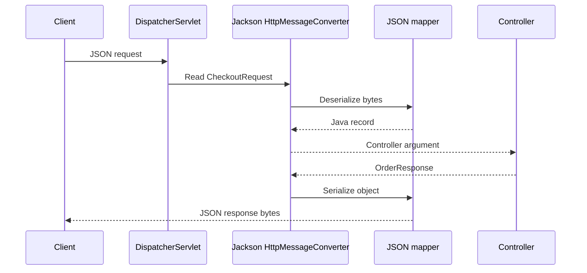

---
title: Spring Web MVC Servlet And Filter Internals
---

# Spring Web MVC Servlet And Filter Internals

Embedded servlet container, request lifecycle, filters, DispatcherServlet, argument resolution, Jackson, exception handling, and security integration.

Back to [Spring Boot Internals](../SPRING-BOOT-INTERNALS.md).

## Embedded Servlet Container

With `spring-boot-starter-web`, Boot detects a servlet application and
configures an embedded servlet container, normally Tomcat.

Simplified flow:

```text
ServletWebServerApplicationContext
  -> find ServletWebServerFactory
  -> create embedded Tomcat
  -> initialize ServletContext
  -> register DispatcherServlet and filters
  -> bind configured port
  -> start accepting requests
```

The application is packaged as an executable JAR; no separately installed
application server is required.

Tomcat assigns requests to worker threads. Those threads are reused, which is
why Shopverse request filters must clean MDC state.


## Servlet Request Lifecycle



Filter order depends on registration and security configuration. The diagram
shows concerns, not a universal numeric order for every Shopverse filter.


## `OncePerRequestFilter`

Shopverse servlet services use a request logging filter:

```java
public class RequestLoggingFilter extends OncePerRequestFilter {

    @Override
    protected void doFilterInternal(
            HttpServletRequest request,
            HttpServletResponse response,
            FilterChain filterChain
    ) throws ServletException, IOException {
        try (var ignored = MDC.putCloseable("correlationId", correlationId)) {
            filterChain.doFilter(request, response);
        }
    }
}
```

`filterChain.doFilter(...)` delegates to the next filter and eventually the
target servlet. Code after it runs while the response unwinds.

`OncePerRequestFilter` is designed to provide one execution per request
dispatch according to its dispatch configuration. Async and error dispatches
still require deliberate handling.


## `DispatcherServlet`

`DispatcherServlet` is Spring MVC's front controller. It coordinates rather
than implementing business logic.

Simplified dispatch:

1. receive servlet request;
2. find a handler through `HandlerMapping`;
3. find a compatible `HandlerAdapter`;
4. resolve controller arguments;
5. invoke the controller;
6. process the return value;
7. serialize the response or resolve a view;
8. map exceptions through exception resolvers.

Common MVC collaborators:

| Component | Responsibility |
|---|---|
| `RequestMappingHandlerMapping` | maps path/method conditions to controller methods |
| `RequestMappingHandlerAdapter` | invokes annotated controller methods |
| `HandlerMethodArgumentResolver` | creates method arguments |
| `HandlerMethodReturnValueHandler` | handles return types |
| `HttpMessageConverter` | reads/writes HTTP bodies |
| `HandlerExceptionResolver` | converts exceptions into responses |


## Controller Argument Resolution

For:

```java
public ResponseEntity<OrderResponse> checkout(
        @Valid @RequestBody CheckoutRequest request,
        @RequestHeader("Idempotency-Key") String key,
        Authentication authentication
) {
    // ...
}
```

Spring resolves:

- `@RequestBody` using an HTTP message converter;
- `@RequestHeader` from request headers;
- `Authentication` from the security context;
- path/query parameters using their argument resolvers;
- `@Valid` through Jakarta Validation.

Validation failure occurs before ordinary controller business logic and is
handled through MVC exception resolution.


## Jackson Auto-Configuration

With Spring MVC and Jackson on the classpath, Boot configures JSON support.
Spring Boot 4 uses Jackson 3 by default through `spring-boot-starter-jackson`.
Its mapper API is under `tools.jackson.*`. Boot 4 also provides deprecated
Jackson 2 compatibility modules under `com.fasterxml.jackson.*` for migration.

The central concept is a configured JSON mapper. Its exact Java type depends
on whether the application uses Jackson 3 or the Jackson 2 compatibility path.



Spring MVC selects the matching Jackson HTTP message converter for media types
such as `application/json`. With Boot 4's default Jackson 3 stack this is the
Jackson 3 converter; `MappingJackson2HttpMessageConverter` belongs to the
Jackson 2 compatibility path.

Boot's Jackson configuration commonly:

- discovers Jackson on the classpath;
- builds/configures the applicable Jackson mapper;
- registers available modules;
- integrates Java time types;
- registers the converter with MVC;
- applies `spring.jackson.*` properties.

Records work well as DTOs because Jackson can bind their constructor
components and serialize their accessors.


## Customizing Jackson

Prefer the customizer that matches the selected Jackson generation.

Boot 4 / Jackson 3:

```java
@Bean
JsonMapperBuilderCustomizer jsonCustomizer() {
    return builder -> {
        // configure application-wide JSON behavior
    };
}
```

Jackson 2 compatibility:

```java
@Bean
Jackson2ObjectMapperBuilderCustomizer jackson2Customizer() {
    return builder -> {
        // configure legacy Jackson 2 behavior
    };
}
```

Or provide a Jackson module for a specific domain type. Replacing the complete
mapper can discard Boot defaults and discovered modules.

Production practices:

- use stable DTOs rather than JPA entities;
- define date/time and timezone conventions;
- avoid polymorphic deserialization of untrusted arbitrary types;
- bound request size;
- decide unknown-field behavior intentionally;
- never serialize credentials or internal security objects;
- test backward compatibility.

Several current Shopverse Kafka/outbox classes import
`com.fasterxml.jackson.databind.ObjectMapper`, which is Jackson 2. Because the
services run Spring Boot 4, this is a compatibility path and should be audited
before removing Jackson 2 support or standardizing on Jackson 3. Do not assume
the MVC Jackson 3 mapper and an injected Jackson 2 `ObjectMapper` are the same
bean or configuration.


## Exception Handling

Exceptions can be handled by:

- controller-local `@ExceptionHandler`;
- global `@RestControllerAdvice`;
- Spring MVC's built-in resolvers;
- servlet container handling for failures outside MVC;
- Spring Security entry points/denied handlers before MVC.

An exception thrown in a security filter does not necessarily reach a
controller advice because it occurs before `DispatcherServlet`.

Use one stable error contract and avoid exposing stack traces or internal SQL.


## Spring Security Integration

Boot detects Spring Security and configures supporting infrastructure.
Application `SecurityFilterChain` beans define the actual request rules.

Servlet flow:

```text
Servlet container
  -> DelegatingFilterProxy
  -> Spring Security FilterChainProxy
  -> first matching SecurityFilterChain
  -> authentication and authorization filters
  -> DispatcherServlet
```

Bearer-token flow:

1. `BearerTokenAuthenticationFilter` resolves the token.
2. `JwtAuthenticationProvider` invokes `JwtDecoder`.
3. signature and configured claims are validated.
4. `JwtAuthenticationConverter` maps claims to authorities.
5. the authenticated object is stored in `SecurityContextHolder`.
6. URL authorization runs.
7. method-security proxies evaluate `@PreAuthorize` when invoked.

User Service has two chains because its internal endpoint uses Basic
authentication while normal APIs use bearer JWT authentication. The first
matching chain is selected.

Detailed security filters, providers, Basic authentication, JWT, method
security, and multiple chains are documented in
[Spring Security](../../security/SPRING-SECURITY-GENERIC.md).


