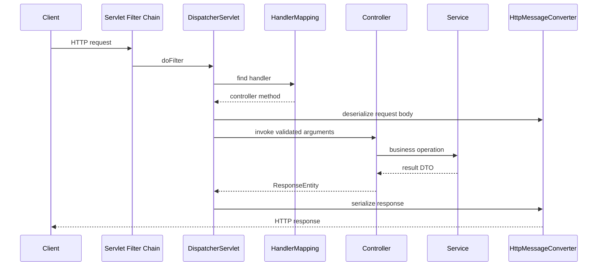

---
title: Spring REST API Basics And CRUD
---

# Spring REST API Basics And CRUD

Dependencies, request lifecycle, and a clean CRUD structure.

Back to [Spring REST APIs](../SPRING-REST-APIS.md).

## Required Dependencies

```gradle
implementation 'org.springframework.boot:spring-boot-starter-web'
implementation 'org.springframework.boot:spring-boot-starter-validation'
implementation 'org.springdoc:springdoc-openapi-starter-webmvc-ui'
testImplementation 'org.springframework.boot:spring-boot-starter-test'
```

The web starter supplies Spring MVC, an embedded servlet server, JSON support,
and common web infrastructure. Validation provides Jakarta Bean Validation.
Use a Springdoc version compatible with the project's Spring Boot generation.


## Request Lifecycle



`DispatcherServlet` is the front controller. It coordinates handler mapping,
argument resolution, validation, controller invocation, exception resolution,
and response conversion.


## A Clean CRUD Structure

Keep controllers responsible for HTTP concerns and services responsible for
business behavior:

```text
ProductController
  -> ProductService
     -> ProductRepository
        -> database
```

### Request And Response Records

```java
public record CreateProductRequest(
        @NotBlank @Size(max = 120) String name,
        @NotNull @Positive BigDecimal price,
        @NotBlank @Size(min = 3, max = 3) String currency
) {
}

public record ProductResponse(
        Long id,
        String name,
        BigDecimal price,
        String currency,
        Instant createdAt
) {
}
```

Records are suitable for immutable API data carriers. Do not expose JPA
entities directly because persistence structure, lazy associations, and
internal fields should not become the public contract.

### Controller

```java
@RestController
@RequestMapping("/api/v1/products")
@RequiredArgsConstructor
public class ProductController {

    private final ProductService productService;

    @PostMapping
    public ResponseEntity<ProductResponse> create(
            @Valid @RequestBody CreateProductRequest request
    ) {
        ProductResponse created = productService.create(request);
        URI location = URI.create("/api/v1/products/" + created.id());
        return ResponseEntity.created(location).body(created);
    }

    @GetMapping("/{id}")
    public ProductResponse get(@PathVariable Long id) {
        return productService.get(id);
    }

    @GetMapping
    public Page<ProductResponse> findAll(
            @RequestParam(defaultValue = "0") @PositiveOrZero int page,
            @RequestParam(defaultValue = "20") @Min(1) @Max(100) int size
    ) {
        return productService.findAll(PageRequest.of(page, size));
    }

    @PutMapping("/{id}")
    public ProductResponse replace(
            @PathVariable Long id,
            @Valid @RequestBody CreateProductRequest request
    ) {
        return productService.replace(id, request);
    }

    @DeleteMapping("/{id}")
    public ResponseEntity<Void> delete(@PathVariable Long id) {
        productService.delete(id);
        return ResponseEntity.noContent().build();
    }
}
```

### Service Transaction Boundary

```java
@Service
@RequiredArgsConstructor
public class ProductService {

    private final ProductRepository repository;
    private final ProductMapper mapper;

    @Transactional
    public ProductResponse create(CreateProductRequest request) {
        ProductEntity saved = repository.save(mapper.toEntity(request));
        return mapper.toResponse(saved);
    }

    @Transactional(readOnly = true)
    public ProductResponse get(Long id) {
        return repository.findById(id)
                .map(mapper::toResponse)
                .orElseThrow(() -> new ProductNotFoundException(id));
    }
}
```

The service owns the transaction because it knows the complete business unit
of work. The controller should not coordinate repository calls.


