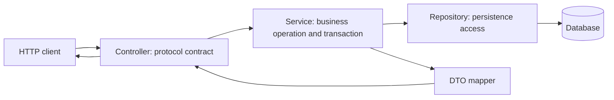

# Spring REST API Basics And CRUD

<DocLabels items={[
  {label: 'Intermediate', tone: 'intermediate'},
  {label: 'API boundaries', tone: 'production'},
  {label: 'Shopverse current', tone: 'shopverse'},
]} />

This page owns controller, DTO, service, and transaction responsibilities. The
servlet and `DispatcherServlet` mechanics live in the
[canonical request-lifecycle guide](../../spring/web/SERVLET-MVC-REQUEST-LIFECYCLE.md).

<DocCallout type="tip" title="Keep the controller fluent in HTTP, not in persistence">
Controllers bind the HTTP contract and delegate one business operation. Services
own transaction boundaries and domain decisions. Repositories own persistence
access. A thin controller is still responsible for precise status, headers,
validation, authentication context, and stable representations.
</DocCallout>

## Required Dependencies

<DependencyTabs
  gradle={<pre><code>{`implementation 'org.springframework.boot:spring-boot-starter-web'
implementation 'org.springframework.boot:spring-boot-starter-validation'
testImplementation 'org.springframework.boot:spring-boot-starter-test'`}</code></pre>}
  maven={<pre><code>{`<dependency>
  <groupId>org.springframework.boot</groupId>
  <artifactId>spring-boot-starter-web</artifactId>
</dependency>
<dependency>
  <groupId>org.springframework.boot</groupId>
  <artifactId>spring-boot-starter-validation</artifactId>
</dependency>`}</code></pre>}
/>

Add OpenAPI tooling only with a version compatible with the selected Spring Boot
generation.

## Responsibility Flow



| Layer | Owns | Avoid |
|---|---|---|
| Controller | route, HTTP method, request DTO, validation trigger, principal, status and headers | repository coordination and long transactions |
| Service | authorization requiring domain state, invariants, transaction and idempotent operation | servlet types and transport-specific error JSON |
| Repository | queries, locking and persistence operations | public API representations |
| Mapper | explicit domain/entity-to-contract conversion | hidden I/O during mapping |

## Stable Request And Response DTOs

```java
public record CreateProductRequest(
        @NotBlank @Size(max = 120) String name,
        @NotNull @Positive BigDecimal price,
        @NotBlank @Pattern(regexp = "[A-Z]{3}") String currency
) {
}

public record ProductResponse(
        Long id,
        String name,
        BigDecimal price,
        String currency,
        Instant createdAt
) {
}
```

Do not expose JPA entities as the public contract. Entity structure, lazy
associations, audit fields, and database refactors should not silently change API
JSON. Explicit DTOs also make field-level authorization and compatibility review
visible.

## Controller Contract

```java
@RestController
@RequestMapping("/api/v1/products")
@RequiredArgsConstructor
class ProductController {

    private final ProductService productService;

    @PostMapping
    ResponseEntity<ProductResponse> create(
            @Valid @RequestBody CreateProductRequest request
    ) {
        ProductResponse created = productService.create(request);
        URI location = URI.create("/api/v1/products/" + created.id());
        return ResponseEntity.created(location).body(created);
    }

    @GetMapping("/{id}")
    ProductResponse get(@PathVariable Long id) {
        return productService.get(id);
    }

    @DeleteMapping("/{id}")
    ResponseEntity<Void> delete(@PathVariable Long id) {
        productService.delete(id);
        return ResponseEntity.noContent().build();
    }
}
```

Use `ResponseEntity` when status or headers differ from the normal default. A DTO
return type is clearer than `ResponseEntity<?>` for an ordinary `200 OK`.

## Service Transaction Boundary

```java
@Service
@RequiredArgsConstructor
class ProductService {

    private final ProductRepository repository;
    private final ProductMapper mapper;

    @Transactional
    ProductResponse create(CreateProductRequest request) {
        ProductEntity saved = repository.save(mapper.toEntity(request));
        return mapper.toResponse(saved);
    }

    @Transactional(readOnly = true)
    ProductResponse get(Long id) {
        return repository.findById(id)
                .map(mapper::toResponse)
                .orElseThrow(() -> new ProductNotFoundException(id));
    }
}
```

The service owns the complete local unit of work. Avoid holding a database
transaction open while waiting on a remote service. Cross-service workflows need
local transactions plus durable coordination rather than one distributed
controller transaction.

## HTTP Semantics To Decide Explicitly

- `POST` creation normally returns `201 Created` and a stable `Location`.
- `PUT` is complete replacement at a known URI; define whether absent fields reset.
- `PATCH` needs explicit partial-update semantics, including absent versus null.
- A successful delete commonly returns `204 No Content`; define repeated-delete
  behavior rather than relying on an accidental repository exception.
- Bound and validate collection endpoints; do not expose Spring `Page<Entity>`.
- Use conditional requests or entity versions when concurrent updates can lose data.
- Authentication identifies the caller; service logic still enforces ownership.

## Shopverse Current And Proposed Evidence

<DocCallout type="shopverse" title="Current: controllers use shared transport helpers but retain service policy">
`UserController` delegates pagination validation to `PaginationUtils` and returns
the shared `PageResponse`, while service methods own user-query behavior.
`OrderController.checkout` binds a validated request, authenticated identity, and
`Idempotency-Key`, then delegates the transaction and SAGA start to
`OrderServiceImpl`.
</DocCallout>

These examples preserve the intended boundary: platform modules share transport
shapes and helpers, while services own domain exceptions, allowed sort fields,
ownership rules, and transactions.

<DocCallout type="production" title="Proposed: verify the public contract at the HTTP boundary">
For each controller operation, add tests for authorization, invalid input,
malformed JSON, status, headers, stable response shape, and service delegation.
Use a live-server test when connector, real security configuration, compression,
or deployed serialization settings are part of the claim.
</DocCallout>

## Review Checklist

- Request and response DTOs are independent of persistence entities.
- Status codes and `Location`, ETag, or retry headers match documented semantics.
- Controller input sizes and collection sizes are bounded.
- The service owns the local transaction and server-side ownership checks.
- Remote waits do not occur inside a database transaction without explicit reason.
- Mapping performs no hidden lazy I/O.
- Error translation is centralized without moving domain policy into a platform module.
- Contract tests cover incompatible changes and failure responses.

## Official References

- [Spring MVC annotated controllers](https://docs.spring.io/spring-framework/reference/web/webmvc/mvc-controller.html)
- [Spring MVC request mappings](https://docs.spring.io/spring-framework/reference/web/webmvc/mvc-controller/ann-requestmapping.html)
- [Spring transaction management](https://docs.spring.io/spring-framework/reference/data-access/transaction.html)

## Recommended Next

<TopicCards items={[
  {title: 'Request lifecycle', href: '/spring/web/SERVLET-MVC-REQUEST-LIFECYCLE', description: 'Trace what happens before and after the controller boundary.', icon: 'route', tags: ['MVC', 'Runtime']},
  {title: 'REST testing', href: '/development/spring-rest/REST-TESTING', description: 'Verify mappings, security, conversion, validation, and live-server behavior.', icon: 'experiment', tags: ['MockMvc', 'Contracts']},
]} />
