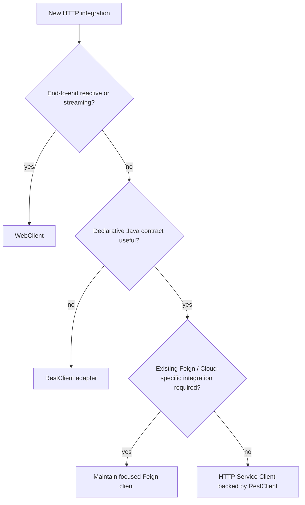
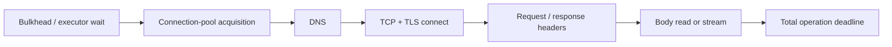

# Spring HTTP Client Selection And Runtime

<DocLabels items={[
  {label: 'Advanced', tone: 'advanced'},
  {label: 'Dependency runtime', tone: 'production'},
  {label: 'Shopverse current', tone: 'shopverse'},
]} />

Choose an HTTP client from the application's execution model, streaming needs,
contract ownership, and Spring Cloud requirements. The API style does not remove
the underlying connection pool, deadlines, DNS, TLS, cancellation, or dependency
capacity.

<DocCallout type="tip" title="Select the execution model before the syntax">
Use `RestClient` for new imperative adapters, `WebClient` for end-to-end reactive
or streaming work, and HTTP Service interfaces when a declarative contract adds
value. Keep existing Feign clients where they are owned and tested; migrate for a
reason, not for novelty.
</DocCallout>

## Selection Flow



## Comparison

| Client | Model | Best fit | Main trap |
|---|---|---|---|
| `RestClient` | synchronous fluent | new imperative integration adapters | assuming connect timeout bounds the whole call |
| `WebClient` | nonblocking reactive | reactive composition, streaming, high concurrency | blocking event-loop threads or mixing blocking dependencies |
| HTTP Service Client | annotated proxy over `RestClient` or `WebClient` | stable focused declarative contracts | interfaces growing into remote-service mirrors |
| Spring Cloud OpenFeign | declarative blocking Cloud integration | existing discovery/load-balancing/interceptor investment | treating feature-complete as the default for new work |
| `RestTemplate` | synchronous template | maintained legacy code | Spring Framework 7 deprecates it in favor of `RestClient` |

## RestClient For Imperative Adapters

```java
@Configuration(proxyBeanMethods = false)
class InventoryHttpConfiguration {

    @Bean
    RestClient inventoryRestClient(RestClient.Builder builder) {
        return builder
                .baseUrl("https://inventory.example.com")
                .defaultHeader(HttpHeaders.ACCEPT,
                        MediaType.APPLICATION_JSON_VALUE)
                .build();
    }
}
```

Keep it behind a domain-focused adapter:

```java
InventoryResponse getInventory(long productId) {
    return inventoryRestClient.get()
            .uri("/api/v1/inventory/{id}", productId)
            .retrieve()
            .onStatus(HttpStatusCode::is5xxServerError,
                    (request, response) -> {
                        throw new InventoryUnavailableException();
                    })
            .body(InventoryResponse.class);
}
```

`RestClient` delegates to a client request factory backed by a concrete HTTP
library. Select and configure that transport explicitly when pool, TLS, proxy, or
timeout behavior matters.

## WebClient For Reactive Or Streaming Work

`WebClient` supports nonblocking I/O and Reactive Streams composition when the
complete path remains nonblocking:

```java
Mono<InventoryResponse> getInventory(long productId) {
    return inventoryWebClient.get()
            .uri("/api/v1/inventory/{id}", productId)
            .retrieve()
            .bodyToMono(InventoryResponse.class)
            .timeout(Duration.ofSeconds(3));
}
```

Reactive types do not transform JDBC, a blocking SDK, or `.block()` into
nonblocking work. Event-loop ownership, backpressure, context, error, and
cancellation depth belongs in [Spring Reactive And WebFlux](../../spring/SPRING-REACTIVE.md).

## HTTP Service Clients

```java
interface InventoryHttpService {

    @GetExchange("/api/v1/inventory/{productId}")
    InventoryResponse get(@PathVariable long productId);
}
```

Create the proxy with `HttpServiceProxyFactory` backed by `RestClient` for
imperative return types or `WebClient` for reactive return types. Keep the
interface narrow, consumer-owned, and independent of the domain model. Test the
generated request against a mock web server.

## Existing Spring Cloud OpenFeign

Spring Cloud OpenFeign creates a proxy from annotated interfaces and integrates
Spring MVC contracts, encoding/decoding, load balancing, interceptors, circuit
breaking, and selected transports. The project is feature-complete and recommends
Spring HTTP Service Clients for new declarative work.

Shopverse already uses Feign, so this is an evolution signal rather than an
emergency rewrite. Deep Feign configuration, error decoders, and migration detail
lives in [Spring Cloud OpenFeign](../../spring/SPRING-OPENFEIGN.md).

## Deadline And Pool Model



Configure and observe each relevant phase:

- pool maximum, pending-acquisition maximum, and acquisition timeout;
- connect and TLS timeout;
- response-header/read timeout;
- total operation deadline including retries;
- idle/eviction policy and connection reuse;
- response and upload size limits;
- cancellation and resource cleanup;
- per-dependency concurrency and rejection behavior.

Retries consume the same total budget. Retry only selected transient failures and
operations safe to repeat. Never retry commands without a durable idempotency
strategy.

## Cross-Cutting Context

Propagate authentication, correlation, trace, locale, and idempotency only when
the downstream contract owns them. Use interceptors/filters rather than repeating
headers at every call. Do not propagate inbound credentials to an unrelated
third party, and never log authorization values.

Metrics should use dependency name, normalized route, method, status/outcome,
attempt, and timeout phase. Complete URLs and resource IDs create high cardinality.

## Shopverse Current And Proposed Evolution

<DocCallout type="shopverse" title="Current: focused Feign clients and correlation propagation">
Auth Service calls User Service through `UserClient`. Order Service calls public
Inventory endpoints through `InventoryClient`. `FeignCorrelationConfig` copies
the bounded correlation header from MDC. Build conventions use Spring Boot
`4.0.6` and Spring Cloud `2025.1.1`.
</DocCallout>

<DocCallout type="production" title="Proposed: contract-test before selecting a migration candidate">
First add mock-web-server tests for both clients, including header propagation,
JSON, error decoding, and timeout behavior. For the next narrow imperative
integration, compare `RestClient` adapter and HTTP Service Client. Migrate existing
Feign only when reduced dependencies, reactive support, or operational consistency
justifies the compatibility work.
</DocCallout>

## Production Review Checklist

- Client style matches the service execution model.
- Transport implementation and connection pool are known.
- Every timeout phase and total deadline has an owner.
- Retry eligibility, attempts, backoff, jitter, and idempotency are explicit.
- Authentication and trace propagation are allow-listed.
- DTOs are contained inside the adapter boundary.
- Response size and streaming lifecycle are bounded.
- Metrics identify pool wait, connect, response, decoding, and retry failures.
- Shutdown drains or cancels active calls predictably.
- Wire behavior is tested with the production transport where required.

## Expandable Interview Checks

<ExpandableAnswer title="Should new imperative code use RestTemplate?">

No. Spring Framework 7 deprecates `RestTemplate` in favor of `RestClient`. Maintain
existing code safely, but use `RestClient` for new imperative adapters.

</ExpandableAnswer>

<ExpandableAnswer title="Does WebClient make a blocking database call nonblocking?">

No. A blocking driver still blocks its executing thread and can stall an event
loop unless isolated. Prefer one coherent execution model and bounded transitions.

</ExpandableAnswer>

<ExpandableAnswer title="Why might HTTP Service Clients replace a new Feign interface?">

They provide declarative interfaces backed by Spring's blocking or reactive
clients without requiring Spring Cloud OpenFeign, which is feature-complete.
Existing Cloud integration needs may still justify Feign.

</ExpandableAnswer>

## Official References

- [Spring Framework REST clients](https://docs.spring.io/spring-framework/reference/integration/rest-clients.html)
- [Spring WebClient](https://docs.spring.io/spring-framework/reference/web/webflux-webclient.html)
- [Spring Cloud OpenFeign](https://docs.spring.io/spring-cloud-openfeign/reference/)

## Recommended Next

<TopicCards items={[
  {title: 'HTTP client contract tests', href: '/spring/testing/HTTP-CLIENT-CONTRACT-TESTS', description: 'Prove mapping, conversion, timeouts, errors, and retries at the wire boundary.', icon: 'experiment', tags: ['Contracts', 'Mock server']},
  {title: 'Spring Cloud OpenFeign', href: '/spring/SPRING-OPENFEIGN', description: 'Review current Shopverse Feign internals, configuration, and migration detail.', icon: 'network', tags: ['Feign', 'Spring Cloud']},
  {title: 'Web execution models', href: '/spring/web/WEB-EXECUTION-MODELS-CAPACITY', description: 'Connect client pools and deadlines to service capacity and saturation.', icon: 'gauge', tags: ['Pools', 'SLOs']},
]} />
