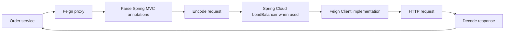

---
title: Spring REST Clients And Feign
---

# Spring REST Clients And Feign

RestTemplate, RestClient, WebClient, Feign, and choosing the right HTTP client.

Back to [Spring REST APIs](../SPRING-REST-APIS.md).

## Calling Other REST APIs

Spring provides several client styles. Choose according to the application's
execution model, contract ownership, and infrastructure needs.

| Client | Programming model | Status | Typical use |
|---|---|---|---|
| `RestClient` | synchronous fluent API | preferred for new imperative code | direct HTTP integrations |
| `WebClient` | non-blocking reactive API | preferred for reactive or streaming code | WebFlux, high concurrency, streaming |
| `RestTemplate` | synchronous template API | maintenance mode | existing applications |
| Spring Cloud OpenFeign | declarative interface proxy | active Spring Cloud integration | internal service contracts |

Do not select `WebClient` only because it is newer. Blocking on it in an
imperative application removes most reactive benefits while adding a more
complex programming model.

### `RestClient`

Dependency:

<DependencyTabs
  gradle={<pre><code>{`implementation 'org.springframework.boot:spring-boot-starter-web'`}</code></pre>}
  maven={<pre><code>{`<dependency>
  <groupId>org.springframework.boot</groupId>
  <artifactId>spring-boot-starter-web</artifactId>
</dependency>`}</code></pre>}
/>

Create a client with shared base configuration:

```java
@Configuration(proxyBeanMethods = false)
class InventoryHttpConfiguration {

    @Bean
    RestClient inventoryRestClient(RestClient.Builder builder) {
        return builder
                .baseUrl("https://inventory.example.com")
                .defaultHeader(HttpHeaders.ACCEPT,
                        MediaType.APPLICATION_JSON_VALUE)
                .build();
    }
}
```

Use it from a focused adapter:

```java
@Component
@RequiredArgsConstructor
class InventoryHttpClient {

    private final RestClient inventoryRestClient;

    InventoryResponse getInventory(long productId) {
        return inventoryRestClient.get()
                .uri("/api/v1/inventory/{productId}", productId)
                .retrieve()
                .onStatus(
                        HttpStatusCode::is5xxServerError,
                        (request, response) -> {
                            throw new InventoryUnavailableException();
                        }
                )
                .body(InventoryResponse.class);
    }
}
```

Internally, `RestClient` uses Spring's `ClientHttpRequestFactory` abstraction.
The chosen request factory delegates to an underlying synchronous HTTP client.
The available implementation depends on classpath and configuration, such as a
JDK, Apache HttpComponents, or Jetty-based request factory.

Configure connection, response, and total operation deadlines explicitly. A
connect timeout alone does not bound how long the complete request can wait.

### `RestTemplate`

`RestTemplate` remains supported for existing synchronous applications, but
new imperative code should generally use `RestClient`.

```java
@Bean
RestTemplate restTemplate(RestTemplateBuilder builder) {
    return builder
            .connectTimeout(Duration.ofSeconds(2))
            .readTimeout(Duration.ofSeconds(3))
            .build();
}
```

```java
InventoryResponse response = restTemplate.getForObject(
        "https://inventory.example.com/api/v1/inventory/{id}",
        InventoryResponse.class,
        productId
);
```

Internally, `RestTemplate` also delegates request creation to a
`ClientHttpRequestFactory` and uses `HttpMessageConverter` instances for
serialization and deserialization.

Do not create a new `RestTemplate` for every call. Configure and inject one or
more purpose-specific clients so connections, timeouts, interceptors, and
observability are consistent.

### `WebClient`

Dependency:

<DependencyTabs
  gradle={<pre><code>{`implementation 'org.springframework.boot:spring-boot-starter-webflux'`}</code></pre>}
  maven={<pre><code>{`<dependency>
  <groupId>org.springframework.boot</groupId>
  <artifactId>spring-boot-starter-webflux</artifactId>
</dependency>`}</code></pre>}
/>

`WebClient` is non-blocking when used end to end with a non-blocking connector
and reactive processing:

```java
@Bean
WebClient inventoryWebClient(WebClient.Builder builder) {
    return builder
            .baseUrl("https://inventory.example.com")
            .build();
}
```

```java
Mono<InventoryResponse> getInventory(long productId) {
    return inventoryWebClient.get()
            .uri("/api/v1/inventory/{id}", productId)
            .retrieve()
            .onStatus(
                    HttpStatusCode::is5xxServerError,
                    response -> Mono.error(
                            new InventoryUnavailableException()
                    )
            )
            .bodyToMono(InventoryResponse.class)
            .timeout(Duration.ofSeconds(3));
}
```

`WebClient` delegates network operations to a `ClientHttpConnector`. Reactor
Netty is a common connector when present through WebFlux, while other
connectors can be configured. Reactive types do not make a blocking database
driver or blocking SDK non-blocking.

Avoid calling `.block()` on event-loop threads. In a normal Spring MVC service,
use `RestClient` unless reactive composition, streaming, or concurrency
requirements justify `WebClient`.

### Spring Cloud OpenFeign

Dependency:

<DependencyTabs
  gradle={<pre><code>{`implementation 'org.springframework.cloud:spring-cloud-starter-openfeign'`}</code></pre>}
  maven={<pre><code>{`<dependency>
  <groupId>org.springframework.cloud</groupId>
  <artifactId>spring-cloud-starter-openfeign</artifactId>
</dependency>`}</code></pre>}
/>

Enable and declare a client:

```java
@SpringBootApplication
@EnableFeignClients
public class OrderServiceApplication {
}
```

```java
@FeignClient(
        name = "inventory-service",
        path = "/api/v1/inventory"
)
public interface InventoryClient {

    @GetMapping("/{productId}")
    InventoryResponse getInventory(
            @PathVariable long productId,
            @RequestHeader("X-Correlation-Id") String correlationId
    );
}
```

Spring Cloud OpenFeign creates a runtime proxy for the interface. Conceptually:



Feign itself defines a `Client` abstraction. Spring Cloud OpenFeign can
integrate it with:

- Spring Cloud LoadBalancer for logical service names;
- Apache HttpClient 5 when its implementation is available and enabled;
- OkHttp when its implementation is available and enabled;
- Feign's simpler default client when no specialized client is selected.

The exact client must be verified from dependencies and configuration rather
than assumed. Feign does not internally call `RestTemplate` or `WebClient` by
default; it uses its own proxy, contract, encoder, decoder, and selected
`feign.Client`.

Feign is useful when:

- the remote API has a stable, narrow Java-facing contract;
- Spring Cloud discovery and load balancing are required;
- common request interceptors propagate authentication and correlation data.

Avoid interfaces that mirror an entire remote service. Keep clients small and
owned by the consuming use case.

### HTTP Interface Clients

Spring can also generate clients from annotated interfaces backed by
`RestClient` or `WebClient`:

```java
public interface InventoryHttpService {

    @GetExchange("/api/v1/inventory/{productId}")
    InventoryResponse get(@PathVariable long productId);
}
```

```java
@Bean
InventoryHttpService inventoryHttpService(RestClient restClient) {
    RestClientAdapter adapter = RestClientAdapter.create(restClient);
    HttpServiceProxyFactory factory =
            HttpServiceProxyFactory.builderFor(adapter).build();
    return factory.createClient(InventoryHttpService.class);
}
```

This provides a declarative client without requiring Spring Cloud. OpenFeign
remains useful when Spring Cloud discovery, load balancing, and Feign-specific
extensions are part of the architecture.

### Client-Side Cross-Cutting Configuration

Propagate correlation and authentication through interceptors rather than
repeating headers at every call:

```java
@Bean
ClientHttpRequestInterceptor correlationInterceptor() {
    return (request, body, execution) -> {
        String correlationId = MDC.get("correlationId");
        if (correlationId != null) {
            request.getHeaders().set(
                    "X-Correlation-Id",
                    correlationId
            );
        }
        return execution.execute(request, body);
    };
}
```

For Feign:

```java
@Bean
RequestInterceptor correlationFeignInterceptor() {
    return template -> {
        String correlationId = MDC.get("correlationId");
        if (correlationId != null) {
            template.header("X-Correlation-Id", correlationId);
        }
    };
}
```

Micrometer Observation can instrument supported clients and propagate trace
context. Manual correlation IDs and distributed tracing serve related but
different operational purposes.

### REST Client Production Practices

- set connect, response, read, and total request deadlines;
- reuse configured clients and connection pools;
- validate response status before decoding;
- cap response and upload sizes;
- retry only selected transient failures and idempotent operations;
- combine retries with deadlines, backoff, jitter, and circuit breaking;
- do not retry `POST` commands without a durable idempotency strategy;
- propagate authentication, correlation, and trace context intentionally;
- record route-template, status, latency, and dependency metrics;
- avoid high-cardinality metrics such as complete URLs or resource IDs;
- use TLS and validate certificates;
- isolate third-party DTOs behind an adapter so their schema does not spread
  into the domain.

### REST Client Do And Do Not

| Do | Do not |
|---|---|
| Use `RestClient` for new imperative clients | Add `WebClient` only because it is newer |
| Use `WebClient` for reactive composition and streaming | Block an event-loop thread |
| Keep Feign interfaces small | Mirror every remote controller |
| Configure bounded timeouts | Use framework defaults without review |
| Reuse managed clients | Construct a client per request |
| Handle non-success statuses explicitly | Treat every body as a success |
| Retry safe/idempotent operations selectively | Retry all exceptions automatically |
| Test with a stub HTTP server | Mock only the Java method and ignore HTTP mapping |


