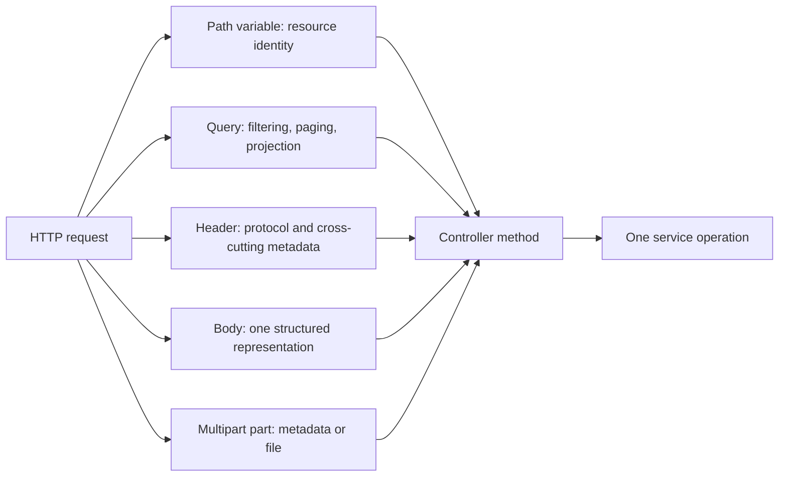

# Spring REST Controller And Request Mapping

<DocLabels items={[
  {label: 'Intermediate', tone: 'intermediate'},
  {label: 'HTTP boundary', tone: 'production'},
  {label: 'Shopverse current', tone: 'shopverse'},
]} />

Spring MVC maps path segments, query parameters, headers, bodies, and multipart
parts through different resolvers. Choose the source that matches HTTP semantics;
do not hide business data in infrastructure headers or build domain workflows in
the controller.

## Request Source Map



<DocCallout type="tip" title="Map narrowly">
Ask for the exact values a controller needs. Injecting the complete
`HttpServletRequest` is appropriate for infrastructure code but usually obscures
the public contract in an ordinary endpoint.
</DocCallout>

## Path Variables

Use a path variable for resource identity:

```java
@GetMapping("/{orderId}")
OrderResponse get(@PathVariable Long orderId) {
    return orderService.get(orderId);
}
```

Conversion can fail before controller business logic. A valid identifier still
requires server-side authorization; knowing `/orders/42` does not prove ownership.

## Query Parameters

Use query parameters for optional filtering, sorting, pagination, and projection:

```java
@GetMapping
PageResponse<UserSummaryResponse> search(
        @RequestParam(defaultValue = "0") int page,
        @RequestParam(defaultValue = "20") int size,
        @RequestParam(defaultValue = "id") String sortBy,
        @RequestParam(required = false) UserStatus status
) {
    Pageable pageable = PaginationUtils.createPageable(
            page, size, sortBy, "ASC", ALLOWED_SORT_FIELDS);
    return userService.getUsers(new UserFilter(null, status, null), pageable);
}
```

Allow-list sort and filter fields. Never concatenate arbitrary client input into
SQL, JPQL, SpEL, or dynamic property access. Cap collection sizes before executing
a query.

## Headers

Headers carry protocol and cross-cutting metadata such as credentials, content
negotiation, correlation, idempotency, and conditional requests:

```java
@PostMapping("/checkout")
OrderResponse checkout(
        @RequestHeader("Idempotency-Key") String idempotencyKey,
        @Valid @RequestBody CheckoutRequest request,
        Authentication authentication
) {
    return orderService.checkout(request, authentication.getName(), idempotencyKey);
}
```

Do not trust client-supplied correlation or forwarding headers without a length,
character, and trusted-proxy policy. Do not log authorization or idempotency
values indiscriminately.

## Request Bodies And Forms

An HTTP request has one body. Use one request DTO rather than multiple
`@RequestBody` parameters:

```java
@PostMapping
ResponseEntity<ProductResponse> create(
        @Valid @RequestBody CreateProductRequest request
) {
    ProductResponse created = productService.create(request);
    return ResponseEntity.created(URI.create("/api/v1/products/" + created.id()))
            .body(created);
}
```

`@ModelAttribute` binds form or query values. `@RequestPart` is appropriate when a
multipart part should be decoded through an `HttpMessageConverter`. Secure file
handling belongs in [Secure REST File Transfer](./REST-SECURE-FILE-TRANSFER.md).

## ResponseEntity

Use `ResponseEntity<T>` when the endpoint must control status or headers. Return a
DTO directly for a normal `200 OK`. Strong generic types improve OpenAPI output
and client generation; avoid returning `ResponseEntity<?>` everywhere.

Common deliberate choices include:

- `201 Created` plus `Location` for a newly addressable resource;
- `202 Accepted` plus an operation URI for durable asynchronous work;
- ETag headers for conditional retrieval and update;
- `204 No Content` for a successful operation with no representation.

## Shopverse Current And Proposed Evidence

<DocCallout type="shopverse" title="Current: Shopverse controllers keep service policy local">
`UserController` owns allowed sort-field selection and delegates bounded pageable
creation to the platform helper. `OrderController.checkout` binds authenticated
identity, a validated body, and the idempotency header before delegating the
transactional command.
</DocCallout>

<DocCallout type="production" title="Proposed: add a binding and trust-boundary contract suite">
For representative endpoints, test unknown enum values, numeric overflow, invalid
UUIDs, duplicate query parameters, oversized headers, malformed bodies,
unsupported content types, untrusted forwarding headers, and field allow-lists.
Assert the service is not called for rejected input.
</DocCallout>

## Architect Review Checklist

- Route and method semantics match the resource operation.
- Body, path, query, header, and multipart limits are explicit.
- Client-controlled sort and filter values are allow-listed.
- Authentication is not confused with resource ownership.
- Proxy-derived scheme, host, and client IP come only from trusted infrastructure.
- DTO conversion and validation occur before expensive service work.
- Status, headers, and response schema are contract-tested.
- Metrics use normalized routes rather than raw identifiers.

## Expandable Interview Checks

<ExpandableAnswer title="Why should an endpoint have only one RequestBody parameter?">

HTTP provides one request body. Model its structured fields in one DTO; use
multipart parts only when the media type and contract genuinely contain multiple
parts.

</ExpandableAnswer>

<ExpandableAnswer title="Why must sort fields be allow-listed?">

Arbitrary property names can expose internal fields, create expensive query plans,
or enter unsafe dynamic expressions. The service owns a bounded public sort
vocabulary mapped to known database expressions.

</ExpandableAnswer>

<ExpandableAnswer title="When is ResponseEntity useful?">

When the endpoint must set a non-default status or headers such as `Location`,
ETag, or retry metadata. A direct DTO is clearer for an ordinary successful body.

</ExpandableAnswer>

## Official References

- [Spring MVC method arguments](https://docs.spring.io/spring-framework/reference/web/webmvc/mvc-controller/ann-methods/arguments.html)
- [Spring MVC request mapping](https://docs.spring.io/spring-framework/reference/web/webmvc/mvc-controller/ann-requestmapping.html)
- [Spring MVC responses](https://docs.spring.io/spring-framework/reference/web/webmvc/mvc-controller/ann-methods/responseentity.html)

## Recommended Next

<TopicCards items={[
  {title: 'REST error contracts', href: '/development/spring-rest/REST-ERROR-CONTRACTS', description: 'Map conversion, validation, security, domain, and infrastructure failures consistently.', icon: 'route', tags: ['Errors', 'Ownership']},
  {title: 'Validation fundamentals', href: '/spring/validation/BEAN-VALIDATION-FUNDAMENTALS', description: 'Apply constraint and cascade semantics at the mapped request boundary.', icon: 'book', tags: ['Valid', 'Constraints']},
]} />
