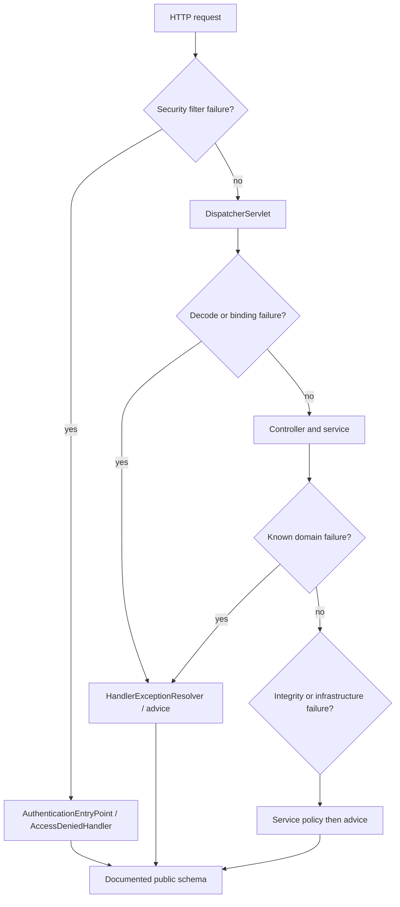

# Spring REST Error Contracts

<DocLabels items={[
  {label: 'Advanced', tone: 'advanced'},
  {label: 'Public contract', tone: 'production'},
  {label: 'Shopverse migration', tone: 'shopverse'},
]} />

Central error handling means one public policy, not one catch-all class that owns
every runtime layer. Security filters, MVC, services, transactions, and committed
responses have different translators.

## Error Ownership Map



<DocCallout type="mistake" title="Controller advice is not outside the filter chain">
An authentication failure can be translated before `DispatcherServlet`, so
`@RestControllerAdvice` is not a universal security error boundary. Configure and
test the security entry point and denied handler against the same public policy.
</DocCallout>

## Failure Taxonomy

| Boundary | Examples | Deliberate public result |
|---|---|---|
| protocol/mapping | unsupported media type, unacceptable representation | `415`, `406` |
| decoding/binding | malformed JSON, type mismatch, missing part | stable `400` |
| validation | body or handler-method constraints | stable field/parameter errors |
| authentication | missing or invalid credentials | `401` without credential detail |
| authorization | authenticated but forbidden | `403` without policy leakage |
| domain | resource missing, invalid state, ownership conflict | service-owned code and status |
| resilience | rate limit, bulkhead, dependency timeout | `429`, `503`, or owned dependency policy |
| database | known unique/foreign-key conflict | safe conflict only when identified |
| unexpected | defect or unknown infrastructure failure | generic `500`, internal evidence once |

Do not map every `DataIntegrityViolationException` to `409`; schema drift and
other defects can surface through the same broad type.

## Generic ProblemDetail

Spring Framework supports RFC 9457 through `ProblemDetail`, `ErrorResponse`, and
`ResponseEntityExceptionHandler`:

```java
ProblemDetail problem = ProblemDetail.forStatusAndDetail(
        HttpStatus.NOT_FOUND,
        "The requested product does not exist"
);
problem.setTitle("Product not found");
problem.setProperty("code", "PRODUCT_NOT_FOUND");
```

This is generic framework guidance. Define media type, extension properties,
message localization, and compatibility rules before publishing it.

## Current Shopverse Contract Shapes

Shopverse's common-error module also provides `ApiErrorResponse`:

```java
public record ApiErrorResponse(
        int status,
        String message,
        LocalDateTime timestamp,
        Map<String, String> errors
) {
}
```

<DocCallout type="shopverse" title="Current: services do not all expose the same shape">
User Service's `GlobalExceptionHandler` returns `ApiErrorResponse` through
`ApiErrors`. Order Service uses `ProblemDetail` for selected exceptions. The
shared module can construct both, so documentation must not claim that module
adoption alone standardizes one JSON schema.
</DocCallout>

<DocCallout type="production" title="Proposed: converge deliberately or version the difference">
Select one contract for a service family, publish schemas and examples in OpenAPI,
add consumer contract tests, and migrate through an additive compatibility window.
Do not change error media type or field meaning silently because clients often
depend on errors more tightly than successful responses.
</DocCallout>

## Validation Ownership

Cover both `MethodArgumentNotValidException` and
`HandlerMethodValidationException`; controller signatures choose which validation
mode runs. `HttpMessageNotReadableException` is decoding, not validation.
`ConstraintViolationException` from a service proxy belongs to the calling
application boundary. Detailed mechanics live in
[Validation Errors Testing And Production](../../spring/validation/VALIDATION-ERRORS-TESTING-PRODUCTION.md).

## Stable And Safe Fields

A public error should provide only fields with explicit semantics:

- stable machine code;
- HTTP status;
- safe human-readable title or message;
- normalized instance/path when policy permits;
- correlation or trace reference;
- bounded field/parameter errors;
- retry metadata only when the server can honor it.

Never return stack traces, SQL, database constraint names, credentials, tokens,
raw claims, internal hostnames, or sensitive rejected values.

## Observability And Incident Evidence

- Log the full internal exception once at the owning boundary.
- Attach correlation and trace IDs without copying secrets.
- Count errors by normalized route, stable code, status, and dependency.
- Avoid message text and resource IDs as metric labels.
- Preserve exception cause chains internally while returning safe detail.
- Detect double logging across service, advice, and container boundaries.
- Test response-commit behavior for streaming and serialization failures.

## Rollout Checklist

1. Inventory current response shapes and consuming clients.
2. Define the canonical schema and status/code mapping table.
3. Add producer and consumer contract tests.
4. Introduce additive fields before removing or changing old ones.
5. Monitor unknown-code and decode failures during a migration window.
6. Retain a rollback representation until consumers have moved.

## Expandable Interview Checks

<ExpandableAnswer title="Why might ControllerAdvice not handle an authentication error?">

Spring Security can reject and translate the request in its servlet filter chain
before MVC dispatch. The configured entry point or denied handler owns that path.

</ExpandableAnswer>

<ExpandableAnswer title="Should every database integrity exception become 409 Conflict?">

No. Map a conflict only after identifying a known client-relevant constraint.
Broad integrity exceptions can also indicate defects or schema/configuration drift.

</ExpandableAnswer>

<ExpandableAnswer title="Can one shared Java module guarantee one public error contract?">

No. It can provide reusable types and builders, but each service's handler,
security boundary, media type, version, and OpenAPI schema determine the actual
wire contract.

</ExpandableAnswer>

## Official References

- [Spring MVC error responses](https://docs.spring.io/spring-framework/reference/web/webmvc/mvc-ann-rest-exceptions.html)
- [Spring MVC exception handling](https://docs.spring.io/spring-framework/reference/web/webmvc/mvc-controller/ann-exceptionhandler.html)
- [Spring Security exception translation](https://docs.spring.io/spring-security/reference/servlet/architecture.html#servlet-exceptiontranslationfilter)
- [RFC 9457 Problem Details](https://www.rfc-editor.org/rfc/rfc9457)

## Recommended Next

<TopicCards items={[
  {title: 'OpenAPI contract governance', href: '/development/spring-rest/REST-OPENAPI-CONTRACT-GOVERNANCE', description: 'Publish and compatibility-test success and error representations.', icon: 'book', tags: ['OpenAPI', 'Compatibility']},
  {title: 'Security request runtime', href: '/spring/web/SECURITY-REQUEST-RUNTIME', description: 'Trace the filter-chain failures that MVC advice cannot own.', icon: 'security', tags: ['401', '403']},
]} />
