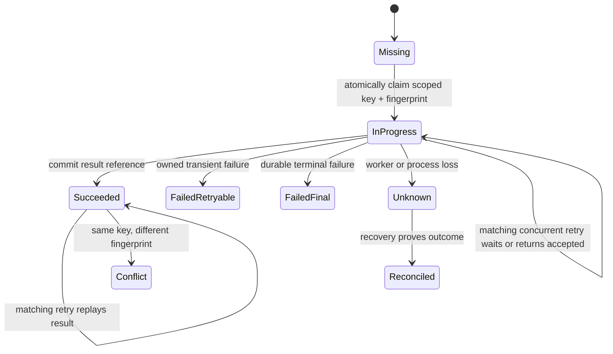

# REST Idempotent Commands

<DocLabels items={[
  {label: 'Architect', tone: 'advanced'},
  {label: 'Retry safety', tone: 'production'},
  {label: 'Shopverse partial', tone: 'shopverse'},
]} />

An idempotency key is not merely a duplicate lookup. A production design binds a
client retry to the same authenticated scope and canonical command, then makes the
first durable outcome atomic under concurrency.

<DocCallout type="mistake" title="Same key does not prove same command">
Without a request fingerprint, a caller can accidentally reuse a key with a
different cart, address, amount, or currency and receive an unrelated old result.
Compare canonical command identity before replaying success.
</DocCallout>

## Durable State Model



A record normally needs:

- key and authenticated tenant/user scope;
- operation name or endpoint version;
- canonical request fingerprint and fingerprint version;
- state plus creation, update, expiry, and lease timestamps;
- status, selected replay headers, and result/body reference;
- bounded failure code and recovery metadata.

Do not store secrets or raw sensitive bodies simply to compute identity.

## Controller Boundary

```java
@PostMapping("/checkout")
ResponseEntity<OrderResponse> checkout(
        @RequestHeader("Idempotency-Key")
        @NotBlank @Size(max = 100) String key,
        @Valid @RequestBody CheckoutRequest request,
        Authentication authentication
) {
    IdempotentResult<OrderResponse> result = checkoutService.execute(
            authentication.getName(), key, request);
    return ResponseEntity.status(result.httpStatus()).body(result.body());
}
```

Validate key length and characters, scope it to the authenticated caller, rate-
limit high-cardinality abuse, and never log the full key when it is sensitive.

## Canonical Request Fingerprinting

Hash a stable canonical business representation, not raw JSON bytes. JSON field
order, whitespace, optional defaults, and equivalent numeric spellings can change
raw bytes without changing intent.

```text
fingerprint input =
  endpoint contract version
  + authenticated scope
  + normalized cart items in stable order
  + shipping-address identity or normalized value
  + currency and monetary amount in canonical units
```

Version the fingerprint algorithm. A contract migration must define whether old
keys remain replayable and how fingerprints compare across versions.

## Concurrent First Requests

The database unique constraint is the arbitration point:

1. attempt to insert `(scope, operation, key, fingerprint, IN_PROGRESS)`;
2. one transaction wins;
3. a loser reads the committed record;
4. a matching fingerprint follows documented in-progress/replay behavior;
5. a different fingerprint returns a deliberate conflict.

A check-then-insert without loser recovery can still return a transient conflict
even though the key is unique. Test with simultaneous requests and a real database.

## Transaction And Side-Effect Ownership

Persist the idempotency claim, local business result, and outbox event in the same
local transaction when possible. If an external provider must be called, decide
how its own idempotency key, timeout, unknown outcome, and reconciliation map to
the local state machine.

Never mark local success before the durable business result exists. Never retry an
unknown payment or checkout outcome blindly.

## Current Shopverse Behavior

<DocCallout type="shopverse" title="Current: unique checkout key and owner check, but no payload fingerprint">
`OrderServiceImpl.checkout` looks up an order by globally unique idempotency key.
It rejects a key owned by another username and returns the existing order for the
same username. Liquibase enforces `uk_orders_idempotency_key`.
</DocCallout>

Current gaps to describe honestly:

- the stored order does not carry a canonical request fingerprint;
- same-owner reuse with a different checkout payload returns the existing order;
- two first requests can race after the initial lookup;
- the loser maps `DataIntegrityViolationException` to `409` instructing a retry,
  rather than reading and returning the winning result immediately;
- key retention and expiry are not modeled independently from order retention.

<DocCallout type="production" title="Proposed: fingerprint plus atomic loser recovery">
Add a fingerprint and version, scope uniqueness deliberately, recover the winning
record after unique-conflict, and distinguish `IN_PROGRESS`, successful replay,
payload conflict, retryable failure, and unknown outcome. Roll out with concurrent
tests and metrics before changing existing replay responses.
</DocCallout>

## Security Capacity And Evidence

- Cap key length and per-caller outstanding-key count.
- Expire records only after the documented maximum retry horizon and audit needs.
- Encrypt or tokenize sensitive result bodies; prefer references where possible.
- Record claim, replay, payload conflict, in-progress, unique-race, and recovery
  counts by normalized operation.
- Measure record age and unknown/in-progress duration.
- Alert on payload-conflict spikes and stuck operations.
- Test process death between claim, business commit, and response delivery.
- Test downstream unknown outcomes and reconciliation.

## Expandable Interview Checks

<ExpandableAnswer title="Why must an idempotency key be bound to a request fingerprint?">

The key identifies a retry only when the command is the same. The fingerprint
detects accidental or malicious reuse with different business input and turns it
into a deliberate conflict instead of replaying an unrelated result.

</ExpandableAnswer>

<ExpandableAnswer title="Is a unique database constraint enough for idempotency?">

It is the essential concurrency arbiter, but the application still needs loser
recovery, fingerprint comparison, durable states, replay responses, retention,
and unknown-outcome handling.

</ExpandableAnswer>

<ExpandableAnswer title="What should happen when a matching retry finds IN_PROGRESS?">

The API must define it: return `202` with operation status, wait within a bounded
deadline, or return a retryable conflict. It must not start the side effect again.

</ExpandableAnswer>

## Official References

- [HTTP method semantics](https://www.rfc-editor.org/rfc/rfc9110.html#name-method-definitions)
- [IETF Idempotency-Key HTTP Header draft](https://datatracker.ietf.org/doc/draft-ietf-httpapi-idempotency-key-header/)
- [Spring transaction management](https://docs.spring.io/spring-framework/reference/data-access/transaction.html)

## Recommended Next

<TopicCards items={[
  {title: 'REST error contracts', href: '/development/spring-rest/REST-ERROR-CONTRACTS', description: 'Define replay, in-progress, conflict, and unknown-outcome response contracts.', icon: 'route', tags: ['409', '202']},
  {title: 'OpenAPI contract governance', href: '/development/spring-rest/REST-OPENAPI-CONTRACT-GOVERNANCE', description: 'Publish key requirements, replay semantics, headers, examples, and compatibility rules.', icon: 'book', tags: ['Headers', 'Schemas']},
]} />
