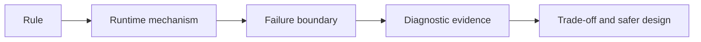

# Spring REST Interview Workbook

<DocLabels items={[
  {label: 'Senior interview', tone: 'advanced'},
  {label: 'Architect follow-ups', tone: 'production'},
  {label: '12 expandable answers', tone: 'foundation'},
  {label: 'Shopverse scenarios', tone: 'shopverse'},
]} />

Attempt each question aloud before expanding it. A strong answer goes beyond a
definition and explains mechanism, failure behavior, evidence, and a safer
production choice.

<DocCallout type="tip" title="Use Shopverse as evidence, not as a universal rule">
Name what the repository implements today, then distinguish proposed hardening.
Do not describe a target design as already deployed. Close with the test, metric,
constraint, or rollback signal that would prove the claim.
</DocCallout>

## Controller And Transaction Boundaries

<ExpandableAnswer title="1. Where should transaction boundaries be placed?">

Usually on public service methods that own one complete local business operation.
The controller owns HTTP mapping and delegates once; the service knows which
repository changes and invariants must commit atomically. Avoid controller
transactions because they blur transport and business lifecycles. Avoid remote
network waits inside a database transaction because latency consumes a connection
and extends lock duration. Verify the boundary with transaction logs, connection-
pool wait, lock evidence, and rollback tests.

</ExpandableAnswer>

<ExpandableAnswer title="2. How do you prevent a REST API from leaking persistence details?">

Use explicit request and response DTOs, mapping at a defined boundary,
service-owned fetch plans, and a stable error contract. Do not serialize JPA
entities, lazy proxies, internal columns, or database exception messages. Test
JSON independently from the entity and capture SQL to prove mapping does not
trigger hidden lazy I/O.

</ExpandableAnswer>

## Retry And Long-Running Operations

<ExpandableAnswer title="3. How do you make a create API safe to retry?">

Accept a stable idempotency key, bind it to the authenticated caller and a
canonical request fingerprint, and persist the key, operation state, and result
atomically. Enforce uniqueness in the database so concurrent first requests
cannot both win. A valid duplicate returns the original result; reuse with a
different request returns a deliberate conflict. Define in-progress behavior,
retention, and replay after partial failure.

Shopverse currently stores a unique checkout key and returns the existing order
when the same owner reuses it. Proposed hardening is to persist and compare a
request fingerprint as well, because owner equality alone does not prove that two
payloads represent the same command.

</ExpandableAnswer>

<ExpandableAnswer title="4. How do you design a long-running API?">

Return `202 Accepted` with a durable operation resource and a `Location` header.
Persist submission before acknowledging it, process asynchronously, expose
status, progress, bounded failure details, and terminal result links, and make
submission idempotent. Define cancellation, retention, authorization, retry, and
recovery ownership. A thread-local future held only in one application process is
not a durable operation model.

</ExpandableAnswer>

<ExpandableAnswer title="5. When would you use PUT instead of PATCH?">

Use `PUT` when the client supplies a complete replacement representation at a
known URI and repeated identical requests have the same intended effect. Use
`PATCH` for explicit partial-change semantics. Define media type, whether omitted
and null fields differ, validation against current state, authorization per field,
and concurrency protection with a version or conditional request.

</ExpandableAnswer>

## Distributed Failure And Persistence

<ExpandableAnswer title="6. How do you handle partial failure across services?">

Do not extend one database transaction across independent services. Commit local
state and a durable event atomically through an outbox, make consumers idempotent,
and model the workflow as observable states. Use SAGA compensation where a
business reversal exists, explicit deadlines for synchronous calls, and recovery
operations for stuck states. Shopverse checkout uses local order state, outbox
events, and a choreography timeline; evidence includes outbox rows, consumer lag,
order state, correlation ID, and recovery records.

</ExpandableAnswer>

<ExpandableAnswer title="7. How do you avoid N+1 queries in an API?">

Start from the response use case, then use DTO projections, entity graphs, batch
fetching, or purpose-specific fetch joins. Do not fix it by making every
association eager. Verify generated SQL, query count, row multiplication, response
size, and pagination correctness. Explicit DTO mapping also prevents message
conversion from traversing an arbitrary lazy entity graph.

</ExpandableAnswer>

## Collection APIs And Evolution

<ExpandableAnswer title="8. How do you protect list APIs under heavy load?">

Enforce pagination and maximum page size, allow-list sort and filter fields,
return only required columns, and index common predicates plus stable ordering.
Use keyset pagination for deep traversal when offset cost or mutation consistency
requires it. Add request deadlines, rate limits, query metrics, and response-size
limits. Shopverse's `PaginationUtils` bounds and allow-lists page requests; the
service still owns filter semantics and query plans.

</ExpandableAnswer>

<ExpandableAnswer title="9. How do you evolve an API without breaking consumers?">

Prefer additive optional changes and preserve existing field meaning. Protect
the contract with schema examples, consumer contract tests, deprecation notices,
usage telemetry, and a migration window. Test older payloads against the current
mapper. Introduce a new major representation only for genuinely incompatible
semantics, and define coexistence plus rollback before rollout.

</ExpandableAnswer>

<ExpandableAnswer title="10. What should be logged for a request?">

Log the method, normalized route template, status, duration, service, correlation
ID, trace context, and bounded error code. Add selected chain or dependency name
only when cardinality remains bounded. Do not log credentials, tokens, personal
or payment data, raw claims, or unbounded bodies. Shopverse's request filter
already records correlation, method, URI, status, and duration; route
normalization and sensitive-path review remain production concerns.

</ExpandableAnswer>

## Public Contract And Error Handling

<ExpandableAnswer title="11. Why is returning Page<Entity> a concern?">

It exposes persistence entities and couples public pagination JSON to Spring Data
internals. Lazy associations can also create SQL during serialization. Prefer a
stable response DTO with explicit content and pagination metadata. Shopverse uses
the shared `PageResponse` transport shape while each service owns allowed sorts,
filters, and entity-to-response mapping.

</ExpandableAnswer>

<ExpandableAnswer title="12. Should a controller catch every exception?">

No. Controllers should express the HTTP contract. Central MVC advice maps known
application exceptions consistently and returns a generic server response for
unexpected failures while logging the internal exception once. Security failures
before `DispatcherServlet` belong to security entry points or denied handlers,
and failures after response commitment may no longer be replaceable with a clean
JSON error.

</ExpandableAnswer>

## Answering Standard

| Level | Expected answer |
|---|---|
| Senior | correct HTTP or Spring rule plus the mechanism that enforces it |
| Lead | failure behavior, test evidence, observability, and a safer alternative |
| Architect | capacity, compatibility, lifecycle, rollout, rollback, and ownership |

## Official References

- [HTTP semantics](https://www.rfc-editor.org/rfc/rfc9110)
- [Spring MVC annotated controllers](https://docs.spring.io/spring-framework/reference/web/webmvc/mvc-controller.html)
- [Spring transaction management](https://docs.spring.io/spring-framework/reference/data-access/transaction.html)
- [Spring MVC testing](https://docs.spring.io/spring-framework/reference/testing/mockmvc.html)

## Recommended Next

<TopicCards items={[
  {title: 'REST testing', href: '/development/spring-rest/REST-TESTING', description: 'Turn each answer into an executable contract or failure test.', icon: 'experiment', tags: ['Evidence', 'MockMvc']},
  {title: 'REST API basics', href: '/development/spring-rest/REST-BASICS-CRUD', description: 'Review the controller, service, DTO, and transaction boundaries.', icon: 'layers', tags: ['Controllers', 'Transactions']},
]} />
