# REST OpenAPI And Contract Governance

<DocLabels items={[
  {label: 'Advanced', tone: 'advanced'},
  {label: 'Compatibility governance', tone: 'production'},
  {label: 'Shopverse partial', tone: 'shopverse'},
]} />

OpenAPI is a versioned machine-readable contract. Swagger UI is only one consumer.
Generation from controller annotations reduces typing but does not decide stable
semantics, error ownership, compatibility, or rollout policy.

<DocCallout type="mistake" title="Generated does not mean governed">
A generated document can be syntactically valid while omitting authentication,
error variants, idempotency replay, cursor meaning, size limits, or incompatible
field changes. Review the artifact that clients consume.
</DocCallout>

## Contract Delivery Pipeline

```mermaid
flowchart LR
    source["Controllers + DTOs + explicit OpenAPI policy"] --> generate["Generate OpenAPI artifact"]
    generate --> lint["Lint semantic rules"]
    lint --> diff["Compatibility diff against released contract"]
    diff --> provider["Provider contract tests"]
    provider --> consumers["Consumer tests / generated SDK compile"]
    consumers --> publish["Versioned registry or portal"]
    publish --> deploy["Canary and telemetry"]
```



Store the released artifact or a reproducible digest. Diff against the last
published contract, not an arbitrary developer build.

## What Every Operation Must Own

- stable unique `operationId`;
- method, path, summary, and lifecycle status;
- authentication and required authorities/scopes at the correct level;
- path, query, header, cookie, body, and multipart parameters;
- required, nullable, default, enum, format, length, range, and collection limits;
- success status, headers, and representation schema;
- validation, authentication, authorization, conflict, rate-limit, and server errors;
- examples without secrets or personal data;
- idempotency, conditional request, pagination, and retry semantics where used.

Strong schema generation still needs prose for business invariants and state
transitions that JSON Schema cannot express.

## Focused Operation Example

```java
@Operation(
        operationId = "checkoutOrder",
        summary = "Create or replay an idempotent checkout"
)
@ApiResponses({
        @ApiResponse(responseCode = "201", description = "Created or replayed result"),
        @ApiResponse(responseCode = "400", description = "Invalid command"),
        @ApiResponse(responseCode = "409", description = "Key reused for another command"),
        @ApiResponse(responseCode = "503", description = "Dependency or capacity unavailable")
})
@PostMapping("/checkout")
ResponseEntity<OrderResponse> checkout(
        @Parameter(required = true,
                   description = "Stable retry key for the same authenticated command")
        @RequestHeader("Idempotency-Key") String key,
        @Valid @RequestBody CheckoutRequest request
) {
    // ...
}
```

Document whether a replay has the same status and headers as creation, how a
payload conflict is represented, and what clients do when processing is still in
progress.

## Compatibility Rules

Usually additive:

- new optional response property whose meaning does not change old fields;
- new optional request parameter with a safe default;
- new operation under a new path;
- new error code only when consumers tolerate unknown codes by contract.

Potentially breaking:

- removing or renaming a field, operation, enum value, header, or media type;
- making an optional input required;
- narrowing accepted values or increasing validation strictness;
- changing number precision, timestamp/zone semantics, pagination shape, or status;
- changing authentication, error schema, null/absent meaning, or idempotency replay;
- adding an enum value when generated clients use exhaustive switches.

Compatibility is consumer behavior, not only schema diff output. Combine static
diffing with consumer tests and usage telemetry.

## Shopverse Current State

<DocCallout type="shopverse" title="Current: springdoc and operation annotations exist across services">
Auth, User, Inventory, Order, and Payment services include the Spring MVC
springdoc starter. Controllers use `@Tag` and selected `@Operation` annotations;
Order checkout also documents the idempotency header with `@Parameter`.
</DocCallout>

Current annotations do not by themselves prove that shared errors, `401`/`403`,
resilience responses, pagination wrappers, validation paths, multipart limits, or
idempotency fingerprint conflicts are represented consistently.

<DocCallout type="production" title="Proposed: publish one tested artifact per service release">
Generate specs in CI, lint required Shopverse fields and error responses, compare
against the released artifact, compile representative consumers, and fail on
unapproved incompatibility. Publish the artifact with service version and commit,
then monitor old-client usage through a declared migration window.
</DocCallout>

## Security And Operational Controls

- Decide whether interactive docs and raw specifications are public, internal, or disabled.
- Protect admin/internal operations independently from the UI route.
- Never embed real bearer tokens, Basic credentials, hosts, keys, or personal data.
- Sanitize example callbacks, server URLs, and downloadable artifacts.
- Rate-limit expensive “try it” behavior and disable it where policy requires.
- Ensure reverse-proxy server URLs and schemes are generated from trusted headers.
- Cache large specs and avoid generating them on every request under load.
- Record specification generation failures and artifact digests in CI evidence.

## Contract Review Evidence

1. Generated artifact is deterministic from the release source.
2. Lint rules cover operation IDs, errors, security, limits, and examples.
3. Compatibility diff is reviewed with an explicit exception process.
4. Provider tests prove representative runtime responses match schemas.
5. Consumer or generated-client tests cover compatibility-sensitive operations.
6. Deprecation includes owner, telemetry, migration date, and removal gate.
7. Rollback restores both implementation and published contract compatibility.

## Expandable Interview Checks

<ExpandableAnswer title="Why is a generated OpenAPI document not automatically a correct contract?">

Generation reflects code and annotations, including their omissions. It cannot
choose business semantics, error policy, compatibility guarantees, or consumer
behavior. Lint, diff, provider, and consumer evidence are still required.

</ExpandableAnswer>

<ExpandableAnswer title="Is adding an enum value always backward compatible?">

No. A schema may call it additive, while generated clients or exhaustive switches
fail on an unknown value. The consumer contract must define unknown-enum behavior.

</ExpandableAnswer>

<ExpandableAnswer title="Should Swagger UI access determine API authorization?">

No. Documentation exposure and operation authorization are separate controls.
Every endpoint enforces its own security regardless of whether the UI is enabled.

</ExpandableAnswer>

## Official References

- [OpenAPI Specification](https://spec.openapis.org/oas/)
- [springdoc-openapi documentation](https://springdoc.org/)
- [HTTP semantics](https://www.rfc-editor.org/rfc/rfc9110)

## Recommended Next

<TopicCards items={[
  {title: 'REST error contracts', href: '/development/spring-rest/REST-ERROR-CONTRACTS', description: 'Select and govern the error schemas every operation publishes.', icon: 'route', tags: ['Errors', 'RFC 9457']},
  {title: 'REST testing', href: '/development/spring-rest/REST-TESTING', description: 'Prove generated schemas against MVC and live-server behavior.', icon: 'experiment', tags: ['Provider tests', 'Consumers']},
]} />
