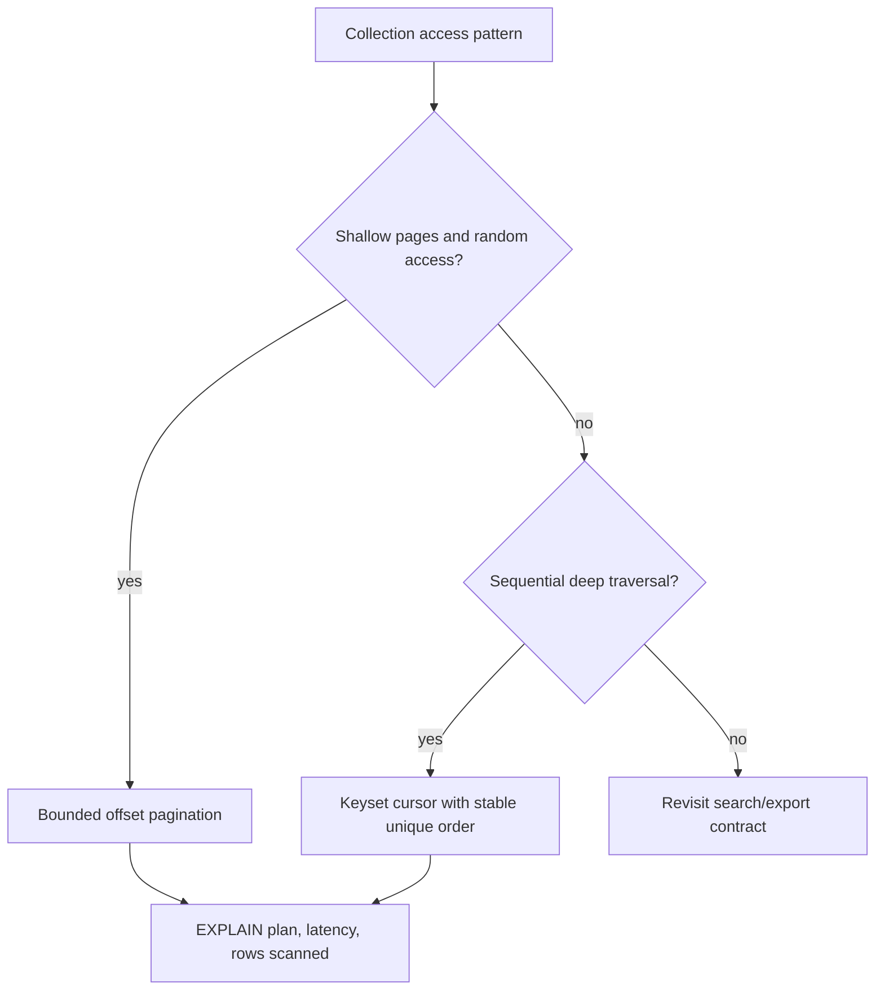

# REST Pagination And Conditional Requests

<DocLabels items={[
  {label: 'Advanced', tone: 'advanced'},
  {label: 'Query capacity', tone: 'production'},
  {label: 'Shopverse current', tone: 'shopverse'},
]} />

Collection APIs and update APIs both operate on changing state. Pagination needs
stable traversal semantics; conditional requests need a validator tied to the
representation or resource version clients are changing.

## Pagination Decision



<DocCallout type="mistake" title="Ordering must be total and stable">
Sorting only by a non-unique value such as `createdAt` can skip or duplicate rows
between pages. Append a unique tie-breaker such as `id`, and encode every ordering
component in the cursor predicate.
</DocCallout>

## Bounded Offset Pagination

Offset pagination is simple, supports direct page numbers, and works well for
small or shallow result sets:

```java
@GetMapping
PageResponse<UserSummaryResponse> users(
        @RequestParam(defaultValue = "0") int page,
        @RequestParam(defaultValue = "20") int size,
        @RequestParam(defaultValue = "id") String sortBy,
        @RequestParam(defaultValue = "ASC") String direction
) {
    Pageable pageable = PaginationUtils.createPageable(
            page, size, sortBy, direction, ALLOWED_SORT_FIELDS);
    return userService.getUsers(UserFilter.empty(), pageable);
}
```

Cap size and page depth, allow-list sort fields, and add database indexes matching
common filter and ordering prefixes. Deep offsets can scan or discard increasing
work and produce inconsistent traversal while rows change.

## Keyset Pagination

For descending `(createdAt, id)` order, the next-page predicate is conceptually:

```sql
WHERE created_at < :cursorCreatedAt
   OR (created_at = :cursorCreatedAt AND id < :cursorId)
ORDER BY created_at DESC, id DESC
LIMIT :limit
```

The cursor should be opaque to clients and include:

- the complete last-seen sort tuple;
- sort direction and version;
- a fingerprint of filters or tenant scope;
- an expiry when appropriate;
- integrity protection when tampering changes query scope.

Do not put authorization decisions only in the cursor. Reapply tenant, ownership,
and filter policy to every page request.

## Stable Response Shape

Expose a public DTO rather than Spring `Page<Entity>`:

```json
{
  "content": [],
  "page": 0,
  "size": 20,
  "totalElements": 0,
  "totalPages": 0
}
```

For keyset pagination, return `nextCursor` and `hasMore`; an exact total count can
be expensive or misleading and should be optional only when the product requires
it.

## Conditional Retrieval

An ETag identifies a selected representation. A client can send
`If-None-Match` on `GET`; when the representation is unchanged, return
`304 Not Modified` without a body.

```http
GET /api/v1/products/42
If-None-Match: "product-42-v7-json"
```

ETag generation must account for representation variants and content negotiation.
Use `Vary` where headers select different cacheable representations.

## Conditional Updates

Expose a strong version validator:

```http
GET /api/v1/products/42
ETag: "7"

PUT /api/v1/products/42
If-Match: "7"
```

Evaluate the precondition immediately before performing the state change. Return
`412 Precondition Failed` when it does not match. A JPA `@Version` column or
equivalent database compare-and-set remains the final concurrent guarantee.

Do not treat an ETag derived from a weak timestamp as a safe write version when
precision or concurrent updates can collide.

## Shopverse Current And Proposed State

<DocCallout type="shopverse" title="Current: shared bounded offset helpers">
User, role, and permission controllers use `PaginationUtils` and `PageResponse`.
The helper validates page size, direction, and allowed sort fields while services
retain filter semantics. This is a sound bounded-offset baseline.
</DocCallout>

<DocCallout type="production" title="Proposed: add keyset and conditional-update paths only where evidence justifies them">
Capture query plans and deep-page latency first. For high-volume timelines or
catalog traversal, introduce a versioned opaque cursor over a stable unique order.
For lost-update-sensitive resources, publish an ETag tied to the database version,
require `If-Match`, and test concurrent writers plus retry behavior.
</DocCallout>

## Evidence And Capacity

- Record normalized route, page-size bucket, pagination mode, query time, rows
  scanned/returned, and count-query time.
- Inspect `EXPLAIN` plans for representative filters and cursor predicates.
- Test insertions and deletions between pages for documented consistency.
- Rate-limit expensive searches and exports separately from ordinary lists.
- Keep cursor decode failures a safe client error without exposing signing detail.
- Test caches and proxies with `ETag`, `If-None-Match`, `If-Match`, and `Vary`.
- Monitor optimistic-lock and `412` rates during conditional-update rollout.

## Expandable Interview Checks

<ExpandableAnswer title="Why does keyset pagination need a unique tie-breaker?">

Without a total order, rows sharing the same primary sort value have no stable
position. Adding a unique tie-breaker such as `id` prevents ambiguous cursor
boundaries that skip or duplicate rows.

</ExpandableAnswer>

<ExpandableAnswer title="Should a keyset cursor contain authorization state?">

It can carry a filter or tenant fingerprint, but the server must reapply current
authorization on every request. A cursor is navigation state, not proof of access.

</ExpandableAnswer>

<ExpandableAnswer title="Does If-Match replace a database version constraint?">

No. It expresses the HTTP precondition. A database version or atomic compare-and-
set is still required to close the race at persistence time.

</ExpandableAnswer>

## Official References

- [Spring Data pagination](https://docs.spring.io/spring-data/commons/reference/repositories/core-extensions.html#core.web.pageables)
- [HTTP conditional requests](https://www.rfc-editor.org/rfc/rfc9110.html#name-conditional-requests)
- [Spring MVC ETag support](https://docs.spring.io/spring-framework/reference/web/webmvc/filters.html#filters-shallow-etag)

## Recommended Next

<TopicCards items={[
  {title: 'Idempotent commands', href: '/development/spring-rest/REST-IDEMPOTENT-COMMANDS', description: 'Handle repeatable writes whose safety cannot be expressed by resource versions alone.', icon: 'route', tags: ['Retries', 'Uniqueness']},
  {title: 'OpenAPI contract governance', href: '/development/spring-rest/REST-OPENAPI-CONTRACT-GOVERNANCE', description: 'Publish cursor, pagination, ETag, and precondition response semantics.', icon: 'book', tags: ['Schemas', 'Headers']},
]} />
