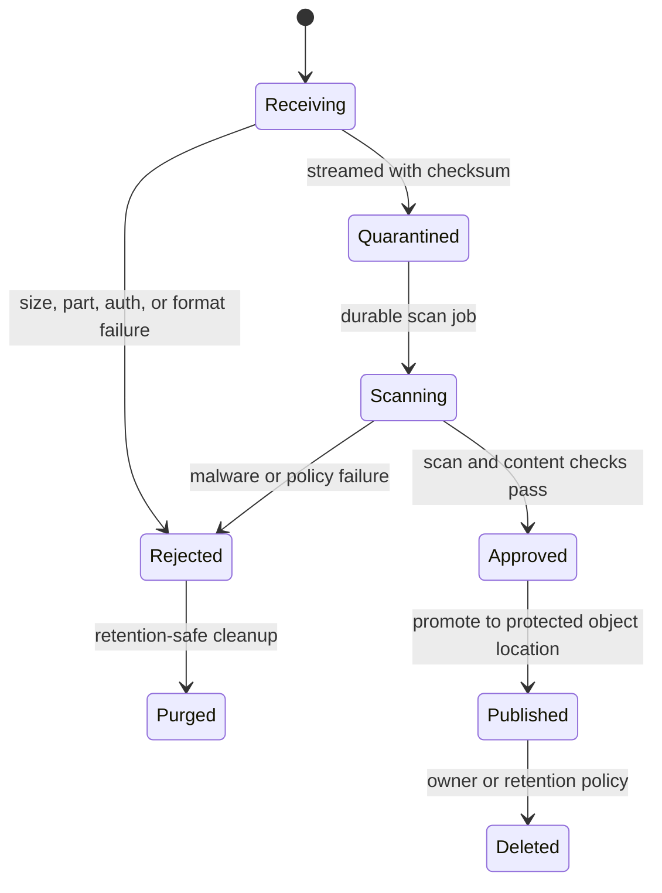

# Secure Spring REST File Transfer

<DocLabels items={[
  {label: 'Advanced', tone: 'advanced'},
  {label: 'Security critical', tone: 'production'},
  {label: 'Shopverse partial', tone: 'shopverse'},
]} />

Multipart parsing makes a file available to application code; it does not prove
that the filename, content type, extension, bytes, or embedded structures are
safe. Treat every upload as untrusted until the complete acceptance workflow
finishes.

<DocCallout type="mistake" title="Content-Type is client input">
Use declared media type only as an early compatibility check. Combine an
allow-listed business type with size limits, signature inspection, parser-safe
validation, malware scanning, and server-generated storage identity.
</DocCallout>

## Quarantine Scan And Promote



The API can return `202 Accepted` with an opaque document operation when scanning
is asynchronous. Do not make quarantined bytes downloadable through the normal
content endpoint.

## Multipart Controller Boundary

```java
@PostMapping(
        path = "/documents",
        consumes = MediaType.MULTIPART_FORM_DATA_VALUE
)
ResponseEntity<DocumentOperation> upload(
        @RequestPart("metadata") @Valid DocumentMetadata metadata,
        @RequestPart("file") MultipartFile file,
        Authentication authentication
) throws IOException {
    DocumentOperation operation = documentService.quarantine(
            authentication.getName(), metadata, file.getInputStream(), file.getSize());
    return ResponseEntity.accepted()
            .location(URI.create("/api/v1/document-operations/" + operation.id()))
            .body(operation);
}
```

The controller binds protocol data. A service owns authorization, generated
identity, checksum, quarantine write, metadata transaction, scan submission, and
cleanup compensation.

## Validation And Storage Rules

- Enforce total request, part count, and per-file size before expensive parsing.
- Allow-list only business-required file types and extensions.
- Inspect signatures and parse content in a sandbox with patched libraries.
- Generate object keys; never use `originalFilename` as a path.
- Normalize any unavoidable local path and prove it remains under the storage root.
- Store quarantine outside the web root with minimal permissions.
- Encrypt storage and transport; define key rotation and tenant separation.
- Record checksum, detected type, size, owner, scan version, state, and retention.
- Scan archives with depth, entry-count, and expanded-size limits or reject them.
- Purge abandoned multipart temp files and stalled quarantine objects.

```yaml
spring:
  servlet:
    multipart:
      max-file-size: 10MB
      max-request-size: 12MB
      file-size-threshold: 2MB
```

Framework limits are one layer. Gateway, container, application, scanner, and
object-storage limits must agree so a larger upstream allowance cannot exhaust a
smaller downstream component.

## Stream Instead Of Buffering

`MultipartFile.getBytes()` loads the complete file into heap. Prefer a bounded
stream into quarantine or object storage while computing a checksum. Apply a
total deadline and abort incomplete objects on disconnect or timeout.

Backpressure matters in both directions. Upload concurrency can exhaust temp disk
or scanner capacity; download concurrency can exhaust connections and network
egress. Use admission controls and per-user quotas rather than relying on heap
failure as the limit.

## Authorized Download

```java
@GetMapping("/documents/{id}/content")
ResponseEntity<Resource> download(@PathVariable UUID id,
                                  Authentication authentication) {
    StoredDocument document = documentService.loadApprovedForOwner(
            id, authentication.getName());
    return ResponseEntity.ok()
            .contentType(MediaType.parseMediaType(document.detectedContentType()))
            .header(HttpHeaders.CONTENT_DISPOSITION,
                    ContentDisposition.attachment()
                            .filename(document.safeDownloadName())
                            .build().toString())
            .body(document.resource());
}
```

Resolve an opaque ID to server-owned metadata, authorize the current user, and
serve only `Approved` content. Avoid inline rendering for active content unless a
specific safe policy exists. For large content, use authorized short-lived object-
storage URLs or support byte ranges with correct ETag and `If-Range` behavior.

## Shopverse Current And Proposed State

<DocCallout type="shopverse" title="Current: Inventory Service streams bounded images directly to MinIO">
`InventoryController` accepts `MultipartFile` for an admin product-image route.
`InventoryImageService` rejects empty and oversized files, allow-lists declared
JPEG/PNG/WebP/GIF media types, generates an object key, and streams into MinIO.
It does not currently show signature/decoder verification, quarantine, malware
scanning, or a scan-gated promotion state.
</DocCallout>

<DocCallout type="production" title="Proposed rollout evidence">
Start with one allow-listed type and small limit. Test signature spoofing, malware,
archive bombs, duplicate names, path traversal, scanner outage, partial object
writes, unauthorized reads, retention deletion, and slow clients. Gate promotion
on scan state stored durably, then monitor quarantine age, rejection reason,
scanner latency, temp usage, and cleanup failures.
</DocCallout>

## Incident Checklist

- Disable new uploads without disabling authorized downloads when containment needs differ.
- Identify published objects by scanner version and checksum.
- Quarantine or revoke suspect objects without changing their opaque public ID.
- Preserve bounded forensic metadata; do not copy malicious content into logs.
- Rotate affected parser/scanner components and rescan where policy requires.
- Verify abandoned multipart and object-store uploads are cleaned after recovery.

## Expandable Interview Checks

<ExpandableAnswer title="Why is checking MultipartFile content type insufficient?">

The client supplies it and can spoof it. Treat it as one early hint and combine it
with size limits, allow-listed formats, signature/content inspection, sandboxed
parsing, malware scanning, and authorization.

</ExpandableAnswer>

<ExpandableAnswer title="Why should an uploaded file enter quarantine first?">

Quarantine prevents unscanned bytes from becoming publicly retrievable. It also
creates a durable state where scanning, retries, rejection, promotion, and cleanup
can be observed and recovered.

</ExpandableAnswer>

<ExpandableAnswer title="Why prefer streaming over getBytes for uploads?">

`getBytes()` allocates the entire file in heap. Streaming supports bounded memory,
incremental checksum calculation, and direct quarantine/object-storage transfer,
though total size, deadline, and partial-write cleanup still need limits.

</ExpandableAnswer>

## Official References

- [Spring MVC multipart forms](https://docs.spring.io/spring-framework/reference/web/webmvc/mvc-controller/ann-methods/multipart-forms.html)
- [OWASP File Upload Cheat Sheet](https://cheatsheetseries.owasp.org/cheatsheets/File_Upload_Cheat_Sheet.html)
- [HTTP range requests](https://www.rfc-editor.org/rfc/rfc9110.html#name-range-requests)

## Recommended Next

<TopicCards items={[
  {title: 'OpenAPI contract governance', href: '/development/spring-rest/REST-OPENAPI-CONTRACT-GOVERNANCE', description: 'Document multipart parts, operation states, limits, errors, and download responses.', icon: 'book', tags: ['OpenAPI', 'Multipart']},
  {title: 'Web execution and capacity', href: '/spring/web/WEB-EXECUTION-MODELS-CAPACITY', description: 'Bound upload, scanner, storage, and slow-client concurrency.', icon: 'gauge', tags: ['Queues', 'Backpressure']},
]} />
