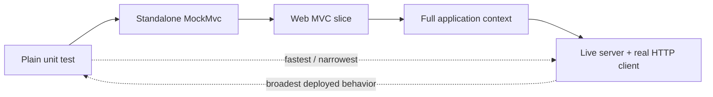

# Spring REST Testing

<DocLabels items={[
  {label: 'Advanced', tone: 'advanced'},
  {label: 'Contract evidence', tone: 'production'},
  {label: 'Shopverse current', tone: 'shopverse'},
]} />

A test is useful only for the boundary it actually runs. Standalone `MockMvc`
tests exercise controller mapping with manually supplied infrastructure. MVC
slices load Spring MVC configuration without a live server. Full-context and
live-server tests cover progressively more auto-configuration and transport
behavior at higher cost.

<DocCallout type="tip" title="State the claim before selecting the test">
If the claim is “this annotation exists,” reflection may be enough. If the claim
is “the deployed security chain rejects this request with the public error
contract,” run the real security and MVC configuration. Test names should make
that boundary visible.
</DocCallout>

## Test Boundary Map



| Boundary | Proves | Does not prove by itself |
|---|---|---|
| Plain unit | deterministic service, mapper, validator, or helper behavior | MVC mapping or framework configuration |
| Standalone `MockMvc` | controller mapping with explicitly installed advice, validator, converters, or filters | auto-configuration omitted from the builder |
| `@WebMvcTest` | MVC slice, selected controller, conversion and included security/advice | database, real server connector, complete application wiring |
| `@SpringBootTest` + `MockMvc` | full application context through mock servlet infrastructure | network socket, connector limits, TLS, compression |
| Live server | actual HTTP client, container, headers, compression and transport integration | external production infrastructure unless supplied |

Spring's `MockMvc` performs Spring MVC request handling through mock servlet
request and response objects without starting a server. Forward, error, async,
and connector behavior can differ from a live container, so use the broader test
when those details are the requirement.

## Current Shopverse Coverage

<DocCallout type="shopverse" title="Current: UserControllerTest is a standalone MVC test">
`user-service/.../controller/UserControllerTest.java` builds `MockMvc` with
`standaloneSetup`, installs `GlobalExceptionHandler` and a validator explicitly,
and verifies successful user JSON plus field-level validation errors. It is fast
and useful, but it does not prove User Service's deployed security chains or Boot
Jackson auto-configuration.
</DocCallout>

The existing test correctly verifies that invalid input does not invoke the
service. It also checks rate-limiter and bulkhead annotations by reflection; that
proves annotation presence, not runtime rejection, fallback, or metrics.

Other current focused evidence includes:

- `GlobalExceptionHandlerTest` for selected service error translations;
- `ShopverseRequestLoggingFilterTest` for correlation IDs, request metrics, and
  actuator exclusion;
- `ApiErrorsTest` for shared error helpers.

## A Focused MVC Slice

Use an MVC slice when converter, validation, controller advice, or Spring
Security behavior is part of the claim:

```java
@WebMvcTest(UserController.class)
class UserControllerWebMvcTest {

    @Autowired MockMvc mockMvc;

    @MockitoBean UserService userService;
    @MockitoBean UserAddressService userAddressService;

    @Test
    @WithMockUser(authorities = "USER_READ")
    void returnsOneUserThroughTheMvcContract() throws Exception {
        when(userService.getUser(1L)).thenReturn(userResponse());

        mockMvc.perform(get("/api/v1/users/1"))
                .andExpect(status().isOk())
                .andExpect(jsonPath("$.data.id").value(1));
    }
}
```

Depending on slice configuration, import the intended security configuration,
advice, mapper customizers, or platform starter configuration explicitly. Do not
disable filters merely to make a security contract test pass.

## Negative Contract Matrix

Every public controller family should cover the applicable rows:

| Input or runtime condition | Evidence to assert |
|---|---|
| no credentials | `401`, stable body/headers, no controller invocation |
| authenticated but forbidden | `403`, stable body/headers, audit signal |
| unsupported `Content-Type` | `415` |
| unacceptable `Accept` | `406` |
| malformed JSON | `400` without parser internals |
| structurally invalid DTO | stable field paths and messages |
| type mismatch in path/query | stable parameter error |
| domain conflict | deliberate status and code |
| unexpected exception | generic `500`, one internal log, correlation ID |
| serialization failure | no sensitive body; committed-response behavior understood |
| rate limit or bulkhead rejection | status, retry policy, metric and no downstream work |

## Proposed Shopverse Test Progression

<DocCallout type="production" title="Proposed: close gaps by boundary, not by duplicating happy paths">
Keep the current standalone tests. Add a small MVC slice proving the actual User
Service security, shared error JSON, validation, and configured JSON mapper. Add
one live-server smoke test for correlation headers and complete filter order. Use
load or concurrency tests for bulkhead, pool, idempotency, and timeout claims.
</DocCallout>

Prioritize these executable scenarios:

1. internal User Service route selects the Basic chain while normal routes require JWT;
2. malformed JSON, body validation, parameter validation, and type mismatch share
   the intended public error shape;
3. request logging cleans MDC after downstream exceptions and behaves deliberately
   for async/error dispatch;
4. two concurrent checkout submissions with one idempotency key create one result;
5. Jackson 2 and Jackson 3 compatibility fixtures remain byte/semantic compatible
   for chosen event and API contracts.

## Running The Current Tests

<CommandTabs
  powershell={<pre><code>{`.\\user-service\\gradlew.bat -p .\\user-service test --tests "io.shopverse.user_service.controller.UserControllerTest"
.\\shopverse-platform\\gradlew.bat -p .\\shopverse-platform :shopverse-observability-starter:test --tests "io.shopverse.platform.observability.ShopverseRequestLoggingFilterTest"`}</code></pre>}
  bash={<pre><code>{`./user-service/gradlew -p ./user-service test --tests "io.shopverse.user_service.controller.UserControllerTest"
./shopverse-platform/gradlew -p ./shopverse-platform :shopverse-observability-starter:test --tests "io.shopverse.platform.observability.ShopverseRequestLoggingFilterTest"`}</code></pre>}
/>

If module paths change, run the relevant wrapper with `projects` rather than
silently executing a different test selection.

## Architect Review Checklist

- Each test names the real boundary it loads.
- Security tests use the intended chain and identity rather than bypassing filters.
- JSON tests use the application mapper when mapper behavior is the claim.
- Error tests assert stable public fields and exclude secrets/internal messages.
- Async, streaming, timeout, and cancellation behavior has a broader-than-standalone test.
- Concurrent invariants are tested concurrently and backed by database constraints.
- Retry and resilience tests assert call count, total deadline, and observable outcome.
- Contract fixtures protect consumer compatibility.
- Testcontainers or production-like infrastructure is used when database semantics matter.

## Official References

- [Spring Framework `MockMvc`](https://docs.spring.io/spring-framework/reference/testing/mockmvc.html)
- [MockMvc versus end-to-end tests](https://docs.spring.io/spring-framework/reference/testing/mockmvc/vs-end-to-end-integration-tests.html)
- [Spring Boot test slices](https://docs.spring.io/spring-boot/reference/testing/spring-boot-applications.html#testing.spring-boot-applications.autoconfigured-tests)
- [Spring Security servlet testing and MockMvc support](https://docs.spring.io/spring-security/reference/servlet/test/index.html)

## Recommended Next

<TopicCards items={[
  {title: 'REST interview workbook', href: '/development/spring-rest/REST-INTERVIEW-WORKBOOK', description: 'Attempt senior and architect REST questions before expanding the evidence-based answers.', icon: 'brain', tags: ['Interview', 'Architect']},
  {title: 'HTTP message conversion', href: '/spring/web/HTTP-MESSAGE-CONVERSION-JACKSON', description: 'Review the JSON and negotiation boundaries these tests must prove.', icon: 'code', tags: ['Jackson', 'Contracts']},
]} />
