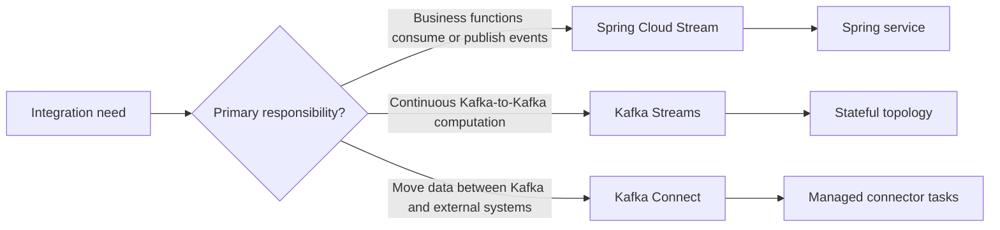

# Event Streaming Application Path

This umbrella starts with the decision that matters most: **is the requirement
application messaging, continuous stream processing, or managed data movement?**
The three technologies use Kafka but solve different problems.

## At-A-Glance Selection

| Requirement | Start with | Reason |
|---|---|---|
| consume an order event and update a database | Spring Cloud Stream or Spring Kafka | application-owned business side effect |
| publish from an HTTP or domain workflow | Spring Cloud Stream `StreamBridge` | imperative trigger behind a binding |
| count orders by customer in five-minute windows | Kafka Streams | local state, windows, changelogs, recovery |
| join two Kafka topics continuously | Kafka Streams | co-partitioned stream/table processing |
| capture committed database changes | Kafka Connect with a CDC connector | standardized source integration and offsets |
| load Kafka records into a warehouse | Kafka Connect sink | connector-managed parallel data movement |
| require detailed Kafka listener-container control | Spring Kafka | lower-level Kafka-specific application API |

Spring Cloud Stream also has a Kafka Streams binder. It provides Spring Cloud
Stream bindings around a Kafka Streams topology; it does not turn an ordinary
`Consumer<T>` into stateful stream processing. Learn native Kafka Streams concepts
first, then decide whether the binder adds useful conventions.

## The Complete Route

### Track A — Spring Cloud Stream

1. [Overview And Mental Model](./streaming/SPRING-CLOUD-STREAM-OVERVIEW.md)
2. [Functions, Bindings, And Runtime Internals](./streaming/SPRING-CLOUD-STREAM-FUNCTIONS-BINDINGS.md)
3. [Kafka Binder Production Engineering](./streaming/SPRING-CLOUD-STREAM-KAFKA-PRODUCTION.md)

### Track B — Kafka Streams

1. [Kafka Streams Overview](./streaming/KAFKA-STREAMS-OVERVIEW.md)
2. [Stateful Processing And Production Operations](./streaming/KAFKA-STREAMS-STATEFUL-PRODUCTION.md)

### Track C — Kafka Connect

1. [Kafka Connect Overview](./streaming/KAFKA-CONNECT-OVERVIEW.md)
2. [CDC And Production Operations](./streaming/KAFKA-CONNECT-CDC-PRODUCTION.md)

### Revision And Interview Mastery

Use [Event Streaming Interview And Revision](./streaming/EVENT-STREAMING-INTERVIEW-REVISION.md)
after every track and again before Lead or Architect interviews.

## Knowledge Layers

| Layer | You must be able to explain |
|---|---|
| foundation | records, topics, partitions, keys, offsets, groups, retention |
| programming model | function binding, topology, connector/task lifecycle |
| correctness | duplicates, ordering, transactions, schemas, replay boundaries |
| performance | partition parallelism, batching, state size, external bottlenecks |
| operations | lag, retries, DLQ, restoration, rebalance, upgrades, security |
| architecture | ownership, coupling, RPO/RTO, cost, governance, failure recovery |

## Completion Standard

Coverage is complete when you can build the three models and also explain when
**not** to use each one. You should be able to diagnose a slow consumer, a failed
state restoration, and a stuck connector without confusing their offset models or
recovery controls.

## Official References

- [Spring Cloud Stream reference](https://docs.spring.io/spring-cloud-stream/reference/)
- [Apache Kafka Streams documentation](https://kafka.apache.org/documentation/streams/)
- [Apache Kafka Connect documentation](https://kafka.apache.org/documentation/#connect)

## Recommended Next

Begin with [Spring Cloud Stream Overview](./streaming/SPRING-CLOUD-STREAM-OVERVIEW.md)
for application messaging, or go directly to the Kafka Streams or Kafka Connect
track when that is the selected execution model.
