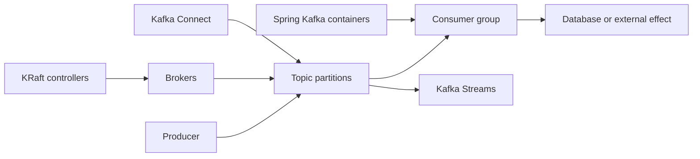

# Kafka And Spring Kafka Architect Overview

This page is the short orientation for the complete Kafka curriculum. Use it to
understand how the important topics fit together, revise before an interview, and
choose the correct deep-dive page.



## The Central Mental Model

Kafka is a distributed, replicated, append-only event log. Producers append
records to topic partitions. Consumers pull records and independently track their
progress. Kafka retains records according to topic policy rather than deleting
them when one consumer reads them.

The most important distinction is:

```text
record stored in Kafka
    != consumer offset committed
    != business effect completed
```

Architects must define and observe all three states.

## Important Kafka Concepts

| Topic | Brief explanation | Why it matters |
|---|---|---|
| broker | Server that stores partition replicas and serves client requests. | Broker count, placement, disk, and network determine capacity and availability. |
| topic | Named stream of related records. | A topic needs an owner, schema, key, retention, security, and lifecycle policy. |
| partition | Ordered append-only log and Kafka's main parallelism unit. | Ordering exists within a partition; consumer parallelism is bounded by partitions. |
| record | Key, value, headers, timestamp, partition, and offset. | The key usually controls ordering and distribution; headers carry bounded metadata. |
| offset | Position of a record inside one partition. | Offsets support progress tracking and replay; they are not business acknowledgments. |
| consumer group | Consumers that divide partition ownership for one logical subscription. | Separate groups receive independent copies and maintain independent progress. |
| replication | Copies of each partition across brokers. | Replication supports availability, but it is not backup or regional disaster recovery. |
| leader and follower | Leader serves normal reads/writes; followers copy its log. | Leader failure requires election from an eligible replica. |
| ISR | Replicas sufficiently synchronized with the leader. | ISR health, `acks`, and minimum ISR shape durability and write availability. |
| retention | Time- or size-based removal of old closed segments. | Retention must exceed outage, lag, replay, and audit requirements. |
| compaction | Eventual retention of the latest record for each key. | Useful for reconstructing current state; tombstones represent deletion. |

## KRaft And Cluster Architecture

Modern Kafka uses KRaft instead of ZooKeeper. A controller quorum stores and
replicates cluster metadata, elects an active controller, registers/fences brokers,
and manages partition leadership. Brokers store topic data and serve clients.

Critical clusters normally isolate controller and broker roles. A quorum of
`2N + 1` controllers tolerates `N` controller failures. Controller quorum loss,
partition leader loss, and broker data loss are different failure modes.

Deep dive: [Kafka Internals](./kafka/KAFKA-INTERNALS.md).

## Producer Essentials

A producer serializes a record, chooses a partition, accumulates it into a batch,
and sends the batch asynchronously to the partition leader.

Important controls:

- `acks` decides the broker acknowledgment requirement;
- `enable.idempotence` prevents duplicate Kafka log entries in supported retry
  scenarios;
- `batch.size` and `linger.ms` trade latency for batching efficiency;
- compression reduces network and storage at a CPU cost;
- `delivery.timeout.ms` bounds total delivery time;
- `buffer.memory` and `max.block.ms` define producer backpressure behavior;
- `transactional.id` enables Kafka transactions and fencing.

Producer idempotence does not make a consumer's database or payment effect
idempotent.

## Consumer Essentials

A consumer joins a group, receives partitions, fetches records, processes them,
and commits offsets. Kafka consumers are not thread-safe.

Important controls:

- `max.poll.records` bounds work exposed by a poll;
- `max.poll.interval.ms` bounds delay between polls;
- session and heartbeat settings control membership liveness;
- fetch settings trade network latency for throughput;
- assignment strategies control how partitions move during rebalances;
- static membership can reduce unnecessary partition movement;
- manual assignment bypasses normal group-managed assignment.

If processing succeeds but offset commit fails, Kafka can deliver the record again.
Consumers therefore need idempotent effects.

## Ordering And Partition Keys

Kafka guarantees order only within a partition. Use the business ordering identity,
such as `orderId`, as the key when all events for that entity must remain ordered.

Ordering can still be broken by:

- changing the key or partition count;
- processing same-key records concurrently outside the consumer thread;
- moving failures to retry topics;
- replaying records into a live workflow;
- producing related events to different topics without a sequencing policy.

Global topic order requires a serial path and severely limits scalability.

## Delivery And Consistency

| Model | Meaning | Main consequence |
|---|---|---|
| at-most-once | progress advances before effect completes | records may be lost from that group's viewpoint |
| at-least-once | effect completes before progress advances | redelivery and duplicate attempts are possible |
| Kafka exactly-once | Kafka inputs, state/output, and offsets commit transactionally | external database/API effects remain outside the Kafka transaction |

Use an inbox or unique event identity for duplicate-safe consumers. Use a
transactional outbox or CDC outbox for reliable database-to-Kafka publication. Use
external idempotency keys and reconciliation for payment or remote API effects.

## Consumer Lag And Slow Consumers

Lag is the distance between available records and a group's committed progress.
Growing lag means arrival exceeds completed processing for some period.

Investigate in this order:

1. Is lag global or isolated to one partition?
2. What are arrival, processing, and commit rates?
3. Is processing slow because of CPU, GC, database, network, API, locks, or retry?
4. Are rebalances or poll interval violations reducing useful work?
5. Are keys skewed or partitions insufficient?
6. Can the consumer recover before retention overtakes it?

Adding consumers cannot help beyond available partitions and may overload the real
downstream bottleneck.

## Retry, DLT, And Poison Records

Retry transient failures such as timeouts and temporary unavailability. Treat
invalid schemas, unsupported versions, and impossible business states as permanent
unless data or code changes.

- blocking retry preserves partition order more naturally but blocks progress;
- retry topics isolate failures but can reorder same-key events;
- a DLT is an operational recovery channel, not a silent discard location;
- replay requires correction, idempotency, rate limiting, security, and auditing.

Spring Kafka non-blocking retry topics do not support batch listeners and cannot be
combined with container transactions.

## Spring Kafka Runtime

Spring Kafka adds application-level abstractions around Kafka clients:

| Component | Responsibility |
|---|---|
| `KafkaTemplate` | high-level asynchronous publishing and transactional operations |
| `ProducerFactory` | creates and manages Kafka producers |
| `ConsumerFactory` | creates consumers from shared configuration |
| listener container | owns polling, invocation, acknowledgment, error handling, events, and shutdown |
| `@KafkaListener` | declares a message-driven listener endpoint |
| `KafkaAdmin` / `NewTopic` | performs controlled topic administration |
| `DefaultErrorHandler` | classifies and recovers listener failures |
| `DeadLetterPublishingRecoverer` | publishes terminal failures to a recovery destination |
| `KafkaTransactionManager` | coordinates Kafka transactions with Spring transaction infrastructure |

Listener concurrency creates multiple child containers/consumers; it does not make
one consumer multi-thread safe. Effective parallelism remains bounded by assigned
partitions and downstream capacity.

Deep dives: [Spring Kafka](../spring/SPRING-KAFKA.md) and
[Advanced Spring Kafka](../spring/kafka/SPRING-KAFKA-ADVANCED.md).

## Serialization And Schema Evolution

Serializers convert records to bytes; deserializers reverse the process. Spring
message converters map records to application types. Schema Registry tooling adds
governed Avro, Protobuf, or JSON Schema compatibility.

Prefer additive compatible changes, stable event meaning, explicit ownership, and
contract tests across old/new producer-consumer combinations. Parsing compatibility
does not guarantee semantic compatibility: changing units, identity, or timing can
break consumers without breaking a schema rule.

## Security

Production Kafka needs:

- TLS for encryption in transit;
- mTLS or SASL for workload authentication;
- ACLs for topic, group, cluster, and transactional-ID authorization;
- separate identities and least privilege;
- secret and certificate rotation;
- quotas and isolation for shared tenants;
- auditing, network controls, and PII governance.

Authentication proves identity; authorization decides permission. Do not use
wildcard superuser access as an application configuration.

## Capacity And Operations

Capacity covers producers, brokers, replication, consumers, downstream systems,
and recovery—not only steady-state message rate.

```text
logical ingress = events/sec * encoded bytes/event
retained data = logical ingress * retention seconds
replicated data = retained data * replication factor
```

Add headroom for peaks, indexes, compaction, reassignment, broker loss, rolling
maintenance, backlog recovery, tiered-storage cache, and growth.

Monitor controller health, offline and under-replicated partitions, ISR changes,
disk/network/CPU, request latency, producer errors/retries, consumer lag,
rebalances, processing latency, retry and DLT rates.

Deep dive: [Kafka Security And Operations](./kafka/KAFKA-SECURITY-OPERATIONS.md).

## Kafka Connect, Streams, And Share Groups

- **Kafka Connect** moves data between Kafka and external systems using managed
  workers, connectors, and tasks. It is well suited to CDC and standard source/sink
  integrations.
- **Kafka Streams** builds stateful Kafka-to-Kafka processing using streams,
  tables, windows, joins, state stores, changelogs, and repartition topics.
- **Share groups** support queue-style record acquisition and redelivery when
  partition-owner processing and strict ordering are not the primary contract.

Use Spring Kafka listeners for domain side effects, Connect for standardized data
movement, and Streams for continuous stateful transformations.

Deep dive: [Kafka Ecosystem And Multi-Cluster](./kafka/KAFKA-ECOSYSTEM.md).

## Multi-Cluster And Disaster Recovery

Replication within one cluster does not protect against regional failure or
administrative deletion. Multi-cluster design must define:

- active/passive or active/active ownership;
- replicated topics and consumer offsets;
- replication lag and acceptable RPO;
- detection and cutover time for RTO;
- duplicate, conflict, and ordering behavior;
- data residency and security;
- failback and reconciliation.

MirrorMaker 2 or managed replication is asynchronous; it does not create global
synchronous ordering or automatic zero-loss failover.

## Architect Decision Checklist

Before approving a Kafka workflow, answer:

1. Why Kafka instead of synchronous calls, a queue broker, or a database workflow?
2. Who owns the topic and event contract?
3. What key and ordering boundary are required?
4. What delivery and business consistency guarantee is required?
5. How are duplicates, poison records, retry, DLT, and replay handled?
6. What partitions, retention, replication, storage, and recovery capacity are needed?
7. How are authentication, authorization, privacy, and tenant isolation enforced?
8. What metrics and SLOs prove healthy operation?
9. How do schema rollout, application rollback, shutdown, and upgrade work?
10. What happens during broker, database, region, and credential failure?

## Recommended Learning Order

1. [Apache Kafka Fundamentals](./APACHE-KAFKA.md)
2. [Kafka Internals](./kafka/KAFKA-INTERNALS.md)
3. [Spring Kafka](../spring/SPRING-KAFKA.md)
4. [Advanced Spring Kafka](../spring/kafka/SPRING-KAFKA-ADVANCED.md)
5. [Kafka Security And Operations](./kafka/KAFKA-SECURITY-OPERATIONS.md)
6. [Kafka Ecosystem And Multi-Cluster](./kafka/KAFKA-ECOSYSTEM.md)
7. [Kafka Architect Labs](./kafka/KAFKA-ARCHITECT-LABS.md)

The complete route and mastery criteria are maintained in the
[Kafka Architect Learning Path](./KAFKA-ARCHITECT-PATH.md).

## Official References

- [Apache Kafka documentation](https://kafka.apache.org/documentation/)
- [Spring for Apache Kafka reference](https://docs.spring.io/spring-kafka/reference/)
- [Spring Boot Kafka support](https://docs.spring.io/spring-boot/reference/messaging/kafka.html)
