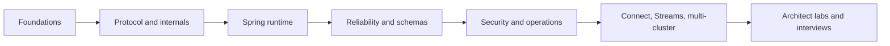

# Kafka Architect Learning Path

This is the canonical route for complete professional Kafka coverage. It joins
Apache Kafka internals and operations with Spring application behavior. Completion
means being able to explain, implement, measure, break, recover, and defend a
design—not merely recognize configuration names.

For a concise first read and revision sheet, begin with the
[Kafka And Spring Kafka Architect Overview](./KAFKA-ARCHITECT-OVERVIEW.md).

## Version Baseline

- Apache Kafka documentation currently exposes the 4.3 release line.
- Spring for Apache Kafka currently lists 4.1 as stable.
- Applications should normally use the Kafka client and Spring Kafka versions
  managed by their Spring Boot dependency platform.
- Examples that depend on a 4.x API say so explicitly. Never copy configuration
  across versions without checking the matching reference and API documentation.

## Route And Completion Evidence

| Stage | Canonical material | Evidence required |
|---|---|---|
| overview | [Kafka And Spring Kafka Architect Overview](./KAFKA-ARCHITECT-OVERVIEW.md) | explain the major components, guarantees, and decision boundaries in one pass |
| foundations | [Apache Kafka](./APACHE-KAFKA.md) | explain records, partitions, replication, offsets, groups, retention, ordering, and delivery semantics |
| internals | [KRaft, Storage, Producer, And Consumer Internals](./kafka/KAFKA-INTERNALS.md) | trace one write and one read through client, broker, storage, replication, and commit |
| security and operation | [Kafka Security And Operations](./kafka/KAFKA-SECURITY-OPERATIONS.md) | secure clients, inspect health, execute a safe reassignment, and write recovery evidence |
| Spring runtime | [Spring For Apache Kafka](../spring/SPRING-KAFKA.md) | implement publishing, listeners, acknowledgment, retry, idempotency, and observations |
| advanced Spring | [Advanced Spring Kafka](../spring/kafka/SPRING-KAFKA-ADVANCED.md) | defend container, transaction, schema, DLT, shutdown, and testing choices |
| ecosystem | [Connect, Streams, Share Groups, And Multi-Cluster](./kafka/KAFKA-ECOSYSTEM.md) | implement or design a CDC flow, stateful topology, queue workload, and regional recovery |
| application platforms | [Event Streaming Application Path](./EVENT-STREAMING-APPLICATION-PATH.md) | build Spring Cloud Stream, Kafka Streams, and Kafka Connect solutions and select between them |
| architecture | [Kafka Architect Labs And Interview Workbook](./kafka/KAFKA-ARCHITECT-LABS.md) | pass failure labs and scenario review with measurable decisions |
| revision | [Kafka Revision Sheet](./KAFKA-REVISION-SHEET.md) | explain internals, guarantees, incidents, and design decisions without notes |

## Full Coverage Checklist

### Kafka platform

- KRaft metadata quorum, controller elections, broker registration, fencing, and
  quorum sizing;
- append-only logs, record batches, segments, indexes, page cache, replication,
  high watermark, last stable offset, retention, compaction, and tiered storage;
- producer metadata, serialization, partitioning, accumulator, batching, sender,
  acknowledgment, retry, idempotence, sequence numbers, epochs, transactions, and
  backpressure;
- consumer fetching, group coordination, assignment, heartbeats, polling, offset
  commits, static membership, eager/cooperative rebalancing, and replay;
- TLS, SASL, ACLs, principal mapping, secret rotation, quotas, audit, and tenant
  isolation;
- topic administration, replica reassignment, leader election, broker removal,
  rolling upgrade, disk recovery, capacity, SLOs, and incident response.

### Application platform

- Boot auto-configuration, factories, templates, admin, listener containers,
  lifecycle, conversion, headers, tombstones, filtering, and validation;
- record and batch listeners, acknowledgment modes, `nack`, partial batches,
  asynchronous acknowledgments, thread safety, pause/resume, and shutdown;
- blocking retry, non-blocking retry, DLT routing, exception classification,
  recovery failure, rollback processing, ordering implications, and replay;
- idempotent consumers, inbox, outbox, CDC, Kafka transactions, external side
  effects, schema compatibility, and rolling deployment;
- Micrometer observations, native client metrics, trace propagation,
  Testcontainers, contract tests, load tests, and failure tests.

### Ecosystem and architecture

- Connect workers, connectors, tasks, converters, internal topics, SMTs, CDC,
  scaling, plugin isolation, DLQ, and monitoring;
- Streams DSL and Processor API, `KStream`, `KTable`, joins, windows, stream time,
  grace, suppression, stores, changelogs, repartition, restoration, and EOS;
- share groups, record acquisition, delivery attempts, acknowledgments, and
  suitability for queue-style work;
- MirrorMaker 2, active/passive and active/active designs, offset replication,
  RPO/RTO, residency, failover, failback, and loop prevention;
- topic/schema governance, event ownership, privacy, cost allocation, managed
  versus self-managed Kafka, and compatibility policy.

## Study Loop

For every topic, use the same loop:

1. Draw the runtime path without notes.
2. Implement the smallest working example.
3. State the guarantee and its boundary.
4. Inject one failure and predict the result before observing it.
5. Capture metrics, logs, offsets, and broker evidence.
6. Explain the trade-off as an architect decision.
7. Answer the related interview question in two minutes and ten minutes.

## Definition Of Done

You have completed this path only when you can:

- distinguish producer acknowledgment, committed visibility, consumer progress,
  and completed business effects;
- calculate partitions, storage, replication, network, and recovery headroom from
  stated traffic and SLOs;
- diagnose lag, hot partitions, rebalance storms, duplicates, missing records,
  under-replication, disk pressure, and DLT growth from evidence;
- secure and operate a cluster without relying on permissive wildcard access;
- explain exactly-once boundaries and select transactions, inbox, outbox, CDC, or
  idempotency keys correctly;
- design and test rolling upgrades, schema evolution, regional failure, replay,
  and credential rotation;
- state when Kafka, Kafka Streams, Kafka Connect, a share group, or another
  messaging platform is the better choice.

## Official References

- [Apache Kafka documentation](https://kafka.apache.org/documentation/)
- [Spring for Apache Kafka reference](https://docs.spring.io/spring-kafka/reference/)
- [Spring Boot Kafka support](https://docs.spring.io/spring-boot/reference/messaging/kafka.html)

## Recommended Start

Begin with the [Kafka Architect Overview](./KAFKA-ARCHITECT-OVERVIEW.md), follow
the route table in order, and finish with the
[Kafka Revision Sheet](./KAFKA-REVISION-SHEET.md).

For dedicated application-platform depth, use the
[Event Streaming Application Path](./EVENT-STREAMING-APPLICATION-PATH.md) and its
[Interview And Revision Sheet](./streaming/EVENT-STREAMING-INTERVIEW-REVISION.md).
