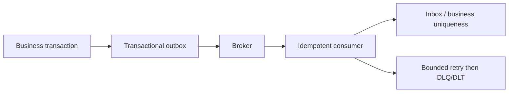

# Kafka vs RabbitMQ vs ActiveMQ Artemis vs JMS

Kafka, RabbitMQ, and ActiveMQ Artemis are messaging products with different
storage and consumption models. JMS—now Jakarta Messaging—is a Java API
specification implemented by providers; it is not a broker and is therefore not
a direct fourth product choice.

## Fast Decision Table

| Need | Prefer | Why |
|---|---|---|
| durable event history, replay, stream processing, many independent consumer groups | Kafka | partitioned replicated log with retained offsets |
| flexible routing, work queues, request/reply, per-message acknowledgements | RabbitMQ | exchanges, bindings, queues, routing keys, acknowledgements |
| enterprise Java/Jakarta messaging, queue/topic semantics, priorities/selectors, protocol interoperability | ActiveMQ Artemis | message broker with anycast/multicast routing and Jakarta Messaging support |
| portable Java messaging API across compatible providers | Jakarta Messaging/JMS | programming contract; choose a provider separately |

## Comparison

| Factor | Kafka | RabbitMQ | ActiveMQ Artemis | Jakarta Messaging/JMS |
|---|---|---|---|---|
| core model | append-only partitioned event log | exchanges route messages to queues | addresses route to anycast/multicast queues | Java API for queues, topics, sessions, producers, consumers |
| consumption | consumers track offsets; records remain by retention | messages normally leave a queue after acknowledgement | broker queues/subscriptions with acknowledgement | provider-defined implementation behind standard API |
| replay | first-class within retention | possible through topology/plugins/republication, not the default log model | redelivery and queues; not a Kafka-style retained log | not guaranteed by the API itself |
| ordering | within one partition | within a queue, affected by priorities/redelivery/multiple consumers | within queue with concurrency/redelivery caveats | provider and destination semantics |
| scale unit | partitions and consumer groups | queues/consumers and clustered topology | addresses/queues, cluster/federation | provider-specific |
| routing | topic plus key/partition; stream applications route further | direct/topic/fanout/headers exchanges and bindings | anycast/multicast, filters, diverts | queue/topic plus provider extensions |
| strongest fit | event streaming and durable integration history | commands/tasks and sophisticated routing | enterprise messaging and Java/Jakarta estates | portability of Java messaging code |

## When To Choose Kafka

- multiple services independently consume the same event history;
- replay, audit-like retention, CDC, stream processing, or event sourcing is required;
- throughput is high and ordering can be partition-key scoped;
- consumers can manage offsets, lag, rebalances, and idempotent processing.

Do not choose Kafka merely as a task queue. Partition count constrains consumer
parallelism inside a group; hot keys and large messages need deliberate design.

## When To Choose RabbitMQ

- a message should be routed into one or more work queues using business keys;
- low-latency commands, request/reply, priority-like patterns, TTL, or dead-letter
  routing are central;
- per-message acknowledgement and competing consumers fit the workload;
- long replayable history and stream processing are not the primary requirement.

Use publisher confirms, durable/quorum queue choices as appropriate, manual
consumer acknowledgements, bounded prefetch, retry limits, and dead-letter handling.

## When To Choose ActiveMQ Artemis

- an existing Java/Jakarta enterprise environment uses JMS contracts;
- queue/topic semantics, selectors, message priority, transactions, or protocol
  interoperability are important;
- operations need a traditional broker with anycast (one queue path) and
  multicast (publish/subscribe) routing, management, clustering, or federation.

Avoid assuming “ActiveMQ” always means the older ActiveMQ Classic architecture;
name the product and version. Artemis and Classic have different internals and operations.

## What JMS Actually Does

Jakarta Messaging defines types such as connection factories, destinations,
sessions/contexts, producers, consumers, queues, topics, messages, and
acknowledgement/transaction semantics. It does not define one universal broker
topology, storage engine, throughput, replay model, or operational behavior.

Spring's `JmsTemplate` simplifies client code, but broker selection and delivery
guarantees still depend on the provider and configuration.

## Reliability Rules For Every Broker

- assume duplicate delivery and make business effects idempotent;
- use stable event/message IDs and business keys;
- define ordering scope and behavior when one message fails;
- cap retries with backoff/jitter and isolate poison messages;
- monitor publish failures, queue depth or consumer lag, oldest age, redelivery,
  DLQ/DLT volume, processing latency, and storage;
- secure transport, authenticate workloads, authorize destinations, rotate
  credentials, limit message size, validate schemas, and protect audit logs;
- use outbox/inbox when a database change and message publication must be coordinated.

## ShopVerse Choice

Kafka fits ShopVerse domain events because order, inventory, and payment services
need independent consumer groups and replayable event history. RabbitMQ would be
a reasonable choice for command/task routing if retained history and stream
processing were not required. Artemis is strongest if Jakarta Messaging
compatibility is an organizational requirement. Do not operate two brokers
without a specific workload that justifies the additional failure domain.

## References

- [Apache Kafka documentation](https://kafka.apache.org/documentation/)
- [RabbitMQ documentation](https://www.rabbitmq.com/docs)
- [ActiveMQ Artemis documentation](https://activemq.apache.org/components/artemis/documentation/latest/)
- [Jakarta Messaging specification](https://jakarta.ee/specifications/messaging/)
- [LinkedIn comparison supplied with this request](https://www.linkedin.com/posts/laxmanrthagan_kafka-vs-rabbitmq-vs-activemq-vs-jms-activity-7475751380234829824-CRyq/)
