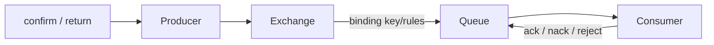

# RabbitMQ And Spring AMQP Beginner-To-Architect Path

RabbitMQ routes messages from producers through exchanges to queues using bindings. Consumers receive
deliveries from queues and acknowledge according to application outcome. Publisher confirms cover the
publisher-to-broker path; consumer acknowledgements cover broker-to-consumer processing. Neither alone makes
an external database/API side effect exactly once.



## Routing And Queue Design

| Exchange | Routing |
|---|---|
| direct | exact routing-key match |
| topic | dot-separated wildcard patterns |
| fanout | every bound queue |
| headers | header argument matching |

Declare durable topology intentionally, use mandatory publishing/returned-message handling for unroutable
messages, and govern naming/ownership. Prefetch bounds unacknowledged work per consumer/channel and affects
fairness, throughput and memory. One slow/poison delivery can block ordering expectations.

## Reliability

Use publisher confirms, persistent messages and an appropriate durable queue type. Quorum queues replicate
with consensus and require majority availability; size membership/failure domains and understand leader/
follower behavior. Consumer processing is generally at least once: make side effects idempotent and ack only
after the durable business outcome. Bound retry; use delayed/retry topology or application scheduling and a
dead-letter exchange with ownership, alerting and replay.

TTL, max length and overflow are data-loss/pressure policies, not free cleanup. Model disk/memory alarms,
flow control, connection/channel count, queue depth/age, unacked messages and redelivery.

## Spring AMQP

```java
@RabbitListener(queues = "orders.created")
public void consume(OrderCreated event) {
    orderProcessor.processIdempotently(event);
}

public void publish(OrderCreated event) {
    rabbitTemplate.convertAndSend("orders.events", "orders.created", event,
        message -> { message.getMessageProperties().setMessageId(event.eventId()); return message; });
}
```

Configure publisher confirm/return callbacks, converters with governed types, listener concurrency/prefetch,
manual/container ack policy, fatal exception classification, retry/recoverer and observation. Transactions have
scope/cost and do not atomically include arbitrary external systems; use outbox/idempotency where required.

## RabbitMQ Versus Kafka

Choose RabbitMQ for flexible broker routing and work-queue/request-reply patterns; Kafka for durable partitioned
logs, replay and stream processing. Compare retention, ordering scope, backpressure, routing, consumer state,
throughput, operations and ecosystem rather than declaring one universally superior.

## Official References

- [RabbitMQ documentation](https://www.rabbitmq.com/docs)
- [Consumer acknowledgements and publisher confirms](https://www.rabbitmq.com/docs/confirms)
- [Spring AMQP reference](https://docs.spring.io/spring-amqp/reference/)

## Recommended Next

Continue with [RabbitMQ Production Operations, Labs, And Interviews](./rabbitmq/RABBITMQ-OPERATIONS-INTERVIEW.md).

