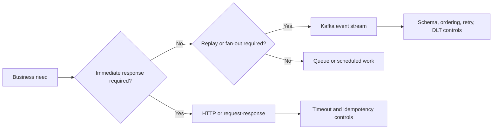

# Messaging And Integration

<DocLabels items={[{label: 'Advanced', tone: 'advanced'}, {label: 'Kafka', tone: 'intermediate'}, {label: 'Architect decisions', tone: 'production'}]} />

This route separates transport selection from Kafka implementation. Begin with coupling, acknowledgement, ordering, replay, and failure-recovery requirements. Select Kafka only when its durable asynchronous log and consumer model solve those requirements.

<TopicCards items={[
  {title: 'Platform selection', href: '/integration/MESSAGING-PLATFORM-SELECTION', description: 'Compare communication models and migration costs.', icon: 'route', tags: ['Decision', 'Trade-offs']},
  {title: 'Apache Kafka', href: '/integration/APACHE-KAFKA', description: 'Partitions, consumer groups, delivery, and Shopverse flows.', icon: 'network', tags: ['Kafka', 'Events']},
  {title: 'Kafka versus synchronous', href: '/spring/decisions/KAFKA-VS-SYNCHRONOUS', description: 'Decide when asynchronous integration creates real value.', icon: 'layers', tags: ['Decision guide']},
]} />

<ExpandableAnswer title="When should Shopverse avoid Kafka?">

Avoid Kafka when the caller requires an immediate authoritative answer, the workflow is genuinely simple, replay has no value, and the team cannot operate schemas, lag, retry, and duplicate delivery. HTTP with explicit timeouts and idempotency is often the clearer boundary in that case.

</ExpandableAnswer>

## Recommended Next

Continue with [SAGA And Transactional Outbox](../reliability/SAGA-GENERIC.md) for durable cross-service workflow design.

## Official References

- [Apache Kafka documentation](https://kafka.apache.org/documentation/)
- [CloudEvents specification](https://cloudevents.io/)
