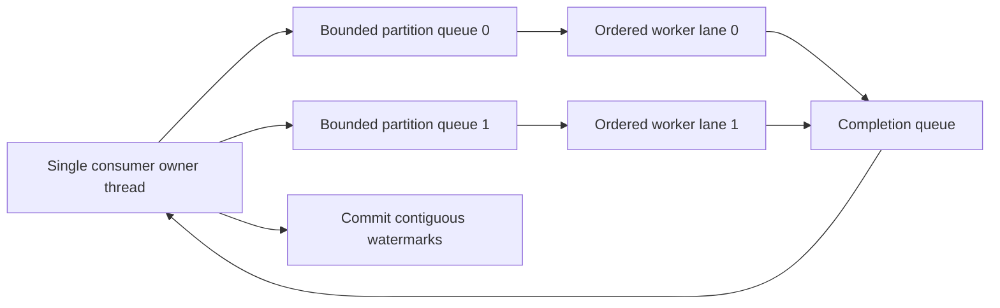

# Kafka Consumer Multithreading And Parallel Processing

`KafkaConsumer` is not thread-safe. The thread that owns it should perform
`poll`, `seek`, `pause`, `resume`, and commit operations. Another thread may use
`wakeup()` to interrupt a blocking poll during shutdown.

## Prefer Partition Parallelism First

The simplest safe model is one consumer thread per assigned set of partitions:

```text
6 partitions + 3 consumer threads = up to 3 active processing lanes
6 partitions + 10 consumer threads = at most 6 active lanes
```

In Spring Kafka, use container `concurrency` and keep listener state stateless or
thread-safe. This retains one ordered execution lane per partition.

## Why A Shared Worker Pool Is Hard

Suppose one poll returns offsets 10, 11, and 12 for partition 0:

```text
worker A completes 10
worker C completes 12
worker B is still processing 11
```

Committing 13 loses 11 on a crash. The safe checkpoint remains 11 until offset
11 finishes; only then can it advance to 13.

## Contiguous Completion Watermark

Maintain state per partition:

```java
final class PartitionProgress {
    private long nextCommitOffset;
    private final NavigableSet<Long> completed = new TreeSet<>();

    synchronized OptionalLong complete(long offset) {
        completed.add(offset);

        while (completed.remove(nextCommitOffset)) {
            nextCommitOffset++;
        }

        return OptionalLong.of(nextCommitOffset);
    }
}
```

Initialize `nextCommitOffset` from the first dispatched offset. The consumer
thread drains worker completions, builds `OffsetAndMetadata(nextCommitOffset)`,
and performs commits. Worker threads never call the consumer.

## Safe Architecture



Partition-affine queues preserve ordering. If ordering is unnecessary, records
may use a general pool, but contiguous completion tracking is still mandatory.

## Backpressure

Never let worker queues grow without limit. When a partition reaches its
in-flight limit:

1. call `pause()` for that partition on the consumer thread;
2. continue polling so group membership stays healthy;
3. drain completion notifications;
4. call `resume()` after the queue falls below a low watermark.

Use high/low watermarks to avoid pause/resume thrashing. Bound queue size,
processing deadline, downstream connections, and total bytes—not only record
count.

## Rebalance Protocol

On partition revocation:

- fence new submissions for the revoked partitions;
- wait for a bounded drain period;
- commit only contiguous completed offsets;
- cancel or mark remaining work stale;
- remove per-partition state after ownership ends.

Every task should carry an ownership generation. A late task from the old owner
must not commit or publish an unguarded state transition after reassignment.

## Spring Kafka `asyncAcks`

Spring Kafka can defer out-of-order manual acknowledgments from one poll. The
container waits for missing acknowledgments and pauses new delivery until the
gap closes. This increases duplicate risk after a failure and is not permission
to use the underlying consumer from worker threads. Negative acknowledgment is
not compatible with this out-of-order mode.

Prefer container concurrency unless record processing is highly uneven and the
extra completion protocol has measurable value.

## Blocking I/O, Virtual Threads, And Reactive Calls

More threads do not create more Kafka partition parallelism. Virtual threads can
reduce the cost of blocked Java tasks, but downstream limits still need:

- connection-pool bounds;
- request deadlines;
- bulkheads per dependency or tenant;
- circuit breakers and retry budgets;
- rate limiting and load shedding.

Unbounded parallel calls move consumer lag into database or HTTP saturation and
create a cascading failure.

## Batch Listeners

For a batch of 100 records, define failure semantics before optimizing:

- whole-batch atomic business transaction;
- per-record idempotent processing with a safe completed prefix;
- explicit failed-record recovery;
- DLT after bounded attempts.

Do not acknowledge the whole batch after only scheduling tasks. A task accepted
by an executor has not completed its business effect.

## Decision Table

| Requirement | Preferred design |
|---|---|
| strict per-key ordering | key to one partition, ordered partition lane |
| ordinary parallelism | more partitions and container concurrency |
| uneven slow records | bounded workers plus watermark tracking |
| bulk database writes | batch listener with explicit partial-failure policy |
| long external workflow | publish a command and continue asynchronously |

## Interview Questions

**Can multiple threads use one `KafkaConsumer`?** No. Give it one owner; use
`wakeup()` for cross-thread shutdown.

**Why can offset 12 not be committed when 10 and 12 completed?** Offset 11 is a
gap. A commit of 13 would skip it during recovery.

**Why did increasing concurrency not reduce lag?** There may be too few
partitions, a hot partition, or the real bottleneck may be downstream.

## Official References

- [Kafka Consumer API and multithreaded processing](https://kafka.apache.org/43/javadoc/org/apache/kafka/clients/consumer/KafkaConsumer.html)
- [Spring Kafka thread safety](https://docs.spring.io/spring-kafka/reference/kafka/thread-safety.html)
- [Spring Kafka out-of-order commits](https://docs.spring.io/spring-kafka/reference/kafka/receiving-messages/ooo-commits.html)

## Recommended Next

Use the [Kafka Production Failure Playbook](./KAFKA-PRODUCTION-FAILURE-PLAYBOOK.md).

