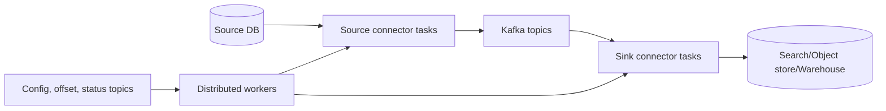

# Kafka Connect Streams Share Groups And Multi-Cluster Architecture

## Selection Map

| Need | Prefer |
|---|---|
| application performs domain side effects | Spring Kafka listener |
| standardized movement between systems and Kafka | Kafka Connect |
| continuous stateful transformation of Kafka records | Kafka Streams |
| queue-style competing work with record acquisition/redelivery | share group |
| cluster or region replication | MirrorMaker 2 or managed replication service |

These tools overlap at the edges, but choosing one only because “it uses Kafka”
usually creates unnecessary code or operational burden.

## Kafka Connect

This section is the architect selection summary. For a full learning sequence,
continue with [Kafka Connect Overview](../streaming/KAFKA-CONNECT-OVERVIEW.md) and
[Kafka Connect CDC And Production](../streaming/KAFKA-CONNECT-CDC-PRODUCTION.md).

A Connect cluster contains workers. A connector owns configuration and creates
tasks, which perform parallel data movement. Distributed mode persists connector
configuration, offsets, and status in compacted internal topics and coordinates
task ownership across workers.

Converters translate Connect's data model to bytes; they are not Kafka client
serializers. Schema-aware Avro, Protobuf, or JSON Schema converters enable governed
evolution. Single Message Transforms perform small per-record changes; they are not
a replacement for complex business logic or stateful processing.

Production requirements:

- size tasks from source/sink parallelism and external-system limits;
- replicate and secure internal topics correctly;
- isolate plugins and pin compatible versions;
- define error tolerance, DLQ, retries, and data ownership;
- monitor worker health, connector/task state, source lag, sink lag, throughput,
  errors, and external throttling;
- test rolling updates and connector reconfiguration without duplicate or missing
  business effects.

### CDC and outbox

CDC reads committed database changes. An outbox table makes the intended domain
event part of the same database transaction as the business change. A CDC
connector then publishes committed outbox rows. Consumers still require
idempotency because connector recovery and downstream delivery can repeat events.

Do not expose arbitrary table-change events as stable domain contracts. Separate
database representation from event ownership, versioning, privacy, and lifecycle.

## Kafka Streams

This section is the architect selection summary. For topology code, state,
restoration, operations, and interview scenarios, use
[Kafka Streams Overview](../streaming/KAFKA-STREAMS-OVERVIEW.md) and
[Kafka Streams Stateful Processing And Production](../streaming/KAFKA-STREAMS-STATEFUL-PRODUCTION.md).

Kafka Streams embeds processing into the application. `KStream` represents an
event stream; `KTable` represents the latest value per key; `GlobalKTable`
replicates table state to each instance for suitable small reference data.

Stateful operations create local stores backed by changelog topics. Key-changing
operations may create repartition topics. On reassignment, an instance restores
state from changelogs; standby replicas trade additional resources for faster
recovery.

### Time and windows

- event time comes from record timestamps;
- stream time advances from observed records and is not wall-clock time;
- windows group records by time boundaries;
- grace periods define how long late records may still update a closed window;
- suppression delays results until a window is suitably final, requiring bounded
  memory/state decisions;
- out-of-order events require business policy, not only a larger grace period.

### Joins

Before a join, verify key co-partitioning, partition counts, serialization,
timestamp semantics, retention, expected multiplicity, null behavior, and state
size. An innocent-looking join can introduce repartition traffic and large stores.

Kafka Streams exactly-once protects Kafka reads, state-store updates, and Kafka
writes under the configured processing guarantee. It does not make an external
HTTP or database side effect exactly once.

Test topology logic with topology test tools, then integration-test serialization,
broker behavior, restoration, rebalances, and failure with real Kafka containers.

## Share Groups And Kafka Queues

Traditional consumer groups assign partitions to members and expose ordered
partition consumption. Share groups support queue-style processing in which
records are acquired for processing and can be acknowledged or redelivered.

Use share groups when work distribution and record-level redelivery matter more
than strict partition-owner processing. Evaluate:

- acknowledgment modes and delivery-attempt limits;
- acquisition locks and processing duration;
- redelivery and poison-record policy;
- ordering requirements;
- client/framework/broker compatibility;
- observability and operational maturity.

Do not migrate a normal group merely to obtain more parallelism without testing
the different delivery and ordering contract.

## Schema Registry And Governance

Schema Registry is ecosystem infrastructure rather than an Apache Kafka broker
feature. Choose Avro, Protobuf, or JSON Schema from contract, tooling, and consumer
needs. Enforce compatibility per subject strategy and test producer/consumer
overlap during rolling deployments.

Govern every event with:

- owner, purpose, key and partitioning rule;
- schema and semantic version policy;
- data classification and deletion obligations;
- retention and replay policy;
- producer and consumer inventory;
- deprecation and migration procedure.

Compatibility is more than parsing. Changing field meaning, units, identity, or
event timing can be semantically breaking even if the schema registry accepts it.

## Multi-Cluster And Regional Design

### Active/passive

One region owns writes; another receives replicated topics. It is simpler than
active/active but requires tested client cutover, offset strategy, acceptable
replication lag, and failback reconciliation.

### Active/active

Multiple regions accept writes. This reduces regional write dependency but makes
ownership, conflict resolution, key ordering, duplicate prevention, topic naming,
loop prevention, and global consumer semantics much harder.

MirrorMaker 2 uses Connect to replicate topics, configurations where supported,
and consumer-group offsets/checkpoints. It does not create synchronous global
ordering or zero-data-loss failover by itself.

Define:

- RPO from worst acceptable unreplicated data;
- RTO from detection through safe application recovery;
- topics and groups in scope;
- failover trigger and authority;
- read/write ownership during partitioned networks;
- offset translation and consumer startup behavior;
- data residency and encryption controls;
- failback, reconciliation, and duplicate handling.

## Managed Versus Self-Managed Kafka

Compare operational ownership, supported Kafka features, networking, identity,
upgrade control, Connect/Streams ecosystem, observability, quotas, storage,
multi-region capabilities, cost, and exit strategy. “Kafka-compatible” services may
not implement every broker API or operational behavior.

## Architecture Exercises

1. Select listener, Connect, or Streams for five data flows and defend each choice.
2. Design a Debezium outbox pipeline and identify every duplicate window.
3. Design a windowed fraud aggregate with late events and restoration.
4. Decide whether a work queue should use a traditional group or share group.
5. Produce active/passive failover and failback runbooks with RPO/RTO calculations.

## Official References

- [Kafka Connect](https://kafka.apache.org/documentation/#connect)
- [Kafka Streams](https://kafka.apache.org/documentation/streams/)
- [Spring Kafka reference](https://docs.spring.io/spring-kafka/reference/)

## Recommended Next

Continue with the
[Event Streaming Application Path](../EVENT-STREAMING-APPLICATION-PATH.md) or
[Advanced Spring Kafka](../../spring/kafka/SPRING-KAFKA-ADVANCED.md).
