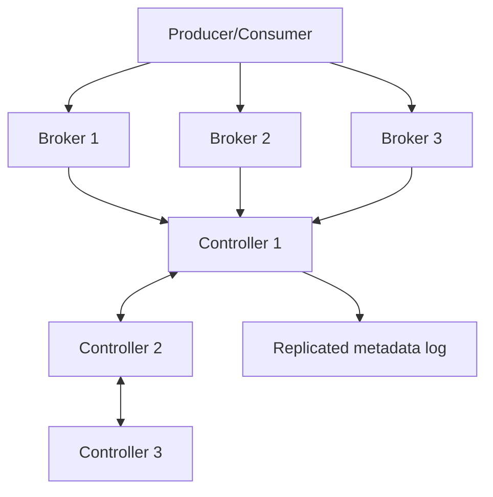
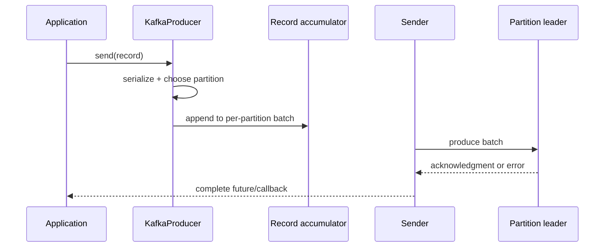

# Kafka KRaft Storage Producer And Consumer Internals

## KRaft Control Plane

KRaft stores cluster metadata in a replicated metadata log managed by a controller
quorum. Brokers store topic data; controllers manage metadata and leadership.
Combined broker/controller nodes are convenient locally, while critical clusters
normally isolate the roles.



The active controller applies committed metadata records and propagates changes.
A majority of controllers is required to make metadata progress. A quorum of
`2N + 1` controllers tolerates `N` controller failures. Losing controller quorum
does not instantly delete topic data, but metadata-changing operations and safe
cluster progress become unavailable.

Know these boundaries:

- cluster ID identifies formatted storage belonging to one cluster;
- node ID uniquely identifies a controller or broker;
- broker registration and heartbeat establish liveness;
- fencing prevents an obsolete broker incarnation from acting as current;
- controller election chooses metadata leadership, not every partition leader;
- partition leaders remain distributed across brokers.

## Partition Storage

A partition is an ordered sequence of record batches stored in segment files.
Kafka uses an active segment for appends and closed segments for older data.
Sparse offset and timestamp indexes locate ranges without indexing every record.

```text
partition-0/
  00000000000000000000.log
  00000000000000000000.index
  00000000000000000000.timeindex
  00000000000001500000.log       <- active segment
```

The operating-system page cache is central to performance. Sequential append and
batched network transfer avoid random per-record disk operations. Disk sizing must
include replicas, indexes, temporary reassignment space, cleaner work, tiered
storage cache, and growth headroom—not only retained payload bytes.

### Important positions

| Position | Meaning |
|---|---|
| log end offset | end of one replica's local log |
| high watermark | records safely replicated enough to be visible as committed |
| last stable offset | visibility boundary for `read_committed` when transactions exist |
| committed group offset | consumer group's durable next-position/progress marker |
| consumer position | next record the current consumer intends to fetch |

These values answer different questions. “Offset 100 exists” does not prove that a
group processed its business effect.

## Replication And Failure

The partition leader handles normal reads and writes. Followers fetch the leader's
log. ISR membership tracks replicas caught up sufficiently for normal leadership.

With `acks=all` and `min.insync.replicas=2`, a write fails when fewer than two ISR
members are available. `min.insync.replicas` is an availability/durability gate;
it does not mean Kafka waits for exactly two replicas. Unclean leader election can
restore availability from an out-of-date replica at the risk of data loss and must
be an explicit business decision.

## Retention And Compaction

Delete retention removes eligible closed segments after time/size policies. A
record does not disappear immediately when its individual age crosses the limit.
Compaction retains the latest value per key eventually, not synchronously.
Tombstones represent key deletion and must remain long enough for consumers and
cleaners to observe deletion safely.

Tiered storage separates local and remote retention economics but adds remote-read
latency, cache behavior, object-store dependency, restore planning, and cost
monitoring. It is not a substitute for tested disaster recovery.

## Producer Runtime



- application threads serialize and enqueue records;
- the accumulator maintains batches per partition;
- `batch.size` bounds a batch target and `linger.ms` allows aggregation;
- the sender drains ready batches using cluster metadata;
- `buffer.memory` exhaustion makes send calls block up to `max.block.ms`;
- `delivery.timeout.ms` bounds total delivery time including batching and retry;
- compression operates on batches, so realistic batching affects its value.

Idempotence uses a producer identity, epoch, and sequence numbers so brokers can
reject duplicate or stale retry sequences within Kafka's protocol. Transactions
extend this with a stable `transactional.id`, coordinator state, commit/abort
markers, and fencing. Neither feature deduplicates a database update, email, or
payment API call.

Ordering can be weakened by application concurrency, key changes, partition-count
changes, retry topics, or custom asynchronous processing even when the producer
protocol preserves order within a partition.

## Consumer Runtime

The consumer is not thread-safe. One owning thread polls, manages group state, and
normally commits. Work handed to another executor needs bounded queues, shutdown
coordination, per-partition ordering rules, and a safe commit design.

```text
subscribe -> join group -> receive assignment -> fetch -> poll returns records
          -> application processing -> offset commit -> repeat
```

Important controls:

| Setting | Question it controls |
|---|---|
| `max.poll.records` | how much work can one poll expose? |
| `max.poll.interval.ms` | how long may application processing delay the next poll? |
| `session.timeout.ms` | how long may membership liveness be absent? |
| `heartbeat.interval.ms` | classic-protocol heartbeat cadence |
| `fetch.min.bytes` | how much data may broker accumulate for throughput? |
| `fetch.max.wait.ms` | how long may that fetch wait? |
| `max.partition.fetch.bytes` | per-partition fetch memory bound |
| `auto.offset.reset` | where does a group start only when no usable committed offset exists? |

### Group coordination

The coordinator tracks membership and committed offsets. Assignment strategies
include range, round-robin, sticky, and cooperative-sticky behavior. Eager
rebalancing revokes broadly; cooperative assignment moves partitions
incrementally. Static membership (`group.instance.id`) reduces avoidable movement
for stable instances but requires unique identities and appropriate timeouts.

Kafka 4.x environments may use either classic or newer consumer group protocols.
Operational tools, client compatibility, assignment behavior, and timeout ownership
must match the selected protocol.

## Transactions And Visibility

Kafka-to-Kafka exactly-once processing atomically commits output records and input
offsets in a Kafka transaction. Downstream consumers use `read_committed` to hide
aborted transactional records. External systems remain outside that atomic unit.

Failure boundaries to recite:

1. business effect succeeds, offset commit fails: redelivery is possible;
2. offset commits before effect: loss from that group's viewpoint is possible;
3. producer acknowledgment is lost: retry may occur;
4. database and Kafka are written independently: either side may commit alone;
5. transaction identity is reused by live instances: fencing occurs.

## Diagnostic Questions

- Is the record absent, uncommitted, filtered by isolation level, expired, or only
  unprocessed by one group?
- Is lag caused by arrival rate, processing latency, retries, skew, rebalances, or
  downstream saturation?
- Are failures local to one partition, one broker, one group, or the whole cluster?
- Does the proposed timeout prevent false failure, or merely hide unbounded work?
- Which durable evidence proves the business effect completed exactly once enough
  for the domain?

## Official References

- [Apache Kafka KRaft](https://kafka.apache.org/documentation/#kraft)
- [Apache Kafka design](https://kafka.apache.org/documentation/#design)
- [Apache Kafka producer configuration](https://kafka.apache.org/documentation/#producerconfigs)
- [Apache Kafka consumer configuration](https://kafka.apache.org/documentation/#consumerconfigs)

## Recommended Next

Continue with [Kafka Security And Operations](./KAFKA-SECURITY-OPERATIONS.md).
