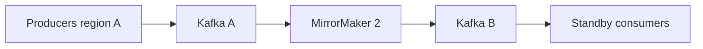

# Kafka Multi-Cluster Disaster Recovery

Broker replication protects partitions inside one cluster. It is not a regional
disaster-recovery strategy. Multi-cluster replication is asynchronous in common
designs, so regional RPO can be nonzero.

## Choose The Business Authority First

Define which region may accept writes for each business entity. Kafka replication
alone cannot merge two conflicting account or order histories.

| Design | Strength | Main risk |
|---|---|---|
| active/passive | clear write authority and simpler failover | standby lag and idle capacity |
| active/active by entity/home region | local writes with explicit ownership | routing, reassignment, and conflict operations |
| active/active to same logical keys | maximum availability ambition | duplicates, loops, conflicts, no global order |

Prefer active/passive unless business requirements justify active/active
complexity.

## Replication Topology

MirrorMaker 2 runs on Kafka Connect and replicates selected topics plus supporting
metadata/checkpoints according to configuration.



Protect replication from loops through directional topology, aliases/naming,
topic selection, and tested identity rules. Internal, retry, DLT, transaction,
schema, and compacted topics need explicit inclusion/exclusion decisions.

## RPO And RTO

```text
RPO is bounded by replication lag plus unreplicated/ambiguous writes
RTO includes detection, decision, routing, consumer start, offset translation,
state restoration, dependency failover, and validation
```

Measure record age and bytes behind, not only connector running status. A running
replicator can be logically stalled.

## Consumer Offset Failover

Source and target offsets are not assumed identical. Checkpoint/offset translation
must be configured and tested. On failover, choose deliberately between possible
duplicate replay and possible skip; production systems normally prefer replay
with idempotent consumers.

Streams applications also restore local state from changelogs and may require
standby replicas or extended RTO. External databases, schema registries, object
stores, secrets, and APIs must fail over consistently with Kafka.

## Failover Runbook

1. confirm region failure and replication position;
2. fence or stop source writers to avoid split brain where possible;
3. record last known source and replicated positions;
4. promote target routing, credentials, schemas, and dependencies;
5. translate/start consumer groups from approved recovery points;
6. rate-limit startup and backlog drain;
7. reconcile duplicates, missing outcomes, outboxes, and Sagas;
8. publish RPO/RTO and business-impact evidence.

Automating traffic switching without authority fencing can make recovery worse.

## Failback Is A Separate Migration

After the original region returns, do not simply reverse DNS. Determine which
region now holds authoritative writes, replicate the recovery-period data, drain
or fence writers, validate offsets and schemas, switch gradually, and reconcile.
Practice failback as frequently as failover.

## Data Residency And Security

Cross-region replication may violate residency, privacy, encryption, or key
management policy. Classify topics, minimize replicated payloads, use regional
ACLs and credentials, audit access, and test certificate/secret rotation in both
regions.

## Failure Scenarios

| Scenario | Control |
|---|---|
| replicator down beyond source retention | capacity/alerts; snapshot or authoritative rebuild plan |
| source accepts writes after target promotion | writer fencing and conflict reconciliation |
| target lacks schema | replicate/deploy schemas before consumers |
| offset checkpoint stale | idempotent replay from conservative point |
| DLT/retry topics omitted | explicit recovery-topic policy |
| DNS changes but clients cache | tested client metadata/DNS behavior and staged routing |
| target brokers healthy but DB unavailable | full dependency recovery plan |

## Proof Through Exercises

Run scheduled game days. Record detection time, replication age, data loss,
duplicate count, consumer recovery point, state restoration time, backlog drain,
business reconciliation, and failback duration. A diagram without an executed
recovery is not a DR capability.

## Interview Questions

**Does MirrorMaker provide zero RPO?** Not generally. Replication is asynchronous;
measure and state the achievable RPO.

**Why not active/active everywhere?** Kafka preserves order only per partition
inside a cluster and does not resolve conflicting business writes across regions.

**What is commonly forgotten?** Consumer recovery points, schemas, external
databases, retry/DLT topics, outboxes, secrets, and failback.

## Official References

- [Kafka geo-replication with MirrorMaker](https://kafka.apache.org/documentation/#georeplication)
- [Kafka Connect](https://kafka.apache.org/documentation/#connect)

## Recommended Next

Return to [Kafka Production Mastery](./KAFKA-PRODUCTION-MASTERY.md) and rehearse
the regional-failure scenario.

