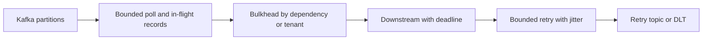

# Kafka Production Failure Prevention And Incident Playbook

Kafka buffers traffic; it does not create downstream capacity. When producers
write 20,000 records/s and the complete consumer path sustains 12,000 records/s,
lag grows by approximately 8,000 records/s until capacity returns or retention
deletes unread data.

## Containment Architecture



Prevent cascading failure with:

- bounded queues, executors, connections, and batch sizes;
- timeouts and end-to-end deadlines;
- circuit breakers and dependency-specific bulkheads;
- retry budgets, exponential backoff, and jitter;
- consumer pause/resume and controlled admission;
- retry topics or DLTs for poison records;
- idempotency at every repeated effect;
- load shedding for work whose deadline has expired.

Never combine an unavailable dependency with unbounded blocking retry. That
occupies listener threads, exceeds poll intervals, triggers rebalances, repeats
work, and increases pressure on the failed dependency.

## Push Versus Pull Delivery

In a push broker, the broker sends messages toward consumers, commonly using a
credit, prefetch, or acknowledgment window. A slow consumer must make the broker
stop pushing before its local memory or connection is overwhelmed.

Kafka uses pull consumption: a consumer sends a fetch request containing the
partitions, offsets, and byte limits it is ready to receive.

| Pull (Kafka) | Push |
|---|---|
| consumer controls fetch timing and size | broker initiates delivery |
| natural batching across available records | low-latency immediate delivery can be natural |
| slow consumers accumulate broker-side lag | slow consumers require broker flow control/prefetch |
| replay by requesting an earlier offset | replay depends on broker/message lifecycle |

Kafka chose pull because consumers have different speeds, can batch efficiently,
and can replay independently. Pull does not eliminate overload: an application
can still request more records than its downstream systems can complete.

## How To Decide Partitions And Consumers

Measure one consumer thread with realistic payloads and downstream calls:

```text
required active consumers
  = ceiling(peak arrival records/sec / sustainable records/sec per consumer)

throughput partitions
  >= required active consumers

effective active consumers
  = min(topic partitions, replicas * concurrency)
```

Example: peak arrival is 12,000 records/s and one consumer safely completes
1,500 records/s at the target p99 latency. The theoretical minimum is eight
active consumers and at least eight partitions. Add tested headroom for rollout,
failure, skew, and catch-up rather than choosing eight blindly.

Also verify:

- required ordering key and expected key skew;
- producer throughput per partition and broker disk/network capacity;
- database/API connection and rate limits;
- maximum useful replicas during failover and deployment;
- retention and backlog recovery SLO;
- operational cost of many partitions and state restoration.

Partitions are not free threads. Increasing them can change key-to-partition
mapping, cannot be reduced normally, increases metadata and recovery work, and
does not split an existing hot key. Scale in this order: remove the processing
bottleneck, use available partitions with concurrency, add replicas within the
partition ceiling, then add partitions only after revisiting ordering and keys.

## Consumer Lag Diagnosis

First split the symptom:

| Observation | Likely direction |
|---|---|
| every partition grows | total capacity, downstream, CPU, GC, network |
| one partition grows | key skew, hot tenant, stuck record |
| saw-tooth lag | bursts or periodic batch/GC behavior |
| lag plus rebalances | poll interval, crashes, deployment, group instability |
| offset lag low but events old | sparse traffic or timestamp/backlog semantics; inspect oldest age |

Then compare:

```text
arrival rate
completion rate
p95/p99 handler duration
retry and DLT rate
active consumers vs partitions
DB/API pool saturation
CPU, heap, GC and network
rebalance and commit failures
```

Scale consumers only after identifying the bottleneck. More consumers cannot
help beyond partition count, cannot fix a hot partition, and can overload a
database faster.

## Batching Failure Modes

Batching improves network and database efficiency but enlarges the unit of
retry, memory use, and latency.

| Failure | Prevention |
|---|---|
| record 37 fails and all 100 replay | idempotency plus failed-record-aware recovery |
| batch exceeds poll interval | reduce records, bulk-write efficiently, tune only after measurement |
| one tenant monopolizes batch | tenant quotas or fair partitioning |
| large batch exhausts heap | bound bytes as well as count |
| batch acknowledged after submission | acknowledge only durable completion |
| repeated batch poisons dependency | bounded retry, split/isolate, DLT |

Measure records per request, batch fill ratio, batch processing time, allocation,
and end-to-end age. Optimize one setting at a time.

### One Record Fails After 100 Succeed

Assume offsets 0–100 arrive and offset 100 fails after the first 100 business
effects completed. Choose one explicit policy:

1. **Retry the entire batch.** Simplest, but offsets 0–99 repeat. Their effects
   must be idempotent.
2. **Commit the successful prefix and retry from the failed record.** Record the
   failing index (`BatchListenerFailedException` in Spring Kafka where applicable)
   so recovery can seek/commit correctly. This works for an ordered successful
   prefix, not arbitrary completion gaps.
3. **Recover the failed record to DLT and commit past it.** Use only after bounded
   retry and successful DLT publication; this sacrifices automatic in-stream
   processing and can affect per-key ordering.
4. **Make the whole batch one database transaction.** Roll back all 101 effects
   and retry. This gives a clear boundary but can create long locks and retry
   amplification.

Never commit offset 101 merely because all records were submitted to an executor.
Commit only durable contiguous completion. For arbitrary parallel completion,
use the [consumer multithreading watermark](./KAFKA-CONSUMER-MULTITHREADING.md).

## Bad Messages, Retry, And DLT

Classify before retrying:

| Failure | Example | Policy |
|---|---|---|
| transient infrastructure | timeout, temporary 503 | bounded retry with jitter |
| throttling | HTTP 429 | honor delay, reduce concurrency |
| malformed bytes | invalid JSON/Avro | deserialization recovery then DLT/quarantine |
| incompatible contract | unknown required schema version | DLT and producer/schema correction |
| permanent business rejection | impossible state transition | terminal business outcome or DLT by policy |
| code defect | null pointer for valid data | stop amplification, fix/canary, controlled replay |

A DLT is an operational workflow, not a trash bin. Preserve original topic,
partition, offset, timestamp, key, headers, event/schema version, consumer group,
exception category, delivery count, and deployment version. Restrict sensitive
payload access. Alert on DLT rate and oldest age, assign an owner, define retention,
and replay through a rate-limited idempotent path after the cause is corrected.

Only commit the source record after DLT publication is acknowledged. If recovery
publication fails, stop or retry recovery; otherwise the bad record can disappear
from both the main stream and DLT.

## Idempotency Layers

Producer idempotence prevents duplicate Kafka log appends for supported producer
retry sessions. It does not deduplicate consumer effects.

Consumer protection should use one or more of:

- `(consumer, event_id)` unique inbox record in the same DB transaction as the effect;
- a business unique constraint;
- compare-and-set state transition with expected version;
- idempotency key at an external payment or HTTP API;
- naturally idempotent assignment instead of increment/decrement;
- reconciliation against the system of record.

Keep deduplication records at least as long as an event can be replayed into that
consumer, or make the domain state itself reject old event versions.

## Incident Sequence

1. **Protect data and dependencies:** stop deployments, bound/reduce concurrency,
   pause selected partitions if necessary, and stop retry storms.
2. **Capture evidence:** group assignment, per-partition lag, oldest timestamp,
   rates, errors, rebalances, thread dumps, pools, broker health, and recent changes.
3. **Classify:** capacity, skew, poison data, dependency, group instability,
   broker/storage, credentials, or schema.
4. **Correct the constraint:** code path, pool, partition key, retry policy,
   dependency capacity, or broker condition.
5. **Recover gradually:** canary consumers, rate-limited replay, monitor saturation.
6. **Reconcile effects:** duplicates, missing outcomes, DLT, and business state.
7. **Record prevention:** alert, capacity model, test, runbook, and owner.

## Failure Scenarios

### Kafka unavailable while HTTP traffic continues

Do not keep unbounded producer memory or request threads blocked. Use a durable
outbox for accepted business writes, cap pending storage, expose degraded status,
and reject/load-shed before database disks fill. Alert on oldest outbox age.

### Downstream database is slow

Apply short DB deadlines, a dedicated connection bulkhead, bounded concurrency,
and pause consumption before exhausting the application. Do not increase Kafka
consumer concurrency until DB headroom exists.

### Retry/DLT volume suddenly grows

Group by exception, schema version, producer, key, and deployment. Stop automatic
replay until the cause is fixed. Preserve original topic/partition/offset,
headers, event ID, and failure history.

### One tenant produces most events

Measure partition distribution and per-tenant cost. Consider tenant quotas,
separate topics for extreme tenants, controlled key bucketing where ordering
allows, and fair downstream admission.

### Producer is much faster than consumers

This is safe only while retention, disk, freshness SLO, and recovery capacity can
absorb the difference. Calculate lag growth and time-to-retention/data-loss risk.
Then choose among:

- optimize or batch the measured consumer bottleneck;
- increase consumers up to partition and downstream limits;
- add partitions after ordering/key review;
- apply producer/tenant quotas and admission control;
- shed expired or low-priority work deliberately;
- separate hot tenants or workload classes;
- increase retention/storage only as temporary capacity, not as the sole fix.

Producer-side backpressure includes bounded `buffer.memory`, `max.block.ms`,
delivery deadlines, quotas, and a durable outbox with storage limits. Never turn
an unavailable Kafka cluster into unlimited heap buffering or unlimited outbox
growth.

### Consumer is slow

Determine whether **processing** is slow or the consumer is repeatedly losing
ownership. Check per-partition lag, oldest event age, poll interval violations,
rebalances, handler p99, retries, GC, CPU, DB/API pools, and key skew. Reduce
`max.poll.records` when one poll cannot complete within its budget. Increase
`max.poll.interval.ms` only when long processing is legitimate—not to conceal an
unbounded handler. Pause/resume and bounded in-flight work protect dependencies.

### Producer send fails

Observe the returned future/callback. Classify serialization, authorization,
timeout, record-size, metadata, and broker durability failures. Configure
idempotence, appropriate acknowledgments, bounded delivery timeout, and a durable
outbox when publication follows a database change. Do not report business success
solely because an asynchronous send was accepted locally.

## Production Evidence

A healthy design proves:

- no record exceeds the processing-age SLO under planned load;
- backlog recovery rate is greater than normal arrival rate;
- a failed dependency does not exhaust unrelated pools;
- duplicate injection produces one business effect;
- broker and consumer restarts cause bounded duplicates, not loss;
- DLT and replay have an owner and audited procedure;
- retention has enough time for worst-case outage plus recovery.

## Interview Response Framework

For “consumer lag is increasing,” answer in this order: scope by partition,
compare arrival/completion rates, inspect handler/downstream latency, check group
stability and partition/concurrency, identify skew/retries, contain pressure,
correct the bottleneck, and prove recovery with lag slope and saturation metrics.

## Official References

- [Kafka consumer configuration](https://kafka.apache.org/documentation/#consumerconfigs)
- [Kafka monitoring](https://kafka.apache.org/documentation/#monitoring)
- [Spring Kafka exception handling](https://docs.spring.io/spring-kafka/reference/kafka/annotation-error-handling.html)
- [Spring Kafka runtime internals and failures](../../spring/kafka/SPRING-KAFKA-RUNTIME-INTERNALS-FAILURES.md)

## Recommended Next

For cross-service workflows, continue with
[Saga Liveness, Timeout, And Recovery](/reliability/SAGA-LIVENESS-TIMEOUT-RECOVERY).
