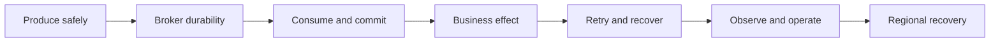

# Kafka Production Mastery

This page is the production coverage index. Use it after the
[Kafka Architect Overview](../KAFKA-ARCHITECT-OVERVIEW.md) to ensure no major
runtime, operational, or interview area is missed.

## Complete Coverage Map

| Area | What mastery means | Canonical guide |
|---|---|---|
| producer reliability | acknowledgments, idempotence, timeouts, accumulator, fencing, ambiguous outcomes | [Producer Reliability And Backpressure](./KAFKA-PRODUCER-RELIABILITY-BACKPRESSURE.md) |
| consumer groups | coordinator, generations, heartbeats, assignment, rebalance storms | [Consumer Groups, Rebalancing, And Ordering](./KAFKA-CONSUMER-GROUPS-REBALANCING-ORDERING.md) |
| ordering and partitioning | keys, skew, expansion, retry ordering, sequence guards | [Consumer Groups, Rebalancing, And Ordering](./KAFKA-CONSUMER-GROUPS-REBALANCING-ORDERING.md) |
| delivery semantics | at-most/at-least/exactly-once boundaries | [Kafka Internals](./KAFKA-INTERNALS.md) |
| offset commits | sync/async, callbacks, safe watermarks, shutdown | [Consumer Offset Commits](./KAFKA-CONSUMER-OFFSET-COMMITS.md) |
| concurrency | consumer ownership, workers, pause/resume, completion gaps | [Consumer Multithreading](./KAFKA-CONSUMER-MULTITHREADING.md) |
| retry and DLT | classification, blocking/non-blocking retry, recovery failure, replay | [Spring Kafka Retry, DLT, And Recovery](../../spring/kafka/SPRING-KAFKA-RETRY-DLT-RECOVERY.md) |
| bad messages and schemas | deserialization, compatibility, poison events, governance | [Kafka Ecosystem And Schema Governance](./KAFKA-ECOSYSTEM.md) |
| performance and sizing | partition, consumer, storage, network, and recovery calculations | [Capacity And Performance Planning](./KAFKA-CAPACITY-PERFORMANCE-PLANNING.md) |
| broker/storage internals | segments, indexes, page cache, replication, visibility, compaction | [Kafka Internals](./KAFKA-INTERNALS.md) |
| KRaft architecture | controllers, quorum, metadata, fencing, quorum failure | [Kafka Internals](./KAFKA-INTERNALS.md) |
| administration | reassignment, leaders, broker removal, disk, upgrades, quotas | [Security And Operations](./KAFKA-SECURITY-OPERATIONS.md) |
| security | TLS, SASL, ACLs, rotation, tenancy, audit | [Security And Operations](./KAFKA-SECURITY-OPERATIONS.md) |
| observability | lag, age, rates, commits, retries, ISR, disk, SLO evidence | [Production Failure Playbook](./KAFKA-PRODUCTION-FAILURE-PLAYBOOK.md) |
| idempotency and inbox | deduplication, business constraints, replay-safe effects | [Spring Kafka Idempotency And Replay](../../spring/kafka/SPRING-KAFKA-CONSUMER-IDEMPOTENCY-REPLAY.md) |
| outbox | atomic intent, relay crashes, claims, ordering, CDC, reconciliation | [Outbox Production Failure Modes](../../reliability/OUTBOX-PRODUCTION-FAILURE-MODES.md) |
| Saga failures | missing outcomes, deadlines, late replies, compensation | [Saga Liveness And Recovery](../../reliability/SAGA-LIVENESS-TIMEOUT-RECOVERY.md) |
| Kafka Streams | state stores, time, joins, restoration, EOS, topology upgrades | [Stateful Kafka Streams In Production](../streaming/KAFKA-STREAMS-STATEFUL-PRODUCTION.md) |
| Kafka Connect and CDC | snapshots, offsets, internal topics, DLQ, plugins, recovery | [Kafka Connect And CDC In Production](../streaming/KAFKA-CONNECT-CDC-PRODUCTION.md) |
| multi-cluster and DR | replication, RPO/RTO, failover, failback, split-brain controls | [Multi-Cluster Disaster Recovery](./KAFKA-MULTI-CLUSTER-DISASTER-RECOVERY.md) |
| Kubernetes deployment | graceful shutdown, autoscaling, advertised listeners, zones | [Spring Kafka Operations](../../spring/kafka/SPRING-KAFKA-OPERATIONS-INCIDENT-RESPONSE.md) |
| Spring internals | template send path, containers, conversion, commits, recovery | [Spring Kafka Runtime Internals](../../spring/kafka/SPRING-KAFKA-RUNTIME-INTERNALS-FAILURES.md) |

## Production Reasoning Template

For every topic, be able to state:

1. **Invariant:** what must never become false?
2. **Ownership:** which component owns progress and recovery?
3. **Failure window:** what can commit before something else?
4. **Containment:** which bound prevents a cascading failure?
5. **Recovery:** retry, replay, reconcile, compensate, or fail over?
6. **Evidence:** which metric, log, offset, and business record prove success?
7. **Trade-off:** what latency, throughput, availability, order, or cost was accepted?

## Production Scenario Set

You are ready when you can defend these without notes:

- producer receives traffic while Kafka is unavailable for 30 minutes;
- broker acknowledges a write but the producer sees a timeout;
- consumer effect succeeds but the offset commit fails;
- one record fails after 100 batch records succeeded;
- one partition lags while others are idle;
- retries overload an already failing database;
- a schema-breaking record never reaches the listener;
- adding consumers does not improve throughput;
- partition count must increase without breaking aggregate ordering;
- a DLT replay must not charge or notify twice;
- a service executes a Saga step but its outcome event is missing;
- an outbox relay dies after Kafka acknowledgment;
- a Streams instance loses its local state store;
- a CDC connector falls behind database log retention;
- an entire region becomes unavailable during writes.

## Interview Answer Shape

Lead with the guarantee, then the failure boundary, diagnosis, containment,
recovery, and evidence. Avoid answering configuration questions with a universal
number: give the measurement and formula that select the value.

## Recommended Sequence

1. Producer reliability and capacity planning.
2. Consumer groups, commits, multithreading, retry, and DLT.
3. Internals, security, administration, and incidents.
4. Inbox, outbox, Saga, schemas, Connect, and Streams.
5. Multi-cluster recovery and Kubernetes operations.
6. Revision sheet and scenario drills.

## Recommended Next

Start with [Producer Reliability And Backpressure](./KAFKA-PRODUCER-RELIABILITY-BACKPRESSURE.md).

