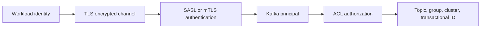

# Kafka Security Administration Capacity And Incident Operations

## Security Model

Kafka security has three separate questions:

1. **Encryption:** can another party read traffic?
2. **Authentication:** which principal connected?
3. **Authorization:** what may that principal do?

TLS protects traffic and can authenticate clients with mutual TLS. SASL mechanisms
include SCRAM, Kerberos/GSSAPI, PLAIN when protected by TLS, and OAuth bearer
integration. ACLs authorize operations on topics, groups, clusters,
transactional IDs, delegation tokens, and other resources.



### Least-privilege examples

- a producer needs write/describe access to its owned topics and transactional-ID
  access only when it uses transactions;
- a consumer needs read/describe access to topics plus group access for its group;
- a Streams application also needs access to its internal topics and application
  group resources;
- an application should not receive topic-creation or cluster-alter permission
  merely because local development auto-creates topics.

Prefer prefixed resource patterns for an application-owned namespace. Avoid
wildcard principals, shared superusers, and credentials embedded in images or
source control.

## Rotation Without Downtime

For certificates or credentials:

1. add trust for the new issuer/key before using it;
2. deploy clients/brokers capable of accepting old and new material;
3. issue and roll new identities gradually;
4. verify authentication, authorization, and connection metrics;
5. revoke old material only after every workload has moved;
6. retain an audited rollback path.

Test expiry, clock skew, hostname verification, principal mapping, file reload
behavior, and secret-manager permissions. Rotation is incomplete if restarted
clients cannot reconnect.

## Multi-Tenant Controls

Isolation uses multiple layers:

- topic and group naming boundaries;
- ACLs and separate workload identities;
- producer, consumer, request, and controller mutation quotas;
- retention and maximum-record policies;
- partition and broker-placement limits;
- schema and PII governance;
- per-tenant lag, throughput, error, and cost attribution.

Quotas protect shared capacity but may intentionally throttle clients. Operations
must distinguish quota delay from broker latency or network failure.

## Topic And Partition Administration

Treat topic configuration as version-controlled infrastructure. Define owner,
purpose, key, schema policy, partitions, replication, minimum ISR, retention,
cleanup policy, maximum record size, security classification, and decommission
date.

Increasing partitions increases available parallelism but changes key-to-partition
mapping for normal hash partitioning. Existing records do not move to the new
partition, so per-key ordering across the change requires a migration design.
Partition count cannot normally be reduced in place.

### Reassignment safety

Before moving replicas:

- confirm source and target disk/network headroom;
- inspect under-replicated and offline partitions;
- bound inter-broker movement with throttles;
- move in batches and observe ISR stability;
- verify placement and remove temporary throttles;
- preserve the generated plan and completion evidence.

Broker decommissioning is not “stop and delete.” Move replicas and leadership,
verify no partition depends on the broker, stop it gracefully, then remove its
infrastructure according to the platform runbook.

## Capacity Model

Start with explicit units:

```text
ingress bytes/sec = events/sec * average encoded record bytes
retained logical bytes = ingress bytes/sec * retention seconds
cluster disk = retained logical bytes * replication factor
```

Then add headroom for traffic peaks, indexes, compression uncertainty, compaction,
reassignment, tiered-storage cache, failures, rolling maintenance, and forecast
growth. Network calculations include client ingress/egress and replica traffic.
Consumer capacity must cover peak arrival plus backlog recovery inside the SLO.

Partition count is constrained by:

- required consumer parallelism;
- peak throughput per partition;
- key cardinality and skew;
- broker metadata, open files, recovery, and controller overhead;
- future expansion and ordering contracts.

## Minimum Production Metrics

| Layer | Evidence |
|---|---|
| controllers | active controller, quorum voters, metadata lag, election changes |
| brokers | request latency/errors, CPU, heap/GC, network, disk usage and latency |
| replication | offline partitions, under-replicated partitions, ISR shrink/expand |
| producer | send/error/retry rate, request latency, batch size, compression, buffer wait |
| consumer | lag by partition, consume rate, fetch/commit latency, assignment, rebalances |
| application | processing latency, success/failure, retry, DLT, idempotency conflicts |
| Connect/Streams | task state, processing lag, store restore, skipped/error records |

Alert on user impact and loss of safety margin, not every transient change. A lag
alert needs rate and age context; a million records may be harmless or critical.

## Incident Runbooks

### Rising consumer lag

1. Compare arrival, consumption, and commit rates.
2. Split by partition to find global saturation or skew.
3. Inspect processing p95/p99, downstream pools, timeouts, GC, and retry traffic.
4. Check assignment count, rebalance frequency, and poll interval violations.
5. Restore capacity without exceeding database/API limits.
6. Estimate catch-up time and verify retention will not overtake the group.

### Under-replicated partitions

1. Identify affected brokers, racks, and disks.
2. Check broker reachability, replica-fetch latency, disk and network saturation.
3. Stop heavy reassignment or nonessential load if it is worsening recovery.
4. Restore failed capacity or move replicas safely.
5. Confirm ISR recovery before declaring completion.

### Broker disk above threshold

Do not immediately delete Kafka data files. Determine topic owners and retention,
stop unexpected producers if necessary, expand or rebalance capacity, and change
retention only through approved topic policy. Verify that compaction/retention is
working and that partition skew is not concentrating data.

### DLT growth

Classify by exception, producer version, schema version, topic, partition, and
deployment. Stop unsafe replay. Correct permanent data or code problems, prove the
consumer is idempotent, replay at a bounded rate, and retain an audit of every
terminal outcome.

### Apparent message loss

Check topic/partition/offset existence, timestamp and retention, transactional
visibility, consumer group, committed offset, reset policy, filters, deserialization
recovery, DLT, and business idempotency store. Never infer loss from the absence of
one application log line.

## Upgrade And Recovery

Rolling upgrade readiness includes broker/client compatibility, metadata feature
levels, protocol changes, connector/Streams compatibility, schema compatibility,
and rollback while new records already exist. Upgrade controllers and brokers in
the sequence required by the target release, observe between batches, and delay
irreversible feature activation until rollback is no longer required.

Kafka replication is availability, not backup. Accidental deletion, bad producers,
corrupt application logic, credential compromise, and regional loss require
separate recovery controls. Define RPO, RTO, replicated topics, offset strategy,
DNS/client cutover, failback, and regular recovery tests.

## Essential Tooling

Practice the Kafka tools for topics, consumer groups, configs, ACLs, quotas,
reassignment, leader election, metadata quorum, features, storage, transactions,
and producer/consumer performance. Use `AdminClient` for controlled automation.
Every mutating operation needs an exact target, captured before-state, bounded
execution, verification, and rollback or compensating procedure.

## Operational Completion Checklist

- [ ] identities and ACLs are least privilege;
- [ ] certificates and credentials have a tested rotation procedure;
- [ ] topics have owners, schemas, retention, keys, and capacity decisions;
- [ ] controller, broker, replication, producer, consumer, and application alerts exist;
- [ ] reassignment, broker removal, disk pressure, and lag runbooks are tested;
- [ ] upgrades preserve client/schema compatibility and rollback;
- [ ] regional recovery proves stated RPO and RTO;
- [ ] replay and DLT recovery are audited and rate limited.

## Official References

- [Apache Kafka security](https://kafka.apache.org/documentation/#security)
- [Apache Kafka operations](https://kafka.apache.org/documentation/#operations)
- [Apache Kafka configuration](https://kafka.apache.org/documentation/#configuration)

## Recommended Next

Continue with [Connect, Streams, Share Groups, And Multi-Cluster](./KAFKA-ECOSYSTEM.md).
