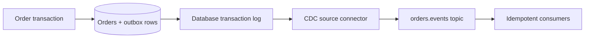

# Kafka Connect CDC And Production Operations

A production connector is a distributed data product. It needs an owner, source
and destination contracts, offset semantics, capacity model, security boundary,
upgrade strategy, recovery runbook, and data-quality controls.

## CDC And Transactional Outbox

Log-based CDC reads committed changes from a database transaction log. It is more
efficient and complete than polling an `updated_at` column, but exposes database
representation unless contracts are designed deliberately.



The outbox pattern writes the business change and intended event row in one local
database transaction. A CDC connector publishes committed outbox rows. This closes
the database/Kafka dual-write gap, but delivery can still repeat after connector or
consumer recovery.

An outbox event should carry event ID, aggregate ID/type, event type, schema
version, occurrence time, payload, correlation/causation IDs, and routing metadata.
Do not turn arbitrary row changes into public domain events.

## Snapshot And Streaming Phases

Many CDC connectors first snapshot existing rows, record a consistent log
position, then stream new changes. Plan:

- source load and locks during snapshot;
- schema changes during snapshot;
- topic capacity for historical volume;
- consumer behavior for snapshot versus live events;
- restart semantics and stored positions;
- validation that no gap or double-count changes business results.

## Offset And Duplicate Boundaries

A source connector tracks its position in the external log and persists source
offsets through Connect. Kafka producer acknowledgment and offset persistence are
not one global transaction with every source. A crash can cause a range to be read
again. Stable event keys and downstream idempotency are mandatory.

For a sink, an external write can succeed before the Kafka consumer offset commits.
On restart, the batch may be written again. Prefer deterministic upsert keys,
destination transactions, deduplication, or connector-documented exactly-once
behavior.

## Errors, Retry, And DLQ

Connect can tolerate selected record errors and route failed records to a DLQ with
context headers. This is useful for conversion and transformation failures; it does
not make infrastructure outages safe to skip.

Classify:

| Failure | Typical action |
|---|---|
| temporary destination outage | retry/backoff and alert; preserve ordering requirements |
| malformed record | DLQ with original data and metadata |
| incompatible schema | stop or quarantine according to contract policy |
| authentication failure | fail fast, alert, rotate/fix credentials |
| source log position unavailable | follow connector recovery procedure; do not reset blindly |

Unlimited tolerance silently loses data. Monitor the DLQ and error counters, assign
an owner, and implement audited correction/replay.

## Plugin Isolation And Supply Chain

Install plugins into controlled plugin paths, isolate incompatible dependencies,
pin exact connector/converter/transform versions, scan artifacts, verify provenance,
and test them against the Kafka and Java versions in the worker image. A plugin
upgrade changes the whole worker fleet's runtime risk even if one connector uses it.

Separate clusters or worker pools when connectors require conflicting libraries,
security boundaries, availability targets, network zones, or noisy resource profiles.

## Scaling And Capacity

Capacity is the minimum of source read capacity, task parallelism, Kafka producer or
consumer capacity, broker partitions, network, and destination write capacity.

```text
pipeline throughput <= min(source, tasks, Kafka, network, destination)
```

Scaling workers cannot increase tasks beyond the connector's work units. Excessive
tasks may overload the source or target and create throttling, locks, or tiny
inefficient batches. Load-test realistic schemas and record sizes.

## Internal Topics

Use separate, compacted config/offset/status topics with production replication,
appropriate `min.insync.replicas`, restricted ACLs, monitoring, and sufficient
retention/cleanup configuration. Do not share internal topics between independent
Connect clusters.

## Security

- use TLS and the approved SASL mechanism to Kafka;
- restrict worker principals to required data and internal topics;
- use separate source/destination credentials per connector where supported;
- inject secrets using a ConfigProvider or platform secret integration;
- lock down and authenticate the REST API;
- mask credentials and regulated record values in logs;
- test credential and certificate rotation without offset loss.

## Rolling Upgrades

Validate worker, plugin, converter, Schema Registry, Kafka broker, and Java
compatibility. Upgrade a staging pipeline with production-like state first. During
rolling restart, expect task reassignments and possible repeats. Verify connector
status, offsets, source lag, destination counts, schemas, and DLQ before and after.

Connector configuration changes can restart tasks and alter topic routing or
identity. Review them like code, store them declaratively, and keep a rollback plan.

## Observability

Monitor worker rebalance and health, connector/task state, source-record poll and
write rate, source lag, Kafka producer errors, sink consumer lag, batch size,
external API/database latency, retry rate, DLQ rate, offset commit failures, schema
errors, JVM/GC, CPU, heap, network, and REST API availability.

Also reconcile business counts and checksums. A green connector can move the wrong
fields to the wrong destination successfully.

## Production Scenarios

**A connector is RUNNING but no records arrive.** Inspect task status, source
filters, source log position, permissions, snapshot state, poll metrics, topic
routing, producer errors, and whether the source actually changed.

**A sink duplicates rows after restart.** The write likely succeeded before the
offset commit. Use deterministic upsert keys or deduplication and verify connector
delivery semantics.

**One task is permanently failed.** Capture the root exception, isolate whether it
is record-specific or infrastructure-wide, preserve offsets, correct the cause, and
restart only the required scope. Repeated blind restart destroys evidence.

**CDC breaks after a database schema migration.** Stop incompatible consumers,
inspect source schema history and converter compatibility, apply the documented
connector recovery path, and reconcile the affected position range.

**Connect workers rebalance repeatedly.** Check worker membership, network and REST
health, GC pauses, internal-topic latency, connector config churn, and task startup
time before increasing timeouts.

## Lead Interview Questions

**Why is CDC plus outbox preferable to an application dual write?** The database
change and outbox intent commit atomically; Connect publishes committed log changes
later.

**Does outbox guarantee exactly one event?** No. It guarantees durable intent;
relay/connector recovery can repeat publication, so consumers remain idempotent.

**How do you recover lost internal offset topics?** Recovery is connector- and
source-specific and may require a known external position or resnapshot. Protect
internal topics because there is no universal safe reset.

**How do you isolate tenants?** Combine separate credentials/ACLs, topic and source
scope, quotas, worker pools where necessary, secret isolation, audit logs, and data
classification controls.

## Official References

- [Kafka Connect documentation](https://kafka.apache.org/documentation/#connect)
- [Kafka Connect monitoring](https://kafka.apache.org/documentation/#connect_monitoring)
- [Kafka security](https://kafka.apache.org/documentation/#security)

## Recommended Next

Use [Event Streaming Interview And Revision](./EVENT-STREAMING-INTERVIEW-REVISION.md).

